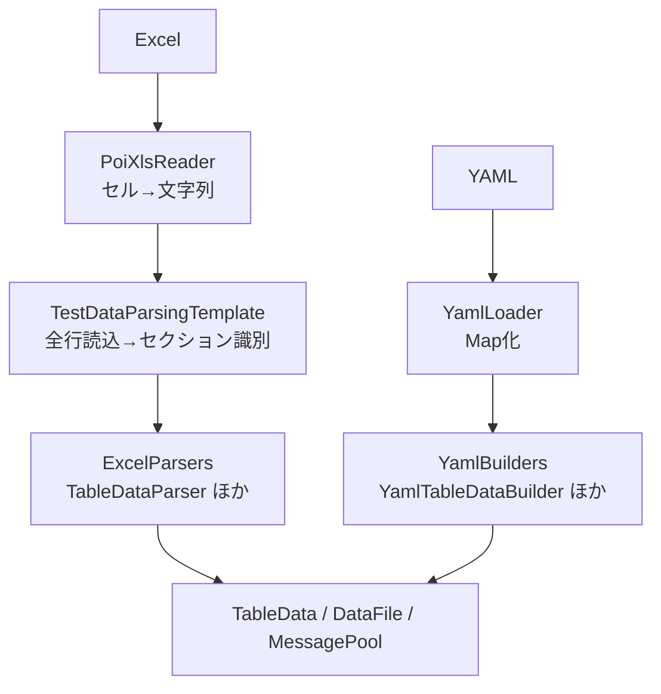

# C-1-0 調査結果: 中間データモデルと NTF 整合性担保方式

変換ツールの中間データモデルを「NTF オブジェクト再利用」と「独自モデル」のどちらにするかを、本体コードの実装事実をもとに評価した記録。判断対象は採否一点で、根拠はすべてコード箇所に紐づける。

## 1. 結論

**採用案: 候補B — 独自モデル（BookModel / SheetModel / SectionModel）**

候補A（`TableData`／`DataFile` 等の NTF オブジェクトをそのまま中間モデルに使う）は、変換ツールがテキスト変換であるにもかかわらず DB 依存・破壊的副作用・static キャッシュ汚染を持ち込むため却下する。決め手は次の 5 点（詳細は 4 章）。

| # | 候補A の問題 | 評価 |
|---|---|---|
| 1 | `TableData` が `DbInfo` 必須。変換ツール単独実行に DI コンテナ＋DB 接続が要る | NG（独立性を損なう） |
| 2 | `EXPECTED_COMPLETED` で `fillDefaultValues()` が自動適用され `columnNames` を DB スキーマで上書き | NG（変換等価性を破壊） |
| 3 | パーサの static LRU キャッシュが JVM 全体共有でテスト実行と汚染し合う | NG（設計上の問題） |
| 4 | 変換始点が既に `List<List<String>>`。独自モデルへ自然に写せる | 候補B が有利 |
| 5 | `DataType` ↔ YAML キーの完全な写像が `YamlSection` に既存。独自モデルから参照するだけ | 候補B が有利 |

独自モデルは DB 依存を完全に排除でき、Excel 構造（`List<List<String>>`）と YAML セクションキーの双方へ自然に写せる。実装コストは BookModel/SheetModel/SectionModel の POJO 追加分だが、単純な値オブジェクトで足りる。

## 2. 評価基準

NTF 本体の Excel／YAML 読み込みコードを調査し、中間モデル候補を次の観点で測った。観点は「変換ツールの独立性」と「変換等価性の保持」に集約される。

- **DB 依存**：変換ツール単独実行で DB 接続が要るか
- **破壊的副作用**：読み込み過程でデータが書き換わるか（変換等価性を壊すか）
- **状態の共有**：本体テスト実行と干渉する static 状態を持つか
- **構造の写しやすさ**：Excel 構造・YAML セクションキーへの写像が自然か
- **実装コスト**：新規実装の量と複雑度

変換等価性の定義は「NTF が読み込んだとき同じデータオブジェクトが生成されること」。この基準を破る副作用は致命的とみなす。

## 3. 調査した本体の読み込みフロー（評価の根拠）

候補評価の前提として、Excel・YAML 双方の本体読み込みフローを確認した。両経路が同じデータオブジェクト型（`TableData`／`DataFile`／`MessagePool`）へ収束し、構造解析 API を共有する点が、独自モデルが両経路へ写せる根拠になる。



### 3.1 Excel 読み込み — PoiXlsReader

`TestDataReader`（interface）を `PoiXlsReader` が実装する。定義メソッドは `open(path, dataName)`／`close()`／`readLine()`／`isResourceExisting()`／`isDataExisting()`。

`PoiXlsReader.java` のフローは次のとおり。

| 処理 | 行 | 内容 |
|---|---|---|
| `open(path, dataName)` | 48 | `dataName` を `/` で分割し `fileName/sheetName` を解析。`WorkbookFactory.create()` でブックをロード→`book.getSheet(sheetName)`。LRU サイズ1のブックキャッシュ `bookCache`（行159）を利用 |
| `readLine()` | 83 | `readOneLine()` を空行スキップしつつ繰り返し、非空行を返す。最終行で `null` |
| `readOneLine()` | 105 | `sheet.getRow(rowIdx++)`→`row.getLastCellNum()` 分ループ。各セルを `cell.toString()`、null セルは `""`（行123）。先頭セルが `//` 始まりならその行で終了（行125） |

戻り値は常に `List<String>`（全セルを文字列化したリスト）。

**セル値の型変換**（`PoiXlsReader.java` 行123）:

```java
String cellValue = cell == null ? "" : cell.toString();
```

- null セル → 空文字 `""`（null は返さない）
- 数値・文字列セル → POI の `Cell.toString()`。クラス冒頭コメント（行26）に「Excel に記述されたテストデータは、すべて文字列書式となっている必要がある」とあり、**数値書式セルの動作は保証外**
- コメント行 → 先頭セルが `//` 始まりなら残りを読まずその1セルだけのリストを返す（行125-127）

### 3.2 セクション解析 — BasicTestDataParser

コア解析は抽象クラス `TestDataParsingTemplate` が担う。

- **全行読み込みとキャッシュ**（`TestDataParsingTemplate.java`）：`parse()` が `reader.open()`→`readTestData()`→`reader.close()` の順で全行を `List<List<String>>` に読む（行128）。`readTestData()`（行165）はコメント行除外→`cutComment()` で各行の `//` 以降を切落とし→`TestDataInterpreter` チェーン適用→`Collections.unmodifiableList` でイミュータブル化しキャッシュ。
- **セクション識別**（`TestDataParsingTemplate.java`）：`getDataType(firstCol)`（行230）が先頭セルを `DataType.values()` の各 `getName()` と前方一致比較（例 `"SETUP_TABLE[case01]=USER"` → `DataType.SETUP_TABLE_DATA`）。非合致は `DataType.DEFAULT`（データ行扱い）。`getTypeValue(line)`（行250）が `=` 以降（テーブル名／ファイルパス等）を抽出。

**生成オブジェクト**:

| メソッド | 使用パーサ | 生成オブジェクト | DataType |
|---|---|---|---|
| `getSetupTableData()`（行50） | `TableDataParser` | `List<TableData>` | `SETUP_TABLE_DATA` |
| `getExpectedTableData()`（行171） | `TableDataParser` ×2 | `List<TableData>` | `EXPECTED_TABLE_DATA`, `EXPECTED_COMPLETED` |
| `getListMap()`（行60） | `ListMapParser` | `List<Map<String,String>>` | `LIST_MAP` |
| `getSetupFile()`（行67） | `FixedLengthFileParser` + `VariableLengthFileParser` | `List<DataFile>` | `SETUP_FIXED`, `SETUP_VARIABLE` |
| `getExpectedFile()`（行75） | 同上 | 同上 | `EXPECTED_FIXED`, `EXPECTED_VARIABLE` |
| `getMessage()`（行82） | `MessageParser` | `MessagePool` | `MESSAGE` |

- **TableData 生成**（`TableDataParser.java`）：`onTargetTypeFound(line)`（行89）が `getTypeValue(line)` でテーブル名抽出→次の1行を `HeaderLine` としてカラム名取得→`new TableData(dbInfo, tableName, columnNames, defaultValues)`（行96）。`onReadLine(line)`（行79）が `header.excludeMarkerColumns(line)` でマーカーカラム（`[...]` 形式）除外後に `processing.addRow(row)`。`HeaderLine`（行33）がマーカーカラム（`[` 始まり `]` 終わり）を自動除外。
- **DataFile（FixedLengthFile）生成**（`DataFileParser.java`）：`READING_DIRECTIVES_AND_NAMES`→`READING_TYPES`→`READING_LENGTHS`→`READING_VALUES` のステートマシンで遷移。ディレクティブ行→`setDirective()`、フィールド名行→`setNames()`／`setRecordType()`、型行→`setTypes()`、長さ行→`setLengths()`、データ行→`addValue()`。

### 3.3 YAML 読み込み — YamlTestDataParser

`YamlTestDataParser.java` は `BasicTestDataParser` を継承し（行32）、`TestDataParser` の全メソッドをオーバーライド。**`setTestDataReader()` は `UnsupportedOperationException`**（行59）で `PoiXlsReader` を一切使わない。返却型は `BasicTestDataParser` と完全同一。

| メソッド | 返却型 |
|---|---|
| `getSetupTableData()` | `List<TableData>` |
| `getExpectedTableData()` | `List<TableData>` |
| `getListMap()` | `List<Map<String,String>>` |
| `getSetupFile()` | `List<DataFile>` |
| `getExpectedFile()` | `List<DataFile>` |
| `getMessage()` | `MessagePool` |

YAML→オブジェクト変換の仕組み:

- **ロード層**（`YamlLoader.java` 行53）：SnakeYAML Engine の `Load` で YAML を解析→`Map<String, Object>`。LRU サイズ8のキャッシュ `YAML_CACHE`（行39）。重複キーは `IllegalStateException`（行61）。
- **セクションキー**（`YamlSection.java` 行29-39）：`DataType` ↔ YAML セクションキーの対応を定数で定義（`SETUP_TABLE_DATA`→`setup_tables`、`EXPECTED_TABLE_DATA`→`expected_tables` 等）。
- **TableData 構築**（`YamlTableDataBuilder.java` 行66）：`new TableData(dbInfo, tableName, columnNames, defaultValues)`（行99）で Excel 経路と同じコンストラクタ。行値を `objectToString(rawVal)`→`interpret(strVal, interps)` で変換（行107-113）。
- **型変換**（`YamlSection.java` 行131 `objectToString()`）：`null`→`null`（RS-03）、`Boolean`→`"true"`/`"false"`（RS-04）、数値→数字文字列（RS-05）、その他→`toString()`。
- **DataFile 構築**（`YamlFileBuilder.java` 行149）：`FixedLengthFile`／`VariableLengthFile` を生成し、Excel の `DataFileParser` と同じ fragment 構築 API（`setRecordType()`／`setNames()`／`setTypes()`／`setLengths()`／`addValue()`）で値を設定。

## 4. 比較

両候補を 2 章の基準で測った。事実（コード箇所）と評価を分けて並べる。

### 4.1 候補A: NTF オブジェクト再利用

| 評価項目 | 評価 | 根拠（コード箇所） |
|---|---|---|
| DbInfo 依存 | **NG**: 大きな制約 | `TableData` コンストラクタは `DbInfo` を必須引数に持つ（`TableData.java` 行71）。変換ツール単独実行時に DI コンテナ＋DB 接続初期化が必要になる |
| `fillDefaultValues()` の破壊的副作用 | **NG**: 致命的リスク | `EXPECTED_COMPLETED` の `TableData` には `fillDefaultValues()` が自動適用される（`BasicTestDataParser.java` 行177）。この処理は `dbInfo.getColumns()` を呼び DB スキーマ由来の全カラムで `columnNames` を上書きする（`TableData.java` 行706-721）。変換後 YAML に「Excel に存在しない DB デフォルト値カラム」が出力されるリスクがある |
| static キャッシュ競合 | **NG**: 設計上の問題 | `TableDataParser.CACHE`、`DataFileParser.cache`、`TestDataParsingTemplate.TEST_DATA_CACHE` はすべて static LRU Map で JVM 全体共有。変換ツールからパーサを直接呼ぶとテスト実行時のキャッシュが汚染される可能性がある |
| TableData の読み出し | 困難 | カラム名は `columnNames` フィールド（行51）に別管理されており、順序付きで列挙するには `getColumnNames()` + `getValue(row, col)` の組み合わせが必要 |

### 4.2 候補B: 独自モデル

| 評価項目 | 評価 | 根拠（コード箇所） |
|---|---|---|
| DB 依存の排除 | **OK**: 完全に排除可能 | 独自 POJO に `DbInfo` を持ち込む必要がない。変換ツールは「テキスト→テキスト」変換として完結できる |
| Excel 構造との対応 | **OK**: 直接対応 | `TestDataParsingTemplate.readTestData()` が返す `List<List<String>>` は 1シート = 複数セクションの構造をそのまま表現しており、SheetModel → SectionModel の階層に自然に対応する |
| YAML との写像 | **OK**: 明確な1対1写像 | `YamlSection.java` のセクションキー定数（行29-39）と `dataTypeToSectionKey()`（行184）が `DataType` ↔ YAML キーの完全な写像を定義済み。SectionModel が `DataType` を保持すれば YAML 出力コードは既存定数を参照するだけで済む |
| マーカーカラム処理 | **OK**: 仕様共有で整合 | `HeaderLine.java` 行87-96 と `YamlTableDataBuilder.java` 行92-94 が同一条件（`[` 始まり `]` 終わり）を使用。独自モデルも同一条件を採用することで両経路と整合 |
| null / 空文字の差異 | **OK**: 設計で吸収可能 | Excel の空セル → `""`（`PoiXlsReader.java` 行123）と YAML の null → `null`（`YamlSection.java` 行131）の差異を独自モデルの変換規則として明示できる |
| NTF との疎結合 | **OK**: 意図的に維持 | NTF のパーサ・データクラスに依存しないため、NTF 側のクラス変更の影響を受けない |
| 実装コスト | 追加実装が必要 | BookModel/SheetModel/SectionModel の POJO を新規作成する必要がある。ただしシンプルな値オブジェクトで十分なため複雑度は低い |

## 5. 採用の根拠と整合性担保

### 5.1 候補B を選んだ根拠

**(1) DbInfo 依存の排除が必須**
`TableData` のコンストラクタは `DbInfo` を必須引数として受け取る（`TableData.java` 行71）。変換ツールは Excel ↔ YAML のテキスト変換であり DB 接続は不要である。候補Aを採用すると、変換ツール実行のためだけに DI コンテナと DB 接続の初期化が必要になり、ツールの独立性を著しく損なう。

**(2) `fillDefaultValues()` の破壊的副作用リスク**
`EXPECTED_COMPLETED` セクションの `TableData` には `fillDefaultValues()` が `BasicTestDataParser.java` 行177 で自動的に呼ばれ、`columnNames` を DB スキーマ由来の全カラムで上書きする（`TableData.java` 行706-721）。候補A では変換後の YAML に「Excel ファイルに書かれていない DB デフォルト値カラム」が出力される恐れがあり、変換等価性の定義（「NTF が読み込んだとき同じデータオブジェクトが生成されること」）を破壊する。

**(3) static キャッシュの競合**
`TableDataParser.CACHE`、`DataFileParser.cache`、`TestDataParsingTemplate.TEST_DATA_CACHE` はすべて static LRU Map として JVM プロセス全体で共有される。候補A で NTF パーサを直接呼ぶと、このキャッシュに変換中データが蓄積し、同一 JVM 内で NTF テストを実行した際に汚染される可能性がある。

**(4) 変換の始点データが既に `List<List<String>>`**
`TestDataParsingTemplate.readTestData()` が返す `List<List<String>>`（行165）は Excel の行・列をそのまま表現した構造で、独自モデルへの変換は自然に行える。`DataType.getDataType(firstCol)` の判定（行230）も独自モデル構築時に再利用できる。

**(5) YAML との写像が `YamlSection` に既存**
`YamlSection.java` のセクションキー定数（行29-39）と `dataTypeToSectionKey()`（行184）が `DataType` ↔ YAML セクションキーの完全な写像を既に定義している。SectionModel が `DataType` を保持する設計にすれば、YAML 出力コードは既存定数を参照するだけで済み、メンテナンス箇所が集約される。

### 5.2 整合性担保方法

独自モデルは NTF パーサを直接呼ばないため、NTF 本体との整合性は規則の一致で保証する。

1. **Excel 読み込みの文字列化は `PoiXlsReader` の仕様に準拠**：セル値文字列化の規則（null セル→`""`、文字列書式前提）は `PoiXlsReader.java` 行123 と同一の規則を独自 `XlsFormatReader` に実装する。`PoiXlsReader` クラス自体を呼ぶかは実装の選択だが、セル変換規則は一致させる。
2. **DataType 識別ロジックは `TestDataParsingTemplate.getDataType()` の仕様に準拠**：`DataType.getName()` との前方一致判定（`TestDataParsingTemplate.java` 行230）と同一の判定式を `XlsFormatReader` に実装する。
3. **マーカーカラム除外は両経路と同一条件を使用**：`[` 始まり `]` 終わり（`HeaderLine.java` 行87-96 / `YamlTableDataBuilder.java` 行92-94）と同一の除外条件を独自モデルのヘッダ解析に適用する。
4. **グループID の書式は `BasicTestDataParser.formatGroupId()` の仕様に準拠**：`[groupId]` 形式（`BasicTestDataParser.java` 行253-266）を独自モデルの `groupId` フィールドの正規化規則として明記する。
5. **null / 空文字の正規化を設計書に明記**：`PoiXlsReader.java` 行123（`cell == null ? "" : cell.toString()`）に従い、Excel の空セルは空文字 `""` として扱う。YAML 出力時も `""` としてダブルクォート付きで出力する。セル値が文字列 `"null"` の場合のみ YAML のアンクォート `null` として出力する（NTF の `NullInterpreter` が `"null"` 文字列と Java null を等価に扱うため）。この規則を設計書 8.6 節の値変換ルール表として明記する。
