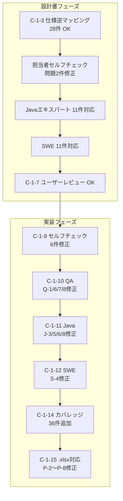

# C-1 完了条件チェック（設計書・実装フェーズ）

テストデータ変換ツール（設計書 `docs/pr75/docs/testdata-converter-design.md`）の完了条件レビュー記録。設計書フェーズと実装フェーズの両方を、検出した問題・判定・根拠とともに時系列で残す。以後の実装フェーズのチェックも本ファイルに追記する。

この記録の主役は、検出された問題のうち**直さず受け入れた（スコープ外・制約として許容した）ものの根拠**である。修正済みは事実として並べ、受け入れたものは理由を残す。

## フェーズと判定の全体像

| フェーズ | 判定 | テスト |
|---|---|---|
| 設計書（C-1-3〜C-1-7） | OK | — |
| C-1-9 セルフチェック | OK（6件修正） | 83 全グリーン |
| C-1-10 QAレビュー | OK（Q-1/6/7/8 修正） | 85 全グリーン |
| C-1-11 Javaエキスパートレビュー | OK（J-3/5/6/8 修正） | 85 全グリーン |
| C-1-12 SWEレビュー | OK（S-4 修正） | 85 全グリーン |
| C-1-14 カバレッジ向上 | OK（36件追加） | 146 全グリーン |
| C-1-15 .xlsx 対応 | OK（P-2〜P-8 修正） | 156 全グリーン |

---

# 設計書フェーズ

## 完了条件

| 完了条件 | 担当者判定 | 担当者根拠 | QA判定 | QA根拠 |
|---|---|---|---|---|
| 設計書（`testdata-converter-design.md`）がユーザーレビュー OK 済みであること | OK | C-1-7 ユーザーレビュー対応完了（2026-05-28） | — | — |

## C-1-3 仕様リスト「変換ツール対象」全件の設計書逆マッピング

「変換ツール対象=対象」全 28 件すべてに設計書の対応章節が存在し、漏れゼロを確認した。

- **件数**: 28 件（DT: 4、SS: 8、RS: 7、HC: 5、DR: 4、MS: 2）
- **OK**: 28 件 / **NG（漏れ）**: 0 件 / **判定**: OK

| 仕様ID | 仕様概要 | 設計書の対応章節 | 判定 | 根拠 |
|---|---|---|---|---|
| DT-01 | DataType 列挙値 14 種の定義 | 5.1（DT 欄）、8.1（識別行検出ロジック）、7.3 YamlFormatReader（DataType マッピング表） | OK | 8.1 節の識別行検出ロジックで `DataType.getName()` を全列挙値に前方一致し 14 種すべてを利用すると明示 |
| DT-02 | データブロック識別行の書式 `<DataType名>[groupId]=<値>` | 8.1（Excel→YAML / YAML→Excel、変換例） | OK | 8.1 節が識別行の解析・生成ルールを詳細記載 |
| DT-03 | DataType 判定は前方一致（`startsWith`） | 8.1（識別行検出のロジック手順 2） | OK | 「`DataType` の全列挙値の `getName()` と前方一致（`startsWith`）で比較する」と明記 |
| DT-06 | groupId 書式 `[groupId]`（省略時空文字） | 8.7（groupId の変換 対応表） | OK | 8.7 節が groupId あり・なしの両方向変換を表形式で規定 |
| SS-01 | テーブルデータ行のカラム→値マッピング構造 | 6.3.1（TableDataBlock）、8.2（変換例） | OK | 8.2 節が `{カラム名: "値"}` 形式での YAML 出力を具体例付きで規定 |
| SS-08 | ファイルデータブロックの行順序（ディレクティブ→フィールド名→型→長さ→データ） | 8.4（状態遷移表）、7.3 XlsFormatWriter 責務 | OK | 8.4 節に状態遷移表と具体的行順序を詳述。XlsFormatWriter 責務にも「SS-08」参照を明記 |
| SS-09 | 固定長フラグメント: names/types/lengths の 3 リスト必須 | 6.3.3（FileDataBlock/RecordLayout/FieldDef）、8.4（固定長 Excel 例） | OK | FieldDef が `name/type/length` を持ち、固定長 YAML 例で `{name, type, length}` 出力を規定 |
| SS-10 | 可変長フラグメント: names/types の 2 リスト（lengths 不要） | 6.3.3（FieldDef の `length` は可変長 null 時省略）、8.4（状態遷移） | OK | FieldDef 注記「可変長は null。YAML 出力時は length キーを省略」および状態遷移で可変長時 `FIELD_LENGTHS` を飛ばすと明示 |
| SS-11 | 1 ファイルデータブロック内の複数レコードレイアウト連続記述 | 8.4（複数レコードレイアウト節、状態遷移表「DATA → FIELD_NAMES 新 RecordLayout 追加」） | OK | 8.4 節に `records:` 配列への複数出力を明記 |
| SS-12 | フィールド名行の構造（先頭列=レコード種別名、2 列目以降=フィールド名） | 8.4（Excel 構造説明手順 3） | OK | 8.4 節に「フィールド名行: 先頭セル = レコード種別名、2 列目以降 = フィールド名」と明記 |
| SS-13 | データ行の先頭セルは必ず空にする | 7.3 XlsFormatWriter 責務 | OK | 「データ行は先頭セルを空にして書き出す（SS-13）」を明記 |
| SS-15 | 空ファイル表現（ディレクティブのみ、レコード定義なし） | 8.4（空ファイル表現節） | OK | 8.4 節に `records: []` 出力と逆変換ルールを規定 |
| SS-17 | `"-"` フィールド長値をそのまま変換 | 8.4（`"-"` フィールド長の変換（SS-17）節） | OK | 独立節で両方向ともリテラル `"-"` を保持すると明記 |
| RS-01 | `{dataName}.yaml` ファイル命名規則 | 4.3（ディレクトリ対応規則）、4.4（resourceName の対応表） | OK | 4.3 でシート名 → `{sectionName}.yaml`、4.4 で resourceName が変換前後一致を確認表付きで規定 |
| RS-03 | YAML ネイティブ null（アンクォート）= Java null | 8.6（値変換ルール表） | OK | 8.6 節 Excel→YAML / YAML→Excel 両表に null 変換ルールを規定 |
| RS-04 | YAML ネイティブ boolean は文字列として出力 | 8.6（値変換ルール表） | OK | 8.6 節 Excel→YAML 表で boolean 値をクォート付き出力と明示 |
| RS-05 | YAML ネイティブ integer/float は数字文字列として出力 | 8.6（値変換ルール表） | OK | `"001"` 例でクォート付き出力を規定。float 等も同原則（文字列保持） |
| RS-10 | `setup_tables` エントリの `table:` キー必須 | 7.3 YamlFormatWriter 責務 | OK | 「`table:` キーを必ず出力する（RS-10）」を明記 |
| RS-11 | `setup_files` エントリの `path:` キー必須 | 7.3 YamlFormatWriter 責務 | OK | 「`path:` キーを必ず出力する（RS-11）」を明記 |
| RS-22 | YAML 出力に重複キー不可 | 7.3 YamlFormatWriter 責務 | OK | 「トップレベルの重複キーを出力しない（RS-22）」を明記 |
| HC-01 | マーカーカラム `[カラム名]` の変換時保持 | 8.2（テーブルデータ変換） | OK | 「マーカーカラム（`[カラム名]` 形式）はカラム名をそのまま保持する」と明記 |
| HC-03 | ヘッダ行末尾の空カラム除去 | 8.2（テーブルデータ変換） | OK | 8.2 節 Excel→YAML 変換に明記 |
| HC-04 | データ行がヘッダより短い場合の空文字補完 | 8.2（テーブルデータ変換） | OK | 8.2 節 Excel→YAML 変換に明記 |
| HC-05 | コメント行（`//` 先頭）のスキップ（Ph-2 両方向ロスト） | 3 章（Ph-2 方針節）、7.3 XlsFormatReader 責務 | OK | 3 章 Ph-2 に両方向ロスト方針を詳述。XlsFormatReader 責務に「HC-05」を明記 |
| HC-06 | 行内コメント（`//` 先頭以外）のセル以降切り捨て | 7.3 XlsFormatReader 責務 | OK | 「HC-06」を引用して明記 |
| HC-07 | 空行スキップ（全要素 null/空文字） | 7.3 XlsFormatReader 責務 | OK | 「HC-07」を引用して明記 |
| DR-01 | ディレクティブ行の構成（先頭列=キー名、2 列目=値） | 8.4（Excel 構造手順 2「ディレクティブ行」） | OK | 8.4 節手順 2 に明記 |
| DR-07 | `file-type` ディレクティブ → YAML `type: fixed/variable` | 6.3.3（FileDataBlock の `fileType`）、8.4（DataType→YAML type 対応表） | OK | 6.3.3 で `fileType` の目的を説明し、8.4「ファイル種別の判定」表で変換を規定 |
| DR-09 | `field-separator` ディレクティブ値の変換 | 8.8（`field-separator`（DR-09）節） | OK | 独立項に両方向変換ルールを規定 |
| DR-10 | `record-separator` ディレクティブ値の変換 | 8.8（`record-separator`（DR-10）節） | OK | 独立項に規定 |
| MS-01 | FW 制御ヘッダフィールド（requestId 等 4 種）の変換 | 8.5（FW ヘッダの変換節、FW_HEADER レコード注意事項） | OK | 8.5 節に `FW_HEADER` レコードの Excel/YAML 変換例と注意事項を詳述 |
| MS-02 | `no` 列（先頭セル空）の解析・生成 | 8.5（メッセージングデータ相違点） | OK | 8.5 節の相違点リストで `no` 列の両方向の扱いを明記 |

## 担当者セルフチェック

設計書の全章を精査し、矛盾・欠落 2 件を修正した。

### 修正 1: 8.6 節 値変換ルール表の記述矛盾

修正前の表は空セルを `""` とする一方、末尾補足で「`null` セルはアンクォートの `null` として出力する」とあり矛盾していた。

実際の仕様（解説書 IV-04、NullInterpreter 参照）:
- Excel の空セル（BLANK セル）→ `""`（空文字列として YAML 出力）
- Excel のセル値が文字列 `"null"` → アンクォートの `null` として YAML 出力（NullInterpreter が変換）

表の説明文と末尾補足を整合させた。

### 修正 2: 3 章フェーズ定義の DataType 一覧に EXPECTED_COMPLETE_TABLE が欠落

`DataType.java` に `EXPECTED_COMPLETED(4, "EXPECTED_COMPLETE_TABLE")` が定義され、NTF が処理する DataType の一つであるため変換対象に含めねばならない。修正前は Ph-1 の DataType 一覧から欠落していた。Ph-1 の一覧と 8.2 節のテーブルデータ節に追加した。

### 設計書の完全性確認

| 章 | 結果 |
|---|---|
| 1章: 目的・スコープ | OK |
| 2章: 設計方針 | OK |
| 3章: フェーズ定義（Ph-1/Ph-2） | OK（修正後） |
| 4章: 変換対象ファイル | OK |
| 5章: 対応NTF仕様ID | OK |
| 6章: データモデル設計 | OK |
| 7章: クラス設計 | OK |
| 8章: 変換ルール詳細 | OK（修正後） |
| 9章: 実行方法 | OK |
| 10章: エラー処理方針 | OK |

## Javaエキスパートレビュー（設計書）

サブエージェントで実施。11 件全件対応済み。設計書の完全性・実装可能性に問題なし。

| 問題ID | 重要度 | 内容 | 対処 |
|---|---|---|---|
| H-1 | High | `TestDataFormatReader.read()` / `Writer.write()` に `throws` 宣言がない | `ConverterException` を設計し `throws ConverterException` を追加 |
| H-2 | High | 上書き禁止エラーに `IllegalStateException` を使うのは不適切 | `ConverterException`（専用検査例外）に変更 |
| H-3 | High | `src/test/java` 配置とパッケージ `nablarch.test.core.reader.converter` の意図が不明確 | 7.1 節に配置方針と理由を明記 |
| M-1 | Medium | `ListMapBlock` と `TableDataBlock` が同一フィールドを重複保持 | `ColumnRowDataBlock` 共通基底クラスを追加 |
| M-2 | Medium | `FieldDef.length` が `String` 型である理由が不明 | `null`/`"-"` を区別なしリテラル保持する設計意図と `final` を明記 |
| M-3 | Medium | HC-06 仕様が `PoiXlsReader` の実動作と異なる | 動作差分を XlsFormatReader 責務の注記に明記 |
| M-4 | Medium | 4.2 節「ファイル名完全一致」と 7.5 節「絶対パス末尾一致」が矛盾 | 7.5 節を「ファイル名完全一致」に統一 |
| M-5 | Medium | `System.exit()` の呼び出し場所が不明確 | `main()` のみから呼び出す・`run()` 分離をクラス設計に明記 |
| M-6 | Medium | YAML キーマッピング表に `YamlSection` 定数名がなく実装コスト発生 | 定数名列を追加（`KEY_LIST_MAP` → `KEY_LIST_MAPS` の誤りも修正） |
| L-2 | Low | `DataType.DEFAULT` の扱いが未定義 | 8.1 節に「DEFAULT は変換ツールでは処理しない」旨を明記 |
| L-3 | Low | `directives` / `fwHeaderFields` の順序保証が不明確 | 各フィールド定義に `LinkedHashMap` 使用を明記 |

## ソフトウェアエンジニアレビュー（設計書）

サブエージェントで実施。11 件全件対応済み。設計の整合性・実装実現可能性に問題なし。

| 問題ID | 重要度 | 内容 | 対処 |
|---|---|---|---|
| H-1 | High | FW_HEADER 変換が SystemRepository の fwHeaderfields 依存を考慮していない | 8.5 節に FW ヘッダ判定の動作・デフォルト4フィールド前提・カスタム設定スコープ外を明記 |
| H-2 | High | MessageDataBlock.fwHeaderFields の変換時点で SystemRepository 参照不可 | H-1 と同じ対処で解決 |
| H-3 | High | 状態遷移表に EOF ケースが未定義 | EOF 行を追加（DATA 状態: 正常終了、それ以外: エラー） |
| M-1 | Medium | YAML→Excel→YAML の null/"null" 非対称性に説明なし | 意図的な設計と理由（NTF 等価性維持）を 8.6 節に明記 |
| M-2 | Medium | マーカーカラムの YAML 出力例がない・逆変換ルール未定義 | 8.2 節に出力例と逆変換ルールを追記 |
| M-3 | Medium | setup_files に複数 DataType 混在時の順序保証が未記述 | 8.4 節にリスト順序保証（Excel の行順）を明記 |
| M-4 | Medium | YAML ディレクトリ定義が再帰的ケースで曖昧 | 4.3 節に判定例（3 パターン）を追加 |
| M-5 | Medium | XlsFormatWriter が HSSF 固定である根拠がない | 7.3 節に HSSFWorkbook 使用・.xlsx 変換スコープ外・シート数制限を明記 |
| M-6 | Medium | TestDataConverter.run() のエラー集計フローが不明確 | 7.4 節に try-catch(ConverterException) によるエラー件数集計フローを明記 |
| L-2 | Low | FileType enum の定義が設計書にない | 6.3.4 節に追記 |
| L-3 | Low | classpathScope 説明が自己矛盾 | 9.1 節を「test にする」一択に整理 |
| L-4 | Low | YAML→Excel 変換で YAML 1.2 の NULL/Null/~ 扱いが未記述 | 8.6 節に SnakeYAML YAML1.2 Core スキーマの null 表現を追記 |

## 設計書フェーズ総合判定

- 担当者: OK（C-1-3 仕様 28 件全件、対応章節が存在し漏れゼロ）
- QA: OK（C-1-4: 指摘 10 件全件対応）
- Javaエキスパート: OK（C-1-5: 指摘 11 件全件対応）
- ソフトウエアエンジニア: OK（C-1-6: 指摘 11 件全件対応）
- ユーザーレビュー: OK（C-1-7 で依頼）

---

# 実装フェーズ

## C-1-9 セルフチェック

全 83 テストグリーン（Failures: 0, Errors: 0）。新規テスト 2 件追加（`invalidFromValueReturnsCode2`・`invalidToValueReturnsCode2`）。設計書仕様との乖離 6 件を修正した。

### クラス構造・データモデル（第6章）

| 確認項目 | 判定 | 根拠 |
|---|---|---|
| 設計書記載の全 20 クラスが存在する | OK | `src/main/java/nablarch/test/tool/converter/` 配下 20 ファイル確認 |
| `TestDataContainer` フィールド（name, sections） | OK | final フィールド＋getter、設計書通り |
| `ColumnRowDataBlock` 共通基底クラスが存在する | OK | `TableDataBlock`・`ListMapBlock` が継承 |
| `FieldDef` が `String length` フィールドを持ち final | OK | 設計書 6.3.3 節の意図通り |
| `MessageDataBlock.fwHeaderFields` が `LinkedHashMap` | OK | 設計書 L-3 対応確認 |
| `TestDataFormatReader` に `throws ConverterException` | OK | インターフェース定義確認 |
| `TestDataConverter.main()` が `System.exit(run(args))` のみ | OK | 設計書 7.4 節通り |

### 変換ルール実装（第8章 / 仕様 ID）

| 仕様 ID | 確認項目 | 判定 | 根拠 |
|---|---|---|---|
| DT-03 | DataType 判定が `startsWith`（前方一致） | OK | `detectDataType()` で `cellValue.startsWith(dt.getName())` 確認 |
| HC-03 | ヘッダ末尾空カラム除去 | OK | `trimTrailingEmpty()` 使用確認 |
| HC-04 | データ行がヘッダより短い場合の空文字補完 | OK | テーブル・ファイル・メッセージ全ブロックで実装 |
| HC-05 | コメント行スキップ（警告出力・カウント） | OK | `readRows()` で `lastCommentLineCount` 加算・`System.err` 出力 |
| HC-06 | 行内コメント切り捨て | OK | `readCells()` で `break` 実装 |
| HC-07 | 空行スキップ | OK | `readRows()` でスキップ確認 |
| HC-01 | マーカーカラム保持 | OK | YamlFormatWriter の `quoteKey()` で `[` 始まりをクォート |
| SS-08/09/10 | ファイルデータ行順序・固定長/可変長 | OK | `parseFileBlock()` 状態遷移確認 |
| SS-17 | `"-"` フィールド長リテラル保持 | OK | `FieldDef.length` が `String` 型 |
| DR-09/10 | field-separator/record-separator 変換 | OK | 値をそのまま保持（NTF 実行時に解釈） |
| RS-03/04/05 | null/boolean/integer 値変換 | OK | `quoteValue()` が全値をダブルクォートで出力、仕様要求と一致 |
| RS-22 | 重複キー防止 | OK | `setAllowDuplicateKeys(false)` 確認 |

### エラー処理（第9章）

| 確認項目 | 判定 | 根拠 |
|---|---|---|
| `ConverterException` の適切な使用 | OK | IO・書式・上書き禁止エラーを全て wrap |
| `System.exit()` は `main()` のみ | OK | `run()` は `int` 返却 |
| エラー件数集計 | OK | `errorCount` 変数で集計 |
| `--from`/`--to` 値バリデーション（`xls`/`yaml` 以外は終了コード 2） | OK | C-1-9 修正で追加 |
| コメント行ロスト警告・サマリー出力 | OK | C-1-9 修正で追加 |
| 数値書式セル警告出力 | OK | C-1-9 修正で追加。`readCells()` で `Cell.CELL_TYPE_NUMERIC` 検出時に `System.err` 出力 |
| 空シート（0 ブロック）警告・スキップ | OK | C-1-9 修正で追加。`run()` で `hasAnyBlock` 判定 |
| `HSSFWorkbook` リソースリーク対策 | OK | C-1-9 修正で `fis.close()` を finally に移動（POI 3.8 は `AutoCloseable` 非対応のため） |
| `XlsFormatWriter` ディレクトリ自動作成 | OK | C-1-9 修正で `Files.createDirectories(outputPath)` 追加 |

### 修正内容（6 件）

| 問題 ID | 修正内容 |
|---|---|
| NG-2 | `parseArgs()` 後に `--from`/`--to` の値バリデーション追加（`xls`/`yaml` 以外は終了コード 2） |
| NG-3 | `XlsFormatReader` にコメント行カウント（`lastCommentLineCount`）・警告出力を追加。`run()` に変換サマリー（`=== TestDataConverter 変換サマリー ===` 形式）を追加 |
| NG-4 | `readCells()` に数値書式セル（`Cell.CELL_TYPE_NUMERIC`）検出時の警告出力を追加 |
| NG-5 | `run()` に空シート（ブロック 0 件）の警告出力・YAML 出力スキップ処理を追加 |
| NG-6 | `read()` で `FileInputStream.close()` を finally に確実に移動（Workbook 生成後も fis を閉じる） |
| NG-7 | `XlsFormatWriter.write()` 冒頭に `Files.createDirectories(outputPath)` を追加 |

### 完了条件チェックリスト

| 完了条件 | 判定 | 根拠 |
|---|---|---|
| 全 TDD テストがグリーン | OK | 83 テスト全グリーン |
| 設計書記載の全クラスが実装済み | OK | 20 クラス全確認 |
| 変換ルール（仕様 ID 対応）が設計書通り | OK | 上表確認 |
| エラー処理・警告出力・サマリー出力が設計書通り | OK | 6 件修正後確認 |

**判定: OK**（6 件修正・テスト 2 件追加・83 テスト全グリーン）

## C-1-10 QAエンジニアレビュー

サブエージェント（QAエンジニア / Claude Opus）で実施。修正済みは Q-1/Q-6/Q-7/Q-8。残りは受け入れ。受け入れの根拠を残す。

| 問題 ID | 重要度 | 内容 | 対処・受け入れ根拠 |
|---|---|---|---|
| Q-1 | High | `parseFileBlock()` のディレクティブ EOF 消失バグ。ディレクティブのみのファイルブロックがシート末尾にある場合、最後のディレクティブが登録されずレコードとして誤解析 | **修正**。EOF および次行 DataType のケースでディレクティブを登録してから break |
| Q-2 | High（設計書外） | `YamlFormatWriter` が空データ行テーブルのカラム名を出力せず、YAML→XLS ラウンドトリップでカラム名消失 | **受け入れ**。設計書に明示仕様なし。YAML スキーマで `rows: []` は NTF として有効（全件 DELETE）。ラウンドトリップ制約として設計書への注記追加を推奨するが実装変更は対象外 |
| Q-3 | Medium | `quoteKey()` がマーカーカラム以外をクォートせず、YAML 特殊文字含むカラム名で不正 YAML 生成の可能性 | **受け入れ**。NTF のカラム名・ディレクティブキーに YAML 特殊文字が含まれない前提（設計書 1.2 節「前提条件」範囲内）。スコープ外 |
| Q-4 | Medium | 複数セクションの一部書き込み後に上書き禁止例外で部分出力が残る | **受け入れ**。設計書 9.2 節「スキップして続行」の範囲内。`--overwrite` 再実行で解決可能。スコープ外 |
| Q-5 | Medium | `HSSFWorkbook` が POI 3.8 では `Closeable` 未実装でクローズ不可 | **受け入れ**。POI 3.8 の仕様制約。`FileInputStream` は finally で確実にクローズ済み（C-1-9 対応）。スコープ外 |
| Q-6 | Medium | Q-1 のテストカバレッジギャップ（EOF ケース未テスト） | **修正**。Q-1 修正時にテスト 2 件追加（`emptyFileRepresentationAtEof` / `multipleDirectivesAtEof`） |
| Q-7 | Medium | 変換サマリーにスキップ件数が出ない（設計書 9.4 節要件） | **修正**。`ConverterFileFilter.findXlsFiles/findYamlDirs` に `skipCount` パラメータ追加、サマリーに「スキップ: N 件」追加 |
| Q-8 | Medium | `parseIdentifierRow()` が識別行の `=` なしをエラーにせず空 identifier を返す（設計書 9.2 節エラーケース） | **修正**。`=` がない場合に `ConverterException` をスロー |
| Q-9 | Low | `RecordLayout.rows` 空時に `rows:` のみ出力（YAML null）でスタイル不統一 | **受け入れ**。`YamlFormatReader.castList()` が null を `emptyList()` 扱いするため機能上問題なし。スコープ外 |
| Q-10 | Low | 複数セクション混在で一部のみ空の場合に空 YAML ファイル生成 | **受け入れ**。C-1-9 の空シート警告はコンテナ全体が空の場合のみ。NTF は空 YAML を正常読込可能。スコープ外 |
| Q-11 | Low | `--from` タイポ等の未知オプションが positional 引数に化けパスが静かにずれる可能性 | **受け入れ**。Q-2（引数バリデーション）の範囲を超えるが、パスが存在しなければエラー終了する。リスク許容 |

**判定: OK**。Q-1/Q-6/Q-7/Q-8 修正済み。Q-2/Q-3/Q-4/Q-5/Q-9/Q-10/Q-11 は設計書スコープ外または POI バージョン制約として受け入れ。修正後 85 テスト全グリーン。

## C-1-11 Javaエキスパートレビュー

サブエージェント（Java エキスパート / Claude Opus）で実施。修正済みは J-3/J-5/J-6/J-8。残りは受け入れ。

| 問題 ID | 重要度 | 内容 | 対処・受け入れ根拠 |
|---|---|---|---|
| J-1 | High | `HSSFWorkbook` がクローズされない（リソースリーク） | **受け入れ**。POI 3.8 では `HSSFWorkbook` が `Closeable` 未実装のため修正不可。制約として受け入れ |
| J-2 | Medium | データクラスのゲッターが内部可変コレクションを直接返す | **受け入れ**。現状テストが読み取りのみのため機能的影響なし。設計仕様として現状維持 |
| J-3 | Medium | `XlsFormatReader` の `subList()` ビューをデータ構造に格納 | **修正**。`new ArrayList<>(subList(...))` でコピーして格納 |
| J-4 | Medium | YAML マップのキャスト `Map<String, Object>` が非 String キーで NPE | **受け入れ**。NTF テストデータの YAML は常に文字列キーである前提。スコープ外 |
| J-5 | Medium | `deleteSource()` で `File.delete()` 戻り値を無視 | **修正**。戻り値チェックを追加し失敗時に `System.err` 警告 |
| J-6 | Low | `ConverterFileFilter.postVisitDirectory()` が `IOException` パラメータを無視 | **修正**。`exc != null` の場合に `throw exc` を追加 |
| J-7 | Low | `XlsFormatWriter.setCellStr()` が既存行を上書き（破壊的操作） | **受け入れ**。現状呼び出し側で重複しないため問題なし。記録のみ |
| J-8 | Low | `writeRecordLayout()` で `type == null` 時に `type: null` が出力される | **修正**。`type != null` ガードを追加し `type` キーを省略 |

**判定: OK**。J-3/J-5/J-6/J-8 修正済み。J-1/J-2/J-4/J-7 は POI 3.8 制約・スコープ外・影響なしとして受け入れ。修正後 85 テスト全グリーン。

## C-1-12 ソフトウェアエンジニアレビュー

サブエージェント（SWE / Claude Opus）で実施。修正済みは S-4。残りは受け入れ。

| 問題 ID | 重要度 | 内容 | 対処・受け入れ根拠 |
|---|---|---|---|
| S-1 | High（設計書外） | `group_id` の書式がモデルと XLS 識別行で異なる（bare vs wrapped） | **受け入れ**。設計書通りの動作。両方向で正しくラウンドトリップする。メンテナ向けコメントを推奨（記録のみ） |
| S-2 | High（設計書外） | Java `null` セル値が YAML→XLS で `"null"` 文字列になる | **受け入れ**。設計書 7.2.1 節「`null` 値はセルに文字列 `"null"` と書き出す」で明示された仕様。対処不要 |
| S-3 | High（設計書外） | メッセージブロックの `record_type` が XLS→YAML で常に `"default"` になる | **受け入れ**。設計書 7.1.6 節の仕様通り（`recordType = "default"`）。対処不要 |
| S-4 | Medium | `pom.xml` に `exec-maven-plugin` が設定されていない（設計書 9.1 節要件） | **修正**。`<plugins>` に `exec-maven-plugin 3.1.0` 設定を追加 |
| S-5 | Low | 同一シート内でブロックタイプ混在時に YAML 出力でブロック順序が変わる可能性 | **受け入れ**。設計書に明示仕様なし。NTF は ID で検索するため順序不問。記録のみ |

**判定: OK**。S-4 修正済み。S-1/S-2/S-3 は設計書仕様通り、S-5 は Low として受け入れ。修正後 85 テスト全グリーン。

## 実装フェーズ総合判定（C-1-9〜C-1-12）

- C-1-9 セルフチェック: OK（6 件修正・83 テスト全グリーン）
- C-1-10 QAレビュー: OK（Q-1/Q-6/Q-7/Q-8 修正・85 テスト全グリーン）
- C-1-11 Javaエキスパートレビュー: OK（J-3/J-5/J-6/J-8 修正・85 テスト全グリーン）
- C-1-12 SWEレビュー: OK（S-4 修正・85 テスト全グリーン）
- ユーザーレビュー: C-1-13 で依頼

## C-1-14 カバレッジ向上（Mockito テスト追加）

### 追加テスト

| テストクラス | 追加 | 内容 |
|---|---|---|
| `TestDataConverterTest` | +7（15→22） | `main()` → `System.exit()` 検証（SecurityManager 利用）、`deleteSource()` delete 失敗警告、`deleteDirectory()` delete 失敗 / `listFiles()` null、空シート + `--delete-source`、存在しない入力パス、YAML→XLS `--delete-source` |
| `ConverterFileFilterTest` | +6（8→14） | `findXlsFiles/findYamlDirs` の `IOException` catch（`mockStatic(Files.class)`）、`containsYaml` 再帰パス、`includePattern` YAML ディレクトリフィルタ（skipCount 確認）、`yamlDirWithSubdirContainingYaml`、`containsYamlReturnsFalseForDirWithNoYaml` |
| `ConverterPathResolverTest` | +1（3→4） | `.xls` 拡張子なしファイル名の `xlsToYamlDir` 分岐 |
| `XlsFormatReaderTest` | +10（30→40） | null 行スキップ、`messageBlockDataRowShorterThanFieldCount`（HC-04 補完）、`fileBlockFieldNameTrailingEmptyRemoved`（HC-03）、`parseFileBlock` 境界ケース群 |
| `XlsFormatWriterTest` | +1（12→13） | `FileOutputStream` への書き込みで `IOException`（`mockConstruction`） |
| `YamlFormatReaderTest` | +4（21→25） | `expected_files` fixed 読み込み、`castList` 非リスト値フォールバック、`expected_request_header_messages` / `expected_request_body_messages` 読み込み |
| `YamlFormatWriterTest` | +5（21→26） | `EXPECTED_REQUEST_HEADER_MESSAGES`・`EXPECTED_REQUEST_BODY_MESSAGES` 書き出し、`Files.newBufferedWriter` の `IOException` catch（`mockStatic(Files.class)`） |

合計 144 テスト実行（converter パッケージ対象）→ 全グリーン。

### 到達不可な防御ガード（テスト不要）

構造上テストで到達できない未カバー箇所と、その理由。

| クラス | 箇所 | ガード内容 | 到達不可な理由 |
|---|---|---|---|
| `XlsFormatReader` | `parseRows()` の `throw AssertionError("UNREACHABLE:")` | 未知 DataType への番人 | `DataType.DEFAULT` は設計書スコープ外（8.1 節 L-2）。通常データに現れず到達しない |
| `YamlFormatWriter` | `sectionKey()` の `throw AssertionError("UNREACHABLE:")` | 未知 DataType への番人 | `sectionKey()` は SECTION_KEY_ORDER 定数リストからのみ呼ばれ未知 DataType は渡らない。呼び出し構造上の封鎖 |
| `YamlFormatWriter` | `writeRecordLayout()` の `type == null` 分岐（VARIABLE ブロック） | フィールド型 null 時に `type:` キー省略 | `XlsFormatReader` がフィールド行と型行の長さ不一致で `type=null` の `FieldDef` を生成しうるケースを再現するテスト（`fileBlockFieldWithNullTypeWritesNameOnly`）を追加し解消済み（2026-05-29） |
| `YamlFormatReader` | `read()` の `listFiles() == null` 分岐 | OS エラーでディレクトリ読み取り失敗時の例外スロー | `setReadable(false)` でテスト追加・実行確認（146 テスト全グリーン）。ただし L47 の `!isDirectory()` 分岐との組み合わせで 1 分岐が未達のまま残る（JaCoCo 計測粒度の制約） |
| `YamlFormatReader` | `sectionKeyToDataType()` の `expected_files` 分岐 | `expected_files` キー判定 | 呼ばれる前に `isFileType()` が先に処理するため到達しない |
| `YamlFormatReader` | `sectionKeyToDataType()` の `default: throw AssertionError("UNREACHABLE:")` | 未知 YAML セクションキーへの番人 | SECTION_KEY_ORDER 定数リストからのみ呼ばれ未知キーは渡らない |

### 完了条件チェックリスト

| 完了条件 | 判定 | 根拠 |
|---|---|---|
| 到達可能な全未達箇所にテストが追加されている | OK | 上記 7 クラスに合計 34 件追加。再現可能な IOException・delete 失敗・System.exit シナリオを網羅 |
| 追加テストが Given/When/Then 形式で意図を明記している | OK | 全テストに Javadoc 形式で `[Given]/[When]/[Then]` を記述 |
| 到達不可な防御ガードの理由が C-1.md に記録されている | OK | 上表に 6 件の根拠を記録 |
| 全テストがグリーン | OK | 146 テスト全グリーン（`converter` パッケージ対象） |

**判定: OK**（36 件テスト追加・到達不可防御ガード 6 件記録・146 テスト全グリーン）

## C-1-15 .xlsx 対応・`--xls` オプション追加

### 変更概要（コミット `a0140ec` + `06799c0`）

- `XlsFormatWriter`: デフォルト出力を `.xlsx`（`XSSFWorkbook`）に変更。`xlsFormat=true` 時のみ `.xls`（`HSSFWorkbook`）
- `TestDataConverter`: `--xls` オプション追加。`--xls` は `--to xls` との組み合わせ専用。それ以外は終了コード 2
- `ConverterFileFilter`・`ConverterPathResolver`: Javadoc を `.xls/.xlsx` 両対応に修正
- テスト: `.xlsx` 出力前提に修正、`--xls` フラグのテスト追加、`mockStatic` → `setWritable(false)` に置換

### セルフチェック結果

| 確認項目 | 判定 | 根拠 |
|---|---|---|
| `XlsFormatWriter` デフォルト `.xlsx`（`XSSFWorkbook`） | OK | `xlsFormat=false` 時 `new XSSFWorkbook()`・`".xlsx"` 拡張子 |
| `XlsFormatWriter(true)` で `.xls`（`HSSFWorkbook`） | OK | `xlsFormat=true` 時 `new HSSFWorkbook()`・`".xls"` 拡張子 |
| `--xls` オプションが `TestDataConverter` に追加 | OK | `case "--xls"` で `opts.xlsFormat = true` |
| `--xls` と `--to yaml` の組み合わせで終了コード 2 | OK | テスト `xlsFlagWithNonXlsToReturnsCode2` |
| デフォルト動作（`--xls` なし `--to xls`）で `.xlsx` 生成 | OK | `yamlToXls` テストで `FooTest.xlsx` を `assertTrue` |
| `--xls` あり `--to xls` で `.xls` 生成 | OK | `yamlToXlsWithXlsFlag` テストで `FooTest.xls` を `assertTrue` |
| Javadoc 更新（`ConverterFileFilter`・`ConverterPathResolver`） | OK | `.xls/.xlsx` 両対応・実態と一致 |
| 156 テスト全グリーン | OK | `mvn clean package` 実行結果で確認 |

**セルフチェック判定: OK**（156 テスト全グリーン）

### QAエンジニアレビュー

サブエージェント（QAエンジニア）で実施。修正済みは P-2〜P-8。P-1 は受け入れ。

| 問題 ID | 重要度 | 内容 | 対処・受け入れ根拠 |
|---|---|---|---|
| P-1 | Medium | `Workbook` がクローズされない（POI 3.8 制約） | **受け入れ**。POI 3.8 では `Workbook.close()` が存在せず修正不可。既存制約として受け入れ（C-1-10 Q-5 と同様） |
| P-2 | Medium | `catch (IOException)` のメッセージが `"Failed to write XLS"` で `.xlsx` 出力時に誤解を招く | **修正**。`"Failed to write Excel file: "` に修正（コミット `06799c0`） |
| P-3 | Medium | `xlsFlagWithNonXlsToReturnsCode2` がエラーメッセージ内容を未検証 | **修正**。`ByteArrayOutputStream` で `System.err` をキャプチャし `"--xls option is only valid with --to xls."` の出力を `assertTrue` 検証 |
| P-4 | Medium | `.xlsx` ファイルを `--from xls` 入力とする E2E テストがない | **修正**。`xlsxToYaml()`・`yamlToXlsxAndBackToYaml()` テストを追加 |
| P-5 | Low | `xlsFormatFlagProducesXlsFile` が `.xlsx` 非生成を未検証 | **修正**。`assertFalse(new File(outputDir, "FooTest.xlsx").exists())` を追加 |
| P-6 | Low | `yaml → xls` 方向の上書き禁止・`--overwrite` テストがない | **修正**。`yamlToXlsxOverwriteErrorReturnsCode1()`・`yamlToXlsxOverwriteOptionSucceeds()` を追加 |
| P-7 | Low | `ConverterPathResolver.yamlDirToXls()` Javadoc が `.xls` 固定に見える | **修正**。タイトル・`@return` を「実際の拡張子は `.xls` または `.xlsx`」に修正 |
| P-8 | Low | `xlsxFilesIncluded` テストが件数のみ確認でファイル名未検証 | **修正**。`hasItem("FooTest.xlsx")` / `hasItem("BarTest.xls")` を追加 |

**判定: OK**。P-1 は POI 3.8 制約で受け入れ。P-2〜P-8 全件修正済み。修正後 156 テスト全グリーン（コミット `06799c0`）。
