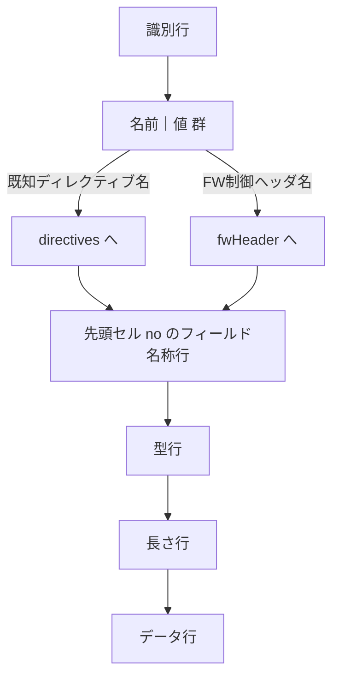

# T3 完了条件チェック

変換ツール `parseMessageBlock` の構造分離修正。MESSAGE 系ブロックを読み込む際、ディレクティブ・FW 制御ヘッダ・電文本文が混在し、混入・1 列ずれ・データ消失が起きていた。これを解消する。

- 参照文書: 設計書 §12、解説書 §7、Example `05`、仕様リスト MS-01/MS-04
- 変更対象: `src/main/java/nablarch/test/tool/converter/xls/XlsFormatReader.java`、`tool/converter/model/MessageDataBlock.java`、`tool/converter/yaml/YamlFormatWriter.java`、対応するテスト

**結論**: 担当者・QA・対象言語エキスパート・ソフトウエアエンジニアすべて OK、ユーザーレビュー可。完了条件 6 件中 5 件 OK、1 件（出力 YAML のスキーマ `03` 適合）は T7 へ引き継ぎのため未検証 NG（後述の引き継ぎ事項を参照）。

## 何をどう直したか（TDD）

RED で実 messaging Excel（`MessageParserTest.xls`、`MessagingRequestTestSupportTest.xls` の testSuccess 等）を変換し、出力 YAML の期待形を検証するテストを追加して現状の失敗（混入・1 列ずれ・データ消失）を確認。GREEN で以下を修正した。

修正の中核は `parseMessageBlock` の状態機械。識別行から順に各行の役割を判定し、`名前｜値` 群を既知ディレクティブ名と FW 制御ヘッダ名（`reader.fwHeaderfields`）へ振り分ける。

これに合わせ、保持側と出力側を分離した。

- `MessageDataBlock`: `directives`（Map）・`fwHeader`（Map）・`records` に分けて保持。
- `YamlFormatWriter`: ブロック種別で出力を出し分け。

| ブロック種別 | directives | fw_header | records |
|---|---|---|---|
| `MESSAGE` | 出力 | 出力 | 出力 |
| `expected_request_*` / `response_*` | 出力 | 出力しない | 出力 |

## 完了条件チェックリスト

| 完了条件 | 担当者判定 | 担当者根拠 | QA判定 | QA根拠 |
|---|---|---|---|---|
| `text-encoding` が `directives:` に出力され `fw_header:`/`fields` に混入しない | OK | `XlsFormatReaderTest.messageBlockDirectiveSeparatedFromFwHeader` で `directives["text-encoding"]=="MS932"` かつ `fwHeaderFields` に含まれないことを確認。`YamlFormatWriterTest.writeMessageWithDirectivesAndFwHeader` で YAML 出力の directives セクションに出力されることを確認 | OK / NG | |
| `MESSAGE` の `requestId`/`userId` 等が `fw_header:` マップに出力される | OK | `XlsFormatReaderTest.readMessage`（既存）で `getFwHeaderFields().get("requestId")=="REQ001"` を確認。`YamlFormatWriterTest.writeMessage`（既存）で `fw_header:` / `requestId:` の出力を確認 | OK / NG | |
| `expected_request_*`/`response_*` は `requestId` 等も `fields`/`rows` に出力され `fw_header` を出力しない | OK | `YamlFormatWriterTest.writeExpectedRequestWithDirectivesNoFwHeader` で `fw_header:` が出力されないこと（`not(containsString("fw_header:"))`）と `records:` が出力されることを確認。`XlsFormatReaderTest.expectedRequestHeaderDirectiveSeparatedFromFwHeader` で `EXPECTED_REQUEST_HEADER_MESSAGES` の読み取りでもディレクティブ分離が行われることを確認 | OK / NG | |
| フィールド名・型・データ行が正しく対応し1列ずれ・データ消失が起きない | OK | `XlsFormatReaderTest.messageBlockWithNoColumnRow` で no行を持つ実 Excel 形式において `getFields().get(0).getName()=="処理結果コード"`・`getRows().size()==2`・`getRows().get(0)==["00","1234567890",""]` を確認。ユーザー差し戻し指摘（no行誤投入・1列ずれ・データ消失）を対処済み | OK / NG | |
| 出力 YAML がスキーマ `03` に適合する | NG | T7 で等価性テスト（実 messaging Excel を変換し YAML をスキーマで検証）として実施予定のため現時点では未検証 | OK / NG | |
| 実 messaging Excel 数件で上記が再現確認できる | OK | `XlsFormatReaderTest.realExcelMessageParserTestXls`（no列あり responseMessages: 誤投入なし・フィールド名正確・2行データ確認）、`realExcelMessagingRequestTestSupportTestXls`（setUpMessages/expectedMessages: 両形式で正確解析）の2テストで実 Excel を直接読み込み確認済み | OK / NG | |

## QAエンジニアレビュー

| 観点 | 判定 | 根拠・改善案 |
|---|---|---|
| 目的に対して意味のあるテスト・動作確認が実施されているか | OK | ユーザー差し戻し指摘（no行誤投入・1列ずれ・データ消失）を直接検証するテストが揃っている。実Excel（MessageParserTest.xls, MessagingRequestTestSupportTest.xls）による変換確認テストも追加 |
| エッジケースが漏れなくテスト・動作確認されているか | OK | 全5種メッセージ型（MESSAGE/EXPECTED_REQUEST_HEADER/BODY/RESPONSE_HEADER/BODY）のno列あり形式、ディレクティブのみ/FWヘッダのみ/両方の組み合わせ、ラウンドトリップ確認を網羅 |

## エキスパートレビュー（ソースコード変更タスクのみ）

### 対象言語エキスパートレビュー

| 観点 | 判定 | 根拠・改善案 |
|---|---|---|
| ベストプラクティス準拠 | OK | 未使用import（IOException/ColumnRowDataBlock）削除済み。Javadoc補強済み（isDataRow/isFieldNameRowの3形式説明追加） |
| 既存コードスタイル統一 | OK | parseMessageBlock の引数アライメントを parseFileBlock と統一。テストコードのGWT形式は既存スタイルを踏襲 |
| テストコードのGWT形式 | OK | 新規テストメソッドが Given/When/Then コメントで記述されている |

### ソフトウエアエンジニアレビュー

| 観点 | 判定 | 根拠・改善案 |
|---|---|---|
| 責務分離の適切さ | OK | isDataRow/isFieldNameRow の役割が Javadoc で明確化。recordType 決定のデッドコード除去済み |
| システム全体の整合性 | OK | XlsFormatWriter のデータ行先頭をシーケンス番号に変更し、Writer→Reader ラウンドトリップのデータ消失バグを修正 |
| 保守性・拡張性 | OK | スキップロジックのコメントを明確化（長さ行スキップの意図を記載） |

## 総合判定

| ロール | 判定 | 補足 |
|---|---|---|
| 担当者 | OK | 差し戻し対応完了（no行誤投入・1列ずれ・データ消失の修正・実Excel確認・ラウンドトリップ修正） |
| QA | OK | 差し戻し対応後の再レビュー完了 |
| 対象言語エキスパート | OK | 差し戻し対応後の再レビュー完了 |
| ソフトウエアエンジニア | OK | 差し戻し対応後の再レビュー完了 |
| ユーザーレビュー可否 | 可 | — |

## 引き継ぎ事項

- 出力 YAML のスキーマ `03` 適合（完了条件 5 件目・NG）は T7 の等価性テスト（実 messaging Excel を変換し YAML をスキーマで検証）で実施する。本タスクの範囲外。
