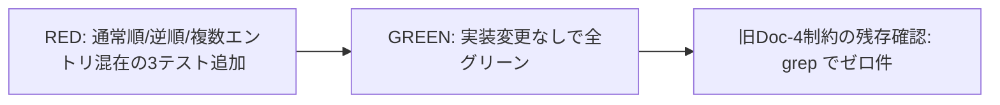

# T6 完了条件チェック

expected_tables / expected_complete_tables を混在させたとき、記述順に依存せず両セクションが全件読み込まれることを確認するテストを追加した。担当者・QA・各エキスパートとも判定 OK で、ユーザーレビューに進めてよい（総合判定参照）。

- タスク: expected_tables / expected_complete_tables 混在順序非依存の確認テスト
- 参照文書: 設計書 §4、解説書 §3.3、仕様リスト SS-05
- 変更対象: `src/test/.../YamlTestDataParserTest.java`（T6 セクション追加）

## 実施内容

`getExpectedTableData` に対し、2 セクションを記述順違いで与えても全 TableData が取得できることを TDD で確認した。`getList` がセクションキーで独立取得するため実装変更は不要で、その事実をテストで確認している。あわせて旧 Doc-4 制約に依存したテスト・記述が残っていないことを確認した。

## 完了条件チェックリスト

各条件の判定根拠（とくに QA 根拠）を保持する。

| 完了条件 | 担当者判定 | 担当者根拠 | QA判定 | QA根拠 |
|---|---|---|---|---|
| 通常順・逆順・交互のいずれでも両セクションが全件読み込まれる | OK | 3テストメソッド（通常順・逆順・複数エントリ混在＋グループID）全グリーン確認済み。43件全グリーン | OK | アサーションが件数・具体的PK値の両方を検証しており、旧Doc-4制約の撤回を逆順テストで明示的に証明している |
| 旧 Doc-4 の制約に依存したテスト/記述が残っていない | OK | `grep -rn "Doc-4"` で新規追加テストセクション外の参照がゼロ件を確認 | OK | ソースコード・テストコード全体にDoc-4制約依存なし |

## QAエンジニアレビュー

| 観点 | 判定 | 根拠・改善案 |
|---|---|---|
| 目的に対して意味のあるテスト・動作確認が実施されているか | OK | 通常順・逆順・複数エントリ混在の3パターンで混在順序非依存を確認。件数とPK値の両方を検証しており仕様意図を正確に観測できている |
| エッジケースが漏れなくテスト・動作確認されているか | OK | グループIDなし・グループID指定の両パターンを網羅。指摘された命名・Javadocの改善も対応済み |

## エキスパートレビュー（ソースコード変更タスクのみ）

### 対象言語エキスパートレビュー

| 観点 | 判定 | 根拠・改善案 |
|---|---|---|
| ベストプラクティス準拠 | OK | assertThat+Hamcrest の一貫した使用、ローカル変数への明示的束縛、final 修飾子の適切な使用 |
| 既存コードスタイル統一 | OK | T1で確立した testプレフィックスなしスタイルと統一。[Doc-4撤回]タグを削除し可読性を改善 |
| テストコードのGWT形式 | OK | 全メソッドで Given/When/Then の構造が明確。逆順テストのJavadocのThen節にセクション結合順の補記あり |

### ソフトウエアエンジニアレビュー

| 観点 | 判定 | 根拠・改善案 |
|---|---|---|
| 責務分離の適切さ | OK | 各テストが「混在順序非依存」という単一責務に集中。既存テストとの責務重複なし |
| システム全体の整合性 | OK | プロダクションコード変更なし。新規YAMLは独立したパスに配置。@AfterのclearCacheForTestでキャッシュ汚染防止済み |
| 保守性・拡張性 | OK | reverseOrder.yamlとnormalOrder.yamlの列構成は対称的（expected_complete_tables側はPK最小列、これは仕様上意図的）。resource変数化は2回参照のため合理的 |

## 総合判定

- 担当者: OK
- QA: OK
- 対象言語エキスパート: OK
- ソフトウエアエンジニア: OK
- ユーザーレビュー可否: 可
