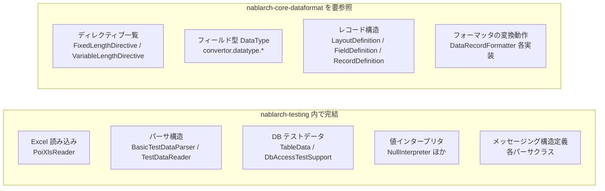

# NTF テストデータ仕様 カバレッジ クラス一覧

YAML スキーマ設計の根拠調査（P4）で、全行走査の対象クラスを引くための一覧。調査範囲・外部依存・各クラスの関連度をパッケージ単位で参照する。

- **リポジトリ**: `nablarch-testing`（`com.nablarch.framework:nablarch-testing`）
- **調査日**: 2026-05-15
- **ブランチ**: `convert-testdata-excel-to-text`

---

## 0. 調査範囲（P4-0）

### このリポジトリだけで仕様を把握できるか

**結論: 把握しきれない。`nablarch-core-dataformat` の参照も要る。**

ただし YAML スキーマ設計の主目的「テストデータの構造（どの項目をどう書くか）」は、本リポジトリのパーサ・インタープリタクラスで大半を把握できる。フォーマッタ本体（バイト列変換ロジック）は外部にあるが、YAML スキーマが扱うのは「フォーマット定義のテスト記述」であり、変換ロジックの詳細を YAML に落とす必要はない。

### 仕様がどこにあるか

`nablarch-core-dataformat` 側の仕様（ディレクティブ・フィールド型）は、設計済みスキーマ（`ntf-testdata-yaml-schema.json`）・設計文書（`ntf-testdata-yaml-design.md`）・構造解析文書（`ntf-testdata-structure.md`）に取り込み済みの内容を参照して補完する。

### 外部依存

| artifactId | scope | テストデータ仕様への関わり |
|---|---|---|
| `nablarch-core-dataformat` | compile（`nablarch-fw-web-extension` からは exclude 済み） | **重要**: 固定長・可変長フォーマットの定義・変換ロジック本体。`LayoutDefinition`, `FieldDefinition`, `DataRecordFormatter`, `FixedLengthDataRecordFormatter`, `VariableLengthDataRecordFormatter` 等を提供 |
| `nablarch-fw-messaging-mom` | provided | メッセージング系テストデータ（`MessagePool`, `MockMessagingClient` 等が依存）|
| `nablarch-fw-messaging-http` | provided | HTTP メッセージング系テストデータ |
| `nablarch-common-dao` | compile | DB テストデータ（`TableData` 等が依存）|
| `org.apache.poi:poi-ooxml:3.8` | compile | Excel 読み込み（`PoiXlsReader` が直接使用）。本リポジトリ内で完結 |

`nablarch-core-dataformat` のクラスを直接 import して使うのは次の 19 クラス。

| パッケージ | クラス |
|---|---|
| `nablarch.test.core.file`（10）| `DataFile`, `DataFileFragment`, `FixedLengthFile`, `FixedLengthFileFragment`, `VariableLengthFile`, `VariableLengthFileFragment`, `FileSupport`, `MockMessages`, `StringDataType`, `TestDataConverter` |
| `nablarch.test.core.reader`（2）| `FixedLengthFileParser`, `VariableLengthFileParser` |
| `nablarch.test.core.messaging`（6）| `MessagePool`, `MessagingRequestTestSupport`, `MockMessagingClient`, `RequestTestingMessagePool`, `RequestTestingMessagingClient`, `RequestTestingMessagingProvider`, `SendSyncSupport` |
| その他（1）| `nablarch.test.Assertion` |

使用される外部クラス（計 23 種）:
`DataRecord`, `DataRecordFormatter`, `DataRecordFormatterSupport`, `DataRecordFormatterSupport.Directive`, `FieldDefinition`, `FileRecordWriter`, `FormatterFactory`, `LayoutDefinition`, `RecordDefinition`, `FixedLengthDataRecordFormatter`, `FixedLengthDataRecordFormatter.FixedLengthDirective`, `VariableLengthDataRecordFormatter`, `VariableLengthDataRecordFormatter.VariableLengthDirective`, `InvalidDataFormatException`, `SimpleDataConvertResult`, `SimpleDataConvertUtil`, `convertor.ConvertorFactorySupport`, `convertor.FixedLengthConvertorSetting`, `convertor.VariableLengthConvertorSetting`, `convertor.datatype.ByteStreamDataSupport`, `convertor.datatype.Bytes`, `convertor.datatype.CharacterStreamDataString`, `convertor.datatype.DataType`

> [要確認] `messaging` の依存クラスは表で 7 クラス挙げているが見出しは「6クラス」。原文どおり保持（元文書の記載差）。

---

## 1. 対象クラス一覧（P4-1） — `src/main/java`

### 関連度の凡例

- **直接影響**: YAML スキーマの構造・制約・有効値に直接関わる仕様を持つ
- **参照情報**: スキーマ設計の背景理解に有用だが、スキーマ項目の直接根拠にはならない
- **対象外**: テストデータ構造定義と無関係（テスト実行支援・HTTP 処理・HTML 検証等）

P4-2 の全行走査対象は、本節の「直接影響」クラスのみ。

### 1.1 `nablarch.test.core.reader`

| クラス | 種別 | 関連度 | 役割・スキーマへの影響 |
|---|---|---|---|
| `DataType` | enum | **直接影響** | セクション識別キー（`SETUP_TABLE`, `EXPECTED_TABLE`, `EXPECTED_COMPLETE_TABLE`, `LIST_MAP`, `SETUP_FIXED`, `EXPECTED_FIXED`, `SETUP_VARIABLE`, `EXPECTED_VARIABLE`, `MESSAGE`, `EXPECTED_REQUEST_HEADER_MESSAGES`, `EXPECTED_REQUEST_BODY_MESSAGES`, `RESPONSE_HEADER_MESSAGES`, `RESPONSE_BODY_MESSAGES`）の完全一覧を定義 |
| `TestDataParsingTemplate` | abstract class | **直接影響** | コメント行（`//` 行スキップ）・セクション先頭一致マッチング規則を実装。値変換はインタープリタ群に委譲 |
| `GroupDataParsingTemplate` | abstract class | **直接影響** | グループID付きセクション識別構文 `TYPE_NAME[groupId]=value` の解析。グループID省略不可の根拠 |
| `SingleDataParsingTemplate` | abstract class | 参照情報 | 単一IDの完全一致参照方式の実装 |
| `HeaderLine` | class | **直接影響** | `[xxx]` 形式のマーカーカラムを除外してカラム名一覧を構築。`[MARKER_COL]` 構文の根拠 |
| `TableDataParser` | class | **直接影響** | `SETUP_TABLE` / `EXPECTED_TABLE` / `EXPECTED_COMPLETE_TABLE` セクション解析。セクション行→カラム名行→データ行の順序を確定 |
| `ListMapParser` | class | **直接影響** | `LIST_MAP` セクション解析。キー名行→データ行の構造を確定 |
| `MessageParser` | class | **直接影響** | `MESSAGE` セクション解析。`record_type` 先頭カラムを常に `"default"` へ強制置換。FWヘッダフィールド名（`requestId`, `userId`, `resendFlag`, `resultCode`）を定義 |
| `SendSyncMessageParser` | class | **直接影響** | `MessageParser` を継承。第2カラムに `errorMode:timeout` または `errorMode:msgException` という特殊値を解釈 |
| `GroupMessageParser` | class | **直接影響** | グループメッセージセクションを複数ブロックとして解析。`SendSyncMessageParser` に委譲 |
| `DataFileParser` | abstract class | **直接影響** | ファイルセクションの行順序（ディレクティブ/フィールド名行→型行→長さ行→値行）を状態機械で実装 |
| `FixedLengthFileParser` | class | **直接影響** | `SETUP_FIXED` / `EXPECTED_FIXED` セクション用。有効ディレクティブキーを `FixedLengthDirective` で判定 |
| `VariableLengthFileParser` | class | **直接影響** | `SETUP_VARIABLE` / `EXPECTED_VARIABLE` セクション用。**長さ行をスキップ**（フィールド長不要）。有効ディレクティブキーを `VariableLengthDirective` で判定 |
| `BasicTestDataParser` | class | 参照情報 | `TestDataParser` の主要実装。各セクションへの委譲構造の確認に利用 |
| `DbLessTestDataParser` | class | 対象外 | DBなし用パーサ。スキーマ構造に影響なし |
| `TestDataParser` | interface | 対象外 | 高レベル読み込みインタフェース。スキーマ構造に直接影響なし |
| `TestDataReader` | interface | 対象外 | 低レベル読み込みインタフェース。スキーマ構造に直接影響なし |
| `PoiXlsReader` | class | 対象外 | Excel読み込み実装。YAMLスキーマとは無関係 |

### 1.2 `nablarch.test.core.file`

| クラス | 種別 | 関連度 | 役割・スキーマへの影響 |
|---|---|---|---|
| `DataFile` | abstract class | **直接影響** | ファイル全体の基底。`file-type`, `record-separator`, `text-encoding` 等の共通ディレクティブ処理を担う |
| `DataFileFragment` | abstract class | **直接影響** | レコード種別ひとまとまりの基底。フィールド名/型/長さ/値の4要素を保持。フィールド長 `-`（`ONDEMAND_CALC_FIELD_SIZE`）特殊値の実装 |
| `FixedLengthFile` | class | **直接影響** | 固定長ファイル実体。`FixedLengthDirective` で有効ディレクティブを決定。レコード長を自動計算 |
| `FixedLengthFileFragment` | class | 参照情報 | 固定長レコード種別実体。バイナリ型フィールドのゼロ埋め処理の根拠 |
| `VariableLengthFile` | class | **直接影響** | 可変長ファイル実体。デフォルトフィールド区切り `,`。`\\t` → タブ文字変換を実装 |
| `VariableLengthFileFragment` | class | 参照情報 | 可変長レコード種別実体。長さ行不要の実装上の根拠 |
| `BasicDataTypeMapping` | class | **直接影響** | 設計書データ型記法→フレームワークシンボル変換のデフォルト実装。有効な設計書記法**22種**を定義（`半角英字`→`X`, `全角`→`N`, `数値`→`Z`, `符号付パック10進数`→`SP`, `バイナリ`→`B` 等）|
| `DataTypeMapping` | interface | 参照情報 | カスタムデータ型マッピングの拡張ポイント |
| `LineSeparator` | enum | **直接影響** | `record-separator` ディレクティブの有効値。`NONE` / `CR` / `LF` / `CRLF` のほか列挙名以外の文字列もリテラルとして使用可能 |
| `MockMessages` | class | 参照情報 | `FixedLengthFile` の同期送信テスト用サブクラス。`errorMode:*` 特殊値がパディング処理を受けない実装根拠 |
| `StringDataType` | class | 参照情報 | テスト用 `TEST_` プレフィクスシンボルの動作（パディングなし・サイズ不一致で例外）の根拠 |
| `TestDataConverter` | interface | 参照情報 | カスタム変換処理の拡張ポイント（`TestDataConverter_{file-type}` キーで登録）|
| `FileSupport` | class | 対象外 | テスト実行サポートユーティリティ。スキーマ構造に影響なし |

### 1.3 `nablarch.test.core.messaging`

| クラス | 種別 | 関連度 | 役割・スキーマへの影響 |
|---|---|---|---|
| `RequestTestingMessagingClient` | class | **直接影響** | `EXPECTED_REQUEST_HEADER_MESSAGES`, `EXPECTED_REQUEST_BODY_MESSAGES`, `RESPONSE_HEADER_MESSAGES`, `RESPONSE_BODY_MESSAGES` の4セクションを使用するHTTP系リクエスト単体テストのモック。送信電文のアサートと応答電文の返却を担う |
| `MockMessagingContext` | class | 参照情報 | MOMメッセージングのアクセスパスA（`group_message_data` 経由）。`requestId` フィールド必須の根拠 |
| `MockMessagingClient` | class | 参照情報 | HTTP系メッセージングのアクセスパスB。`statusCode` デフォルト `200` の根拠 |
| `RequestTestingMessagePool` | class | 参照情報 | `errorMode:timeout` → `null` 返却、`errorMode:msgException` → `MessagingException` スローの動作確認 |
| `SendSyncSupport` | class | **直接影響** | テストデータ配置規則：`sendSyncTestData` ベースパス配下の `{requestId}/message` シートからデータを取得。配置場所の仕様を確定 |
| `MessagePool` | class | 参照情報 | MESSAGEセクションデータの実体。テストショット毎のメッセージ管理 |
| `RequestTestingMessagingProvider` | class | 参照情報 | `RequestTestingMessagingClient` と同仕様のMOM系実装 |
| `MessagingRequestTestSupport` | class | 対象外 | テスト実行サポート。スキーマ構造に影響なし |
| `MessagingReceiveTestSupport` | class | 対象外 | 受信テストサポート。スキーマ構造に影響なし |
| `EmbeddedMessagingProvider` | class | 対象外 | 組み込みメッセージングプロバイダ。スキーマ構造に影響なし |
| `MQSupport` | class | 対象外 | MQサポートユーティリティ。スキーマ構造に影響なし |
| `MockMessagingProvider` | class | 対象外 | コンポーネント設定クラス。スキーマ構造に影響なし |
| `AsyncMessageSendActionForUt` | class | 対象外 | 非同期送信アクション。スキーマ構造に影響なし |
| `RequestTestingSendSyncSupport` | class | 対象外 | リクエストテスト用同期送信サポート。スキーマ構造に影響なし |

### 1.4 `nablarch.test.core.db`

| クラス | 種別 | 関連度 | 役割・スキーマへの影響 |
|---|---|---|---|
| `TableData` | class | **直接影響** | テーブルデータの実体。日付デフォルトフォーマット `yyyyMMddHHmmssSSS`。`fillDefaultValues()` で省略カラムにデフォルト値補完（`EXPECTED_COMPLETE_TABLE` 用）|
| `DbAccessTestSupport` | class | 対象外 | テスト実行サポート。スキーマ構造に影響なし |
| `BasicDefaultValues` | class | 対象外 | デフォルト値設定クラス |
| `DefaultValues` | interface | 対象外 | デフォルト値インタフェース |
| その他（`DbInfo`, `EntityDependencyParser` 等）| class | 対象外 | DB操作ユーティリティ群 |

### 1.5 `nablarch.test.core.util.interpreter`

| クラス | 種別 | 関連度 | 役割・スキーマへの影響 |
|---|---|---|---|
| `NullInterpreter` | class | **直接影響** | 文字列 `"null"`（大文字小文字不問）を Java の `null` へ変換。YAMLネイティブ `null` との使い分け仕様の根拠 |
| `QuotationTrimmer` | class | **直接影響** | 半角/全角ダブルクォートで囲まれた値の前後クォートを除去。Excelでの文字列エスケープ記法の根拠 |
| `DateTimeInterpreter` | class | **直接影響** | `${systemTime}` → システム時刻、`${setUpTime}` → DBセットアップ時刻、`${updateTime}` → DB更新時刻 へ変換 |
| `LineSeparatorInterpreter` | class | **直接影響** | デフォルト設定で `\\r` パターンを CR（`\r`）に置換。改行コードのエスケープ記法の根拠 |
| `BinaryFileInterpreter` | class | **直接影響** | `${binaryFile:相対パス}` 記法をファイルのバイナリ内容（16進数文字列）に変換 |
| `BasicJapaneseCharacterInterpreter` | class | **直接影響** | `${文字種,文字数}` 記法を指定文字種の文字列に変換。`BasicJapaneseCharacterGenerator` に委譲 |
| `CompositeInterpreter` | class | **直接影響** | 複数の `${...}` 記法を含む値（例: `${半角数字,4}-${半角数字,4}`）を分解・個別解釈・連結 |
| `TestDataInterpreter` | interface | 参照情報 | インタープリタ拡張ポイント |
| `InterpretationContext` | class | 対象外 | 内部実装クラス |

### 1.6 `nablarch.test.core.util.generator`

| クラス | 種別 | 関連度 | 役割・スキーマへの影響 |
|---|---|---|---|
| `BasicJapaneseCharacterGenerator` | class | **直接影響** | `BasicJapaneseCharacterInterpreter` から利用される文字生成実装。サポートされる文字種トークンの完全一覧を定義 |
| `JapaneseCharacterSet` | enum | **直接影響** | 文字種トークンの enum。`半角英字`, `全角`, `半角数字` 等の有効トークン名を確定 |
| `CharacterGenerator` | interface | 参照情報 | 文字生成拡張インタフェース |
| `CharacterGeneratorBase` | abstract class | 参照情報 | 文字生成基底クラス |

### 1.7 対象外パッケージ（全クラス）

テストデータ構造定義とは無関係なため P4-2 の対象外。

| パッケージ | 理由 |
|---|---|
| `nablarch.fw.web` | HTTPモック・サーバ実装 |
| `nablarch.test.core.http` | HTTPリクエストテスト実行サポート |
| `nablarch.test.core.batch` | バッチリクエストテスト実行サポート |
| `nablarch.test.core.entity` | エンティティバリデーションテストサポート |
| `nablarch.test.core.integration` | 統合テストサポート |
| `nablarch.test.core.log` | ログ検証サポート |
| `nablarch.test.core.repository` | リポジトリ設定ブラウザ |
| `nablarch.test.core.standalone` | スタンドアロンテストサポート |
| `nablarch.test.tool.htmlcheck` | HTML構文チェックツール |
| `nablarch.test.tool.sanitizingcheck` | サニタイズチェックツール |
| `nablarch.test.event` | テストイベントリスナ |
| `nablarch.test`（ルート）| テスト基底ユーティリティ（`TestSupport`, `Assertion` 等）|

### 1.8 直接影響クラス 集計

| パッケージ | 直接影響クラス数 | 主要な仕様 |
|---|---|---|
| `reader` | 11 | セクション識別、行順序、record_type強制化、errorMode特殊値 |
| `file` | 6 | ディレクティブ有効値、データ型マッピング17種、record-separator有効値 |
| `messaging` | 2 | 4セクションの役割定義、配置規則 |
| `db` | 1 | 日付フォーマット |
| `interpreter` | 7 | null/クォート/日時/改行/バイナリ/文字生成の特殊値記法 |
| `generator` | 2 | 文字種トークン完全一覧 |
| **合計** | **29** | |

> [要確認] データ型マッピングの種数は、1.2 の `BasicDataTypeMapping` 行が「22種」、本集計表が「17種」で不一致。両方とも原文の記載どおり保持。正値の確定が必要。

---

## 2. `src/test/java` クラス一覧（P4-1 追補）

### 2.1 分類方針

テストクラスはスキーマ仕様の根拠にはならない（テストは実装の動作確認であり、仕様定義は `src/main/java` 側にある）。ただし `src/main/java` のコードだけでは挙動が読み取りにくい場合、テストコードが補助的な証拠になる。

**凡例（`src/test/java` 向け）**

- **参照情報**: テストケースが仕様の境界値・特殊ケースを明示しており、`src/main/java` 仕様確認の補助に使える
- **対象外**: テストデータ構造定義と直接無関係。P4-2 の全行走査対象にしない

P4-2 の全行走査対象は **`src/main/java` の「直接影響」29クラスのみ**。

### 2.2 `nablarch.test.core.reader`（11クラス）

| クラス | 関連度 | 備考 |
|---|---|---|
| `BasicTestDataParserTest` | 参照情報 | 914行。各セクション識別・パース動作の網羅的テスト。未明確な仕様確認の補助に使える |
| `DataTypeTest` | 対象外 | `DataType.getName()`/`getType()` の基本動作確認のみ |
| `DbLessTestDataParserTest` | 対象外 | DBなしパーサのテスト。スキーマ構造に影響なし |
| `FixedLengthFileParserTest` | 参照情報 | 固定長パーサの境界値テスト。ディレクティブ処理の補助確認に使える |
| `HeaderLineTest` | 参照情報 | `[MARKER_COL]` 処理の境界値テスト。マーカーカラム仕様確認に使える |
| `MockTestDataReader` | 対象外 | テスト用スタブ実装 |
| `PoiXlsReaderTest` | 対象外 | Excel読み込みテスト。YAML スキーマと無関係 |
| `SendSyncMessageParserTest` | 対象外 | `getFwHeader()` の例外確認のみ（17行）|
| `SingleDataParsingTemplateTest` | 対象外 | 単一IDパースの動作テスト |
| `TestDataParsingTemplateTest` | 参照情報 | コメント行スキップ・セクション先頭一致の境界値テスト |
| `VariableLengthFileParserTest` | 参照情報 | 可変長パーサの長さ行スキップ動作確認に使える |

### 2.3 `nablarch.test.core.file`（9クラス）

| クラス | 関連度 | 備考 |
|---|---|---|
| `BasicDataTypeMappingTest` | 参照情報 | データ型マッピング17種の境界値テスト。有効型記法確認に使える |
| `DataFileTest` | 参照情報 | 共通ディレクティブ（`file-type`, `text-encoding` 等）の動作テスト |
| `FileSupportTest` | 対象外 | テスト実行サポートのテスト |
| `FileSupportWithDbLessTestDataParserTest` | 対象外 | DBなし用ファイルサポートのテスト |
| `FixedLengthFileFragmentTest` | 参照情報 | バイナリ型ゼロ埋め・パディングの境界値確認に使える |
| `FixedLengthFileTest` | 参照情報 | 固定長ファイル書き込み動作の網羅的テスト（241行）。ディレクティブ動作確認に使える |
| `LineSeparatorTest` | 対象外 | `LineSeparator` enum の基本確認のみ |
| `SimpleWriter` | 対象外 | テスト用ヘルパークラス（スタブ）|
| `VariableLengthFileTest` | 参照情報 | 可変長ファイルのデフォルト区切り・`\\t` → タブ変換等の確認に使える |

### 2.4 `nablarch.test.core.messaging`（15クラス + サンプル21クラス）

| クラス | 関連度 | 備考 |
|---|---|---|
| `MessageParserTest` | 参照情報 | `record_type` 強制置換・FWヘッダフィールド名の境界値確認に使える |
| `MessagePoolTest` | 対象外 | メッセージプール管理テスト |
| `MockMessagingClientTest` | 参照情報 | `statusCode` デフォルト `200`・アクセスパスBの確認に使える |
| `MockMessagingContextTest` | 参照情報 | `requestId` 必須・アクセスパスAの確認に使える |
| `RequestTestingMessagingClientTest` | 参照情報 | 4セクション使用動作の確認に使える |
| `RequestTestingSendSyncSupportTest` | 参照情報 | テストデータ配置規則の確認に使える |
| `AsyncMessageSendActionForUtTest` | 対象外 | スキーマ構造に影響なし |
| `EmbeddedMessagingProviderTest` | 対象外 | スキーマ構造に影響なし |
| `MessagingReceiveTestSupportTest` | 対象外 | スキーマ構造に影響なし |
| `MessagingRequestTestSupportTest` | 対象外 | スキーマ構造に影響なし |
| `MockMessagingProviderTest` | 対象外 | スキーマ構造に影響なし |
| `RequestTestingMessagingContextTest` | 対象外 | スキーマ構造に影響なし |
| `RequestTestingMessagingProviderTest` | 対象外 | スキーマ構造に影響なし |
| `RequestTestingSendSyncBatchTest` | 対象外 | スキーマ構造に影響なし |
| `HttpStatusSyncMessagingEventHook` | 対象外 | テスト用フッククラス |
| `sample/` 配下（21クラス）| 対象外 | テスト用サンプルアクション・フォームクラス群。スキーマ構造に影響なし |
| `receive/form/RM11AC0001Form` | 対象外 | テスト用フォームクラス |

### 2.5 `nablarch.test.core.db`（38クラス）

| クラス群 | 関連度 | 備考 |
|---|---|---|
| `TableDataTest` | 参照情報 | 日付フォーマット・`rows:[]` 全件削除・`EXPECTED_COMPLETE_TABLE` デフォルト補完の境界値確認に使える |
| `TableDataTestForPostgreAndDB2` | 参照情報 | DB依存動作の補助確認（PostgreSQL/DB2向け）|
| `BasicDefaultValuesTest` | 対象外 | デフォルト値設定のテスト |
| `DbAccessTestSupportTest` | 対象外 | テスト実行サポートのテスト |
| `EntityDependencyParserTest` | 対象外 | エンティティ依存パーサのテスト |
| `EntityTestSupportTest` | 対象外 | エンティティテストサポートのテスト |
| `GenericJdbcDbInfo*` 系 | 対象外 | JDBC DB情報テスト群 |
| `MasterDataRestorer/SetUpperTest` | 対象外 | マスタデータ管理テスト |
| `MessageComparatorTest` | 対象外 | メッセージ比較テスト |
| `MockConnection`, `MockDefaultValues` | 対象外 | テスト用スタブクラス |
| `SqlLogWatchingFormatterTest` | 対象外 | SQLログフォーマッタのテスト |
| `TableDataSorterTest` | 対象外 | テーブルデータソートのテスト |
| `TransactionTemplateTest` | 対象外 | トランザクションテンプレートのテスト |
| `TableRestorerTest` | 対象外 | テーブルリストアのテスト |
| `*Table`, `*SsdMaster`, `Father`, `Son`, `Daughter` 等のエンティティクラス群 | 対象外 | テスト用エンティティ定義クラス（18クラス）|

### 2.6 `nablarch.test.core.util.interpreter`（8クラス）

| クラス | 関連度 | 備考 |
|---|---|---|
| `NullInterpreterTest` | 参照情報 | 大文字小文字不問の `"null"` → `null` 変換境界値の確認に使える |
| `QuotationTrimmerTest` | 参照情報 | 半角/全角ダブルクォート除去の境界値確認に使える |
| `DateTimeInterpreterTest` | 参照情報 | `${systemTime}` 等の記法変換の境界値確認に使える |
| `LineSeparatorInterpreterTest` | 参照情報 | `\\r` → CR 変換の境界値確認に使える |
| `BinaryFileInterpreterTest` | 参照情報 | `${binaryFile:...}` 記法の境界値確認に使える |
| `BasicJapaneseCharacterInterpreterTest` | 参照情報 | 文字種記法の境界値・エラーケース確認に使える |
| `CompositeInterpreterTest` | 参照情報 | 複合 `${...}` 記法の境界値確認に使える |
| `InterpretationContextTest` | 対象外 | 内部実装クラスのテスト |

### 2.7 `nablarch.test.core.util.generator`（2クラス）

| クラス | 関連度 | 備考 |
|---|---|---|
| `BasicJapaneseCharacterGeneratorTest` | 参照情報 | 文字種トークン一覧の境界値・エラーケース確認に使える |
| `RandomStringGeneratorTest` | 対象外 | スキーマ構造に影響なし |

### 2.8 残パッケージ（全クラス対象外）

| パッケージ | クラス数 | 理由 |
|---|---|---|
| `nablarch.test.core.http` + サブパッケージ | 10 + 12 | HTTPリクエストテスト実行サポート・HTMLパーサ実装 |
| `nablarch.test.core.batch` | 8 | バッチリクエストテスト実行サポート |
| `nablarch.test.core.entity` | 14 | エンティティバリデーションテストサポート |
| `nablarch.test.core.log` | 4 | ログ検証サポート |
| `nablarch.test.core.standalone` | 1 | スタンドアロンテストサポート |
| `nablarch.test.core.util` | 4 | 汎用ユーティリティテスト（ByteArrayAwareMap等）|
| `nablarch.test.event` | 2 | テストイベントリスナ |
| `nablarch.test` | 17 | テスト基底ユーティリティのテスト群 |
| `nablarch.test.tool.htmlcheck` | 4 + 1 | HTML構文チェックツールのテスト |
| `nablarch.test.tool.sanitizingcheck` + サブパッケージ | 6 + 2 | サニタイズチェックツールのテスト |
| `nablarch.fw.web` + サブパッケージ | 2 + 2 | HTTPモック実装のテスト |
| `nablarch.core.validation.*` | 8 + 17 + 1 | バリデーション実装のテスト（テストデータ構造と無関係）|
| `nablarch.common.validation` | 5 | バリデーション実装のテスト |
| `nablarch.core.message` | 1 | メッセージリソーステスト用スタブ |
| `nablarch.test.core`（ルート1クラス）| 1 | `MultiResourceDataSetUpTest`（マルチリソーステスト）|

### 2.9 集計

| パッケージ | 参照情報クラス数 | 対象外クラス数 | 合計 |
|---|---|---|---|
| `reader` | 5 | 6 | 11 |
| `file` | 5 | 4 | 9 |
| `messaging`（サンプル含む）| 6 | 30 | 36 |
| `db` | 2 | 36 | 38 |
| `interpreter` | 7 | 1 | 8 |
| `generator` | 1 | 1 | 2 |
| その他（http/batch/entity/log/tool/fw 等）| 0 | 129 | 129 |
| **合計** | **26** | **207** | **233** |

**P4-2 の全行走査対象外**: `src/test/java` 全 233 クラス。仕様根拠は `src/main/java` の「直接影響」29クラスにあり、テストコードは必要に応じて参照情報として参照する。
