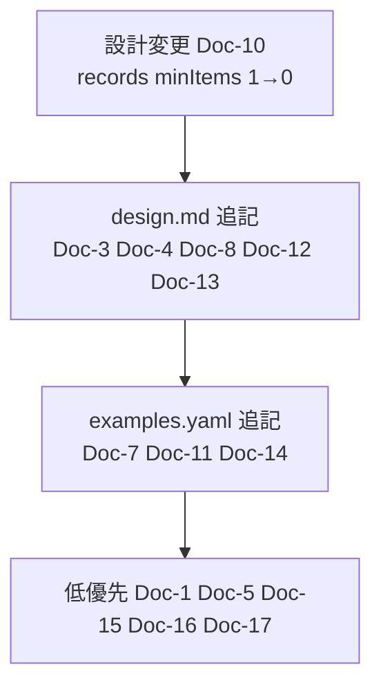

# NTF 公式解説書 × スキーマ設計 照合チェック

- **照合日**: 2026-05-15
- **解説書リポジトリ**: nablarch/nablarch-document
- **照合対象スキーマ**: ntf-testdata-yaml-schema.json / ntf-testdata-yaml-design.md / ntf-testdata-yaml-examples.yaml

公式解説書が定めるテストデータ仕様と、コード調査（P4-2）で作成した YAML スキーマ設計を突き合わせ、設計に未反映の仕様を洗い出した記録。読み手は YAML 対応の実装者（schema.json／design.md／examples.yaml の保守担当）。何を・どの優先度で・どのファイルに反映するかを決めて反映作業に入るために使う。結論と推奨で全体を把握し、必要な仕様の行を 4 章の比較表から引く。

---

## 1. 結論と推奨対応

解説書の仕様はコード調査の設計と概ね整合する。未反映は 17 項目（Doc-1〜Doc-17）で、内訳は **設計変更 1 件・design.md／schema.json への追記 13 件・examples.yaml への追記** に集約される。設計変更を要するのは 1 件のみで、残りは記述追加でカバーできる。

着手順は次のとおり。設計変更を先に確定し、実務でアサート失敗・読み込み中断を招く罠（Doc-3／Doc-4）を優先する。

| 優先 | # | 反映先 | 仕様の要点 |
|---|---|---|---|
| 設計変更 | Doc-10 | schema.json `file_data.records` の `minItems` を 1→0 / design.md に空ファイル表現を追記 | 空ファイル（0バイト）はディレクティブ行のみでレコード定義を省略。現行 `minItems:1` では表現不可 |
| 高 | Doc-3 | design.md §7（日付型カラムの記述形式）/ examples.yaml | `java.sql.Timestamp` 期待値は末尾 `.0` 必須（例 `2010-01-01 12:34:56.0`）。欠けるとアサート失敗 |
| 高 | Doc-4 | design.md（注意事項として追加） | `EXPECTED_TABLE` と `EXPECTED_COMPLETE_TABLE` を同一シート内で混在させると後半が読み込まれない。データタイプごとにまとめる |
| 中 | Doc-8 | design.md §7（特殊値の表現）/ examples.yaml | ダブルクォートでスペース値を明示（`"⊔"`→半角スペース）。`"""` でダブルクォート1文字を格納（QuotationTrimmer） |
| 中 | Doc-12 | design.md（ファイル系のデータ型説明）/ examples.yaml | 符号付/符号無数値型 `X9`/`SX9` は、パディング文字・符号を含めた固定長フォーマットの実値をそのまま記載 |
| 中 | Doc-13 | design.md §11（messaging の注意事項） | マルチレコード送信時はヘッダと本文の行数を一致させ、送信回数分ヘッダを繰り返す |
| 中 | Doc-7 | examples.yaml の特殊値一覧 / design.md AI向けプロンプト | `\\n`→LF(0x0A) の変換（`LineSeparatorInterpreter`）。`\\r`→CR は記載済みだが `\\n` が欠落 |
| 中 | Doc-11 | examples.yaml のバイナリ型フィールドの例 / design.md | バイナリ直接記述 `0x` プレフィクス付き16進数（例 `0x4AD`）。`0x` なしは文字列扱い |
| 中 | Doc-14 | design.md §18（SendSyncSupport）/ examples.yaml の response_*_messages 例 | 同一リクエストIDで複数回送信時は `no` の値を変えて連続記述し、送信順序と `no` 値順を一致させる |
| 中 | Doc-6 | design.md §7（日付型カラムの記述形式） | 日付フォーマット `yyyyMMddHHmmss`（12桁、ミリ秒省略）が有効。design.md に後置0埋めとして間接的に含まれるが明示なし |
| 低 | Doc-1 | design.md §4（EXPECTED_COMPLETE_TABLE の説明） | `BasicDefaultValues` の `charValue`/`numberValue`/`dateValue` をコンポーネント設定で変更可能。通常ユーザには不要 |
| 低 | Doc-5 | design.md §8（グループIDなしの説明） | グループID `default` はグループIDなし扱いと同等。バッチ固有 |
| 低 | Doc-15 | design.md §20（messaging のフォーマット定義） | HTTP 同期応答ボディは各行の文字列長が同一であることが必要（JSON/XML 制約） |
| 低 | Doc-16 | design.md §9（SingleData 系の制約） | LIST_MAP の `testShots` ID はバッチ単体テストの予約 ID として自動読み込み |
| 低 | Doc-17 | design.md AI向けプロンプト | 解説書の `${文字種,文字数}` は11種記載、実装は14種有効。差異を注記 |

加えて design.md 注意事項とスキーマ description に反映を要する 2 件（Doc-2／Doc-9）がある。

| 優先 | # | 反映先 | 仕様の要点 |
|---|---|---|---|
| 中 | Doc-2 | schema.json `table_data.rows` description / design.md 注意事項 | SETUP_TABLE では主キーカラム省略不可（登録系は全カラム記述）。EXPECTED_TABLE では省略カラムは比較対象外 |
| 中 | Doc-9 | schema.json `fields` description / design.md | 固定長/可変長で、異なるレコード種別間は同一フィールド名が存在してよい（同一種別内のみ禁止） |

---

## 2. 評価基準

各仕様を「解説書に記載あり」かどうかで拾い、design.md／schema.json／examples.yaml への反映状況を 3 区分で判定する。

- **反映済み**: スキーマ設計のいずれかに対応する記述・定義がある。
- **一部未反映**: 概念は反映済みだが、解説書が明示する形式・値・差異が設計に欠ける。
- **未反映**: 設計に対応する記述・定義がない。

優先度は実務影響で決める。設計変更を要するもの＞アサート失敗・読み込み中断を招くもの＞記述追加で済むもの＞固有・高度で通常利用に不要なもの。

「対象外」はアサート API 仕様やフレームワーク設定など、YAML スキーマ設計の範囲外のため判定しない。

---

## 3. コードから導いた仕様との相違点

公式解説書はコード調査（P4-2）の仕様と概ね整合する。設計判断に関わる相違は次の 3 点。事実と判断を分けて示す。

| 観点 | 解説書の記載（事実） | design.md の記載（事実） | 判断 |
|---|---|---|---|
| 日付デフォルト値 | `1970-01-01 00:00:00.0`（UTC 基準の単一値） | JVM タイムゾーン依存（JST: `1970-01-01 09:00:00.0`） | YAML スキーマ的には design.md が正確。解説書は UTC 環境での値を記載している可能性が高い |
| データ型名 | Excel 記述用に日本語名称（`半角英字` 等） | 型記号（`X`/`N` 等）を直接記述（§5） | YAML 移行の意図的変更。乖離の明示が設計側にない（後述 §4.2 の型名項目） |
| 空ファイル表現 | ディレクティブ行のみ・レコード定義省略 | `records: minItems: 1` で表現不可 | 設計変更が必要（Doc-10） |

---

## 4. 比較（仕様別の反映状況）

解説書から読み取った仕様を種別ごとに列挙し、根拠ドキュメントと反映状況を示す。判断の根拠はこの表にある。

### 4.1 テーブルデータ（SETUP_TABLE / EXPECTED_TABLE 等）

| 仕様 | 根拠（ドキュメント） | スキーマ対応状況 |
|---|---|---|
| `SETUP_TABLE=テーブル名` の書式（グループIDなし） | 01_Abstract.rst, 02_DbAccessTest.rst | 反映済み（`setup_tables[].table`） |
| `SETUP_TABLE[グループID]=テーブル名` の書式 | 03_Tips.rst | 反映済み（`setup_tables[].group_id`） |
| `EXPECTED_TABLE` は省略カラムを比較対象外にする | 02_DbAccessTest.rst, 03_Tips.rst | 反映済み（design.md §4） |
| `EXPECTED_COMPLETE_TABLE` は省略カラムにデフォルト値を補完して比較 | 02_DbAccessTest.rst | 反映済み（schema.json description） |
| デフォルト値（数値型=0, 文字列型=半角スペース, 日付型=`1970-01-01 00:00:00.0`） | 02_DbAccessTest.rst | 一部未反映（解説書は UTC 表記の単一値を公式値として提示。design.md は JVM タイムゾーン依存を記載。§3 参照） |
| `BasicDefaultValues` の設定項目（`charValue`, `numberValue`, `dateValue`）をコンポーネント設定ファイルで変更可能 | 02_DbAccessTest.rst | 未反映（Doc-1） |
| 主キーカラムは省略不可（SETUP_TABLE） | 02_DbAccessTest.rst | 未反映（Doc-2） |
| `assertTableEquals` はレコード順序に依存しない（主キーで突合） | 02_DbAccessTest.rst | 対象外（アサート API 仕様） |
| `assertSqlResultSetEquals` はレコード順序が異なる場合アサート失敗 | 02_DbAccessTest.rst | 対象外（アサート API 仕様） |
| `java.sql.Timestamp` 型カラムの期待値表示形式: `2010-01-01 12:34:56.0`（末尾 `.0` が必要） | 02_DbAccessTest.rst | 未反映（Doc-3） |
| グループIDを使用する場合、同一データタイプごとにまとめて記述すること（混在禁止） | 01_Abstract.rst, 03_Tips.rst | 未反映（Doc-4） |
| グループIDに `default` を指定するとグループIDなし扱いと同等になる（バッチ固有） | 05_UnitTestGuide/02_RequestUnitTest/batch.rst | 未反映（Doc-5） |
| 日付フォーマット `yyyyMMddHHmmssSSS` および `yyyy-MM-dd HH:mm:ss.SSS` が有効 | 01_Abstract.rst | 反映済み（design.md §7、examples.yaml） |
| 日付フォーマットは時刻・ミリ秒省略可（`yyyyMMddHHmmss`, `yyyyMMdd`, `yyyy-MM-dd HH:mm:ss`, `yyyy-MM-dd`） | 01_Abstract.rst | 一部未反映（design.md に12桁形式 `yyyyMMddHHmmss` の明示なし。Doc-6） |
| セルの書式は文字列のみ使用すること | 01_Abstract.rst | 反映済み（examples.yaml の NG 例コメント） |
| `\\n` はセル内改行（LF）に変換される（`LineSeparatorInterpreter` 経由） | 01_Abstract.rst | 一部未反映（examples.yaml に `\\r`→CR のみ。`\\n`→LF が欠落。Doc-7） |

### 4.2 ファイルデータ（SETUP_FIXED / SETUP_VARIABLE 等）

| 仕様 | 根拠（ドキュメント） | スキーマ対応状況 |
|---|---|---|
| `SETUP_FIXED[グループID]=ファイルパス` の書式 | batch.rst（05_UnitTestGuide） | 反映済み（`setup_files[].group_id`, `path`） |
| ディレクティブ行はフィールド名行の直前に0行以上記述 | batch.rst（05_UnitTestGuide） | 反映済み（schema.json `directives`） |
| レコード種別 → フィールド名 → データ型 → フィールド長 → データ の順で記述 | batch.rst（05_UnitTestGuide） | 反映済み（schema.json `record_fragment`） |
| 可変長ファイルはフィールド長を記載しない | batch.rst（05_UnitTestGuide） | 反映済み（schema.json `field_def.length` 省略可） |
| データ型は日本語名称（`半角英字`, `数値` 等）で記述する | send_sync.rst、batch.rst（05_UnitTestGuide） | 一部未反映（YAML は型記号を直接記述する設計（design.md §5）。解説書の日本語名称記述との乖離の明示がない。§3 参照） |
| `file-type` ディレクティブは固定長テストデータでは記述不要 | batch.rst, send_sync.rst（05_UnitTestGuide） | 反映済み（schema.json `file-type` description） |
| `record-length` ディレクティブはフィールド長合計から自動計算されるため記述不要 | batch.rst, send_sync.rst（05_UnitTestGuide） | 反映済み（schema.json `record-length` description） |
| デフォルトディレクティブ（`defaultDirectives`, `fixedLengthDirectives`, `variableLengthDirectives`）をコンポーネント設定ファイルで一括設定可能 | 06_TestFWGuide/RequestUnitTest_batch.rst | 反映済み（design.md §14） |
| フィールド名の重複は禁止（同一レコード種別内） | batch.rst, send_sync.rst（05_UnitTestGuide） | 反映済み（schema.json `fields` description） |
| 異なるレコード種別間では同一フィールド名が存在してもよい | batch.rst（05_UnitTestGuide） | 未反映（Doc-9） |
| `field-separator=\t` でタブ区切りを指定可能（可変長ファイル） | batch.rst（05_UnitTestGuide） | 反映済み（examples.yaml, schema.json） |
| 空のファイル（0バイト）を定義する場合、ディレクティブ行のみ記述しレコード定義を省略する | 03_Tips.rst, batch.rst（05_UnitTestGuide） | 未反映（`file_data.records` が `minItems:1`。設計変更要。Doc-10） |
| バイナリデータは `0x` プレフィクス付き16進数で記述（例: `0x4AD`）。`0x` がない場合は文字列として解釈 | batch.rst（05_UnitTestGuide） | 未反映（examples.yaml は `${binaryFile:path}` 参照形式のみ。Doc-11） |
| 符号付/符号無数値型（`X9`/`SX9`）使用時はパディング・符号を含めた固定長フォーマットの実値をそのまま記載すること | batch.rst（05_UnitTestGuide） | 未反映（Doc-12） |
| 符号付/符号無数値型を使用する場合、`TEST_X9`/`TEST_SX9` コンバータ設定が必要 | batch.rst（05_UnitTestGuide） | 反映済み（design.md §16 TEST_ プレフィクス型の説明） |

### 4.3 メッセージデータ（MESSAGE / RESPONSE_* 等）

| 仕様 | 根拠（ドキュメント） | スキーマ対応状況 |
|---|---|---|
| 識別子書式: `EXPECTED_REQUEST_HEADER_MESSAGES[グループID]=リクエストID` 等 | send_sync.rst（05_UnitTestGuide） | 反映済み（schema.json `expected_request_header_messages`, `group_id`, `id`） |
| `no` 列（先頭列）は Excel 上必須。フレームワークが除去してデータには含めない | send_sync.rst（05_UnitTestGuide） | 反映済み（design.md §12 の説明） |
| 複数レコード送信時にヘッダと本文データが交互に並ぶ必要がある（ヘッダの繰り返し記述） | send_sync.rst（05_UnitTestGuide） | 未反映（Doc-13） |
| `errorMode:timeout` / `errorMode:msgException` を最初のフィールド（`no` を除く先頭フィールド）に設定で障害系テスト可能 | send_sync.rst, http_send_sync.rst（05_UnitTestGuide） | 反映済み（examples.yaml, design.md §11） |
| 同一リクエストIDで複数回送信する場合、`no` の値を変えて連続記述する | send_sync.rst（05_UnitTestGuide） | 未反映（Doc-14） |
| HTTP同期応答メッセージ送信処理では `file-type` の値により項目単位/バイト列一括のアサート方式が切り替わる | http_send_sync.rst（05_UnitTestGuide） | 反映済み（design.md §19） |
| HTTP送信のメッセージボディは各行の文字列長が同一であることが必要（JSON/XML制約） | http_send_sync.rst（05_UnitTestGuide） | 未反映（Doc-15） |
| FW制御ヘッダフィールドはデフォルト `requestId`, `userId`, `resendFlag`, `resultCode` の4つ | send_sync.rst | 反映済み（schema.json `message_data.records` description） |

### 4.4 その他（LIST_MAP、特殊値、ディレクティブ等）

| 仕様 | 根拠（ドキュメント） | スキーマ対応状況 |
|---|---|---|
| `LIST_MAP=ID` の書式。ID はシート内で一意 | 01_Abstract.rst, 03_Tips.rst | 反映済み（`list_maps[].id`） |
| `LIST_MAP` の `testShots` は バッチ単体テストのテストケース一覧として使用される特別 ID | batch.rst（05_UnitTestGuide） | 未反映（Doc-16） |
| `null`（大文字/小文字不問）で DB NULL を表現 | 01_Abstract.rst | 反映済み（examples.yaml, design.md §7） |
| `"null"` でダブルクォート除去後に文字列 `null` を格納 | 01_Abstract.rst | 反映済み（examples.yaml） |
| `""` で空文字列を表現 | 01_Abstract.rst | 反映済み（examples.yaml） |
| `"⊔"` や `"△"` のようにダブルクォートでスペースを明示する記法 | 01_Abstract.rst | 未反映（QuotationTrimmer 活用例なし。Doc-8） |
| `"""` でダブルクォート1文字を表現 | 01_Abstract.rst | 未反映（Doc-8） |
| `${systemTime}`, `${updateTime}`, `${setUpTime}` で日時特殊値 | 01_Abstract.rst | 反映済み（examples.yaml） |
| `${文字種,文字数}` で文字種生成（14種。解説書には中国語・サロゲートペア・改行・外字の4種は記載なし） | 01_Abstract.rst | 一部未反映（解説書は11種記載、design.md は14種で正確。差異の注記なし。Doc-17） |
| `${binaryFile:パス}` でバイナリファイルを BLOB に格納（パスは Excel ファイルからの相対パス） | 01_Abstract.rst | 反映済み（examples.yaml, design.md §21） |
| `\\r` で CR(0x0D)、`\\n` で LF(0x0A) に変換（`LineSeparatorInterpreter`） | 01_Abstract.rst | 一部未反映（examples.yaml に `\\r`→CR のみ。`\\n`→LF が欠落。Doc-7） |
| 可変長ファイルの空行をテストデータとして含めたい場合は `""` を左端セルに記述する | 03_Tips.rst | 反映済み（design.md §ファイル系注意事項の空行動作で言及） |
| テストデータ読み込みディレクトリは `nablarch.test.resource-root` プロパティで変更可能（セミコロン区切りで複数指定可） | 03_Tips.rst | 対象外（フレームワーク設定） |
| `TestDataConverter_<データ種別>` キーで TestDataConverter を登録してデータ変換処理を追加可能 | 03_Tips.rst | 反映済み（design.md §17） |
| メッセージングテスト固有: テストデータファイルは `sendSyncTestData` ベースパス下のリクエスト ID と同名ファイルを使用 | design.md §18（コードから） | 反映済み（design.md §18 に記載済み） |

---

## 5. 根拠：照合対象ドキュメント一覧

上記の判定は次の解説書を読んで行った。テストデータ仕様への関連度を併記する。

| ファイルパス | 行数 | 関連度 | 概要 |
|---|---|---|---|
| 06_TestFWGuide/01_Abstract.rst | 739 | 中 | 自動テストフレームワークの概要・Excel命名規約・シート構造・データタイプ一覧・特殊記法・日付記述方法 |
| 06_TestFWGuide/02_DbAccessTest.rst | 554 | 高 | DBアクセステストの方法・SETUP_TABLE/EXPECTED_TABLE/EXPECTED_COMPLETE_TABLE/LIST_MAP の記述方法・デフォルト値仕様 |
| 06_TestFWGuide/02_RequestUnitTest.rst | 552 | 低 | リクエスト単体テスト（Web）の構造・設定値一覧。テストデータ記述仕様への直接言及なし |
| 06_TestFWGuide/03_Tips.rst | 831 | 高 | グループID・LIST_MAP・空行表現・特殊値・TestDataConverter・テストデータディレクトリ変更・空のファイル定義 |
| 06_TestFWGuide/04_MasterDataRestore.rst | 215 | 低 | マスタデータ復旧機能の説明。テストデータ記述仕様への直接言及なし |
| 06_TestFWGuide/RequestUnitTest_send_sync.rst | 156 | 高 | 同期応答メッセージ送信テスト：EXPECTED_REQUEST_HEADER/BODY_MESSAGES・RESPONSE_HEADER/BODY_MESSAGES の Excel 書式・errorMode の説明 |
| 06_TestFWGuide/RequestUnitTest_http_send_sync.rst | 23 | 中 | HTTP同期応答メッセージ送信テストの差分説明（send_sync に準拠） |
| 06_TestFWGuide/RequestUnitTest_batch.rst | 262 | 高 | バッチ用テストデータ：SETUP_FIXED/SETUP_VARIABLE/EXPECTED_FIXED/EXPECTED_VARIABLE の Excel 書式・日本語データ型・デフォルトディレクティブ設定・空ファイル定義・符号付数値型の注意 |
| 06_TestFWGuide/RequestUnitTest_rest.rst | 361 | 低 | RESTfulウェブサービスのリクエスト単体テスト。テストデータ記述仕様への直接言及なし |
| 05_UnitTestGuide/02_RequestUnitTest/send_sync.rst | 296 | 高 | 同期応答メッセージ送信テスト実施方法の詳細・識別子書式・no列・フィールド名重複禁止・マルチレコード時のヘッダ繰り返し記述 |
| 05_UnitTestGuide/02_RequestUnitTest/http_send_sync.rst | 164 | 高 | HTTP同期応答メッセージ送信テスト実施方法・file-type によるアサート方式切り替え・JSON/XML 制約 |
| 05_UnitTestGuide/02_RequestUnitTest/batch.rst | 619 | 高 | バッチ・リクエスト単体テスト実施方法の詳細・固定長/可変長ファイルの詳細記述・testShots LIST_MAP・0xプレフィクスバイナリ表記 |
| 05_UnitTestGuide/01_ClassUnitTest/index.rst | 7 | 低 | クラス単体テストの目次のみ |
