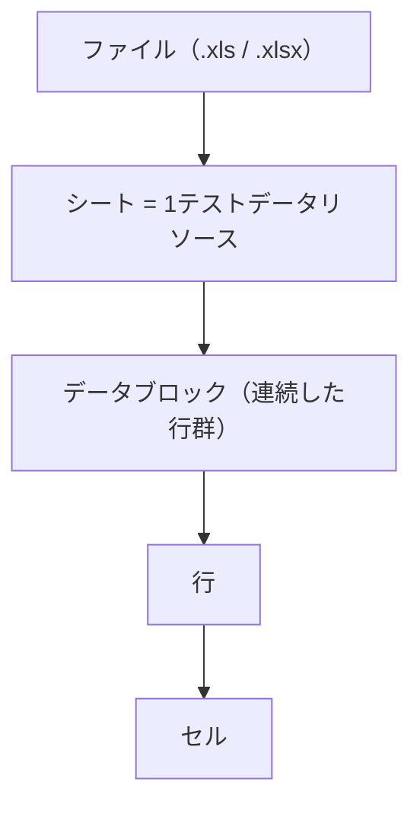
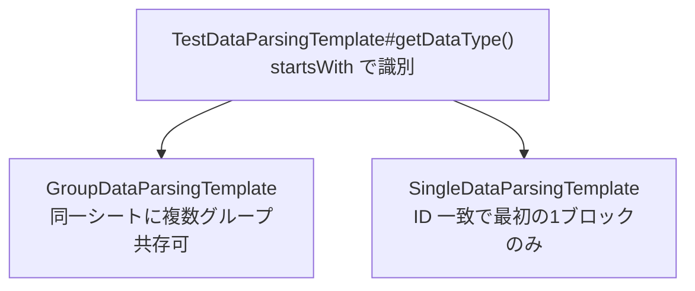

# NTF テストデータ構造 リファレンス

NTF が Excel から読み込むテストデータの構造を、変換ツール実装時に引くためのリファレンス。記載はコードと Javadoc のみを根拠とし、推測を含まない。各項目に根拠クラスを併記する。

---

## 1. 全体像

### 論理単位の階層



| レベル | Excel 上の単位 | 仕様 | 根拠クラス |
|---|---|---|---|
| ファイル | `.xls` / `.xlsx` | `.xls` が存在しない場合に `.xlsx` を試みる | `PoiXlsReader` |
| シート | 1 シート = 1 テストデータリソース | `dataName` = `"ファイル名/シート名"`（`/` 区切り） | `PoiXlsReader` |
| データブロック | シート内の連続した行群 | データタイプ行（例 `SETUP_TABLE=...`）が起点 | `TestDataParsingTemplate` |
| 行 | データ行・ヘッダ行等 | 先頭セルが `//` 始まりはコメント行としてスキップ。空行もスキップ | `TestDataParsingTemplate` |
| セル | 文字列 | 全て文字列化。`cell == null` → `""` | `PoiXlsReader` |

### パーステンプレートの分岐

データ種別ごとに、複数ブロック共存可能な GroupData 系と、ID 一致で最初の 1 ブロックのみ取得する SingleData 系に分かれる（§2 のテンプレート種別列）。



---

## 2. データ種別

根拠: `nablarch.test.core.reader.DataType`（enum）

| enum 定数 | Excel 識別文字列 | 用途 | テンプレート種別 |
|---|---|---|---|
| `SETUP_TABLE_DATA` | `SETUP_TABLE` | DB 事前準備用テーブルデータ | GroupData |
| `EXPECTED_TABLE_DATA` | `EXPECTED_TABLE` | 期待値テーブルデータ | GroupData |
| `EXPECTED_COMPLETED` | `EXPECTED_COMPLETE_TABLE` | 期待値テーブル（省略カラムにデフォルト値補完） | GroupData |
| `LIST_MAP` | `LIST_MAP` | `List<Map<String,String>>` 形式データ | SingleData（ID 一致で停止） |
| `SETUP_FIXED` | `SETUP_FIXED` | 事前準備用固定長ファイル | GroupData |
| `EXPECTED_FIXED` | `EXPECTED_FIXED` | 期待値固定長ファイル | GroupData |
| `SETUP_VARIABLE` | `SETUP_VARIABLE` | 事前準備用可変長ファイル | GroupData |
| `EXPECTED_VARIABLE` | `EXPECTED_VARIABLE` | 期待値可変長ファイル | GroupData |
| `MESSAGE` | `MESSAGE` | 要求電文（固定長ファイルとして処理） | SingleData |
| `EXPECTED_REQUEST_HEADER_MESSAGES` | `EXPECTED_REQUEST_HEADER_MESSAGES` | 要求電文ヘッダ期待値 | SingleData |
| `EXPECTED_REQUEST_BODY_MESSAGES` | `EXPECTED_REQUEST_BODY_MESSAGES` | 要求電文本文期待値 | SingleData |
| `RESPONSE_HEADER_MESSAGES` | `RESPONSE_HEADER_MESSAGES` | 応答電文ヘッダ | GroupData |
| `RESPONSE_BODY_MESSAGES` | `RESPONSE_BODY_MESSAGES` | 応答電文本文 | GroupData |

識別: `TestDataParsingTemplate#getDataType()` が `startsWith` で判定。
グループ ID 書式: `SETUP_TABLE[グループID]=テーブル名`（ID なしは `SETUP_TABLE=テーブル名`）。

---

## 3. 各データ種別のフィールド構造

### 3.1 テーブルデータ（SETUP_TABLE / EXPECTED_TABLE / EXPECTED_COMPLETE_TABLE）

根拠: `TableDataParser`、`HeaderLine`、`TableData`

```
行1: SETUP_TABLE[groupId]=テーブル名
行2: COL1 | COL2 | [MARKER] | COL3      ← ヘッダ行
行3: val1 | val2 | mark_val  | val3      ← データ行
```

- テーブル名・カラム名は `toUpperCase()` される（`TableData#setTableName()`、`setColumnNames()`）
- `[` 始まり `]` 終わりのカラムはマーカーカラム（DB 操作から除外）（`HeaderLine`）
- `EXPECTED_COMPLETE_TABLE` は `fillDefaultValues()` で省略カラムにデフォルト値補完

### 3.2 LIST_MAP

根拠: `ListMapParser`（`SingleDataParsingTemplate` 継承）

```
行1: LIST_MAP=ID
行2: KEY1 | KEY2 | [MARKER]
行3: val1 | val2 | mark_val
```

- ID は `getTypeValue()`（`=` 以降の文字列）で取得
- 結果は `List<Map<String,String>>`、マーカーカラム除外後

### 3.3 固定長ファイル（SETUP_FIXED / EXPECTED_FIXED）

根拠: `FixedLengthFileParser`、`DataFileParser`、`FixedLengthFileFragment`

```
行1: SETUP_FIXED[groupId]=ファイルパス
行2: text-encoding  | UTF-8           ← ディレクティブ行（key|value 形式）
行3: レコード種別名  | FIELD1 | FIELD2  ← フィールド名行（先頭セルが種別名）
行4:                | X      | N       ← データ型行（先頭空）
行5:                | 10     | 5       ← フィールド長行（先頭空。"-" はオンデマンド計算）
行6:                | val1   | val2    ← データ行（先頭空）
```

有効なディレクティブ（共通 3 キー + 固定長専用 8 キー）:

| キー | 意味 | 適用範囲 |
|---|---|---|
| `text-encoding` | 文字エンコーディング | 共通 |
| `record-separator` | レコード区切り文字 | 共通 |
| `file-type` | ファイル種別（通常は自動設定） | 共通 |
| `record-length` | レコード長（バイト数） | 固定長専用 |
| `positive-zone-sign-nibble` | ゾーン正符号ニブル | 固定長専用 |
| `negative-zone-sign-nibble` | ゾーン負符号ニブル | 固定長専用 |
| `positive-pack-sign-nibble` | パック正符号ニブル | 固定長専用 |
| `negative-pack-sign-nibble` | パック負符号ニブル | 固定長専用 |
| `required-decimal-point` | 小数点の要否（boolean） | 固定長専用 |
| `fixed-sign-position` | 符号位置の固定（boolean） | 固定長専用 |
| `required-plus-sign` | 正符号の要否（boolean） | 固定長専用 |

根拠: `nablarch-core-dataformat` の `DataRecordFormatterSupport$Directive`（共通 3 キー）・`FixedLengthDataRecordFormatter$FixedLengthDirective`（固定長専用 8 キー）

### 3.4 可変長ファイル（SETUP_VARIABLE / EXPECTED_VARIABLE）

根拠: `VariableLengthFileParser`

固定長ファイルと同構造だが**フィールド長行がない**（`onReadingTypes()` で `READING_LENGTHS` ステートをスキップ）。
デフォルト区切り文字: `,`

### 3.5 メッセージ（MESSAGE / EXPECTED_REQUEST_*_MESSAGES）

根拠: `MessageParser`（`SingleDataParsingTemplate` + `FixedLengthFileParser` に委譲）

- 内部構造は固定長ファイルと同一
- FW ヘッダフィールド（デフォルト: `requestId`, `userId`, `resendFlag`, `resultCode`）は `fwHeader` Map に分離
- `SystemRepository` の `reader.fwHeaderfields` キーで上書き可能

### 3.6 グループメッセージ（RESPONSE_HEADER_MESSAGES / RESPONSE_BODY_MESSAGES）

根拠: `GroupMessageParser`（`GroupDataParsingTemplate` 継承）

- 固定長ファイルと同構造、複数件対応

---

## 4. 特殊値・変換ルール

根拠: `TestDataParsingTemplate#interpret()`、各 `Interpreter` 実装

| Excel セル値 | 変換後 | 根拠クラス |
|---|---|---|
| `null`（大文字小文字不問） | Java `null` | `NullInterpreter` |
| `"abc"` / `"abc"`（全半角ダブルクォート囲み） | `abc`（クォート除去） | `QuotationTrimmer` |
| `""` / `""` | 空文字 | `QuotationTrimmer` |
| `${systemTime}` | システム日時 | `DateTimeInterpreter` |
| `${updateTime}` | システム日時（`${systemTime}` と同値） | `DateTimeInterpreter` |
| `${setUpTime}` | DB セットアップ時刻（JDBC タイムスタンプ形式） | `DateTimeInterpreter` |
| `${文字種, 文字数}`（例 `${全角英字, 10}`） | 対応文字種の文字列 | `BasicJapaneseCharacterInterpreter` |
| `${binaryFile:パス}` | HexString | `BinaryFileInterpreter` |
| `\r`（文字列） | CR（0x0D） | `LineSeparatorInterpreter` |
| 複合式（`${...}-${...}` 等） | 各部分を個別解釈して結合 | `CompositeInterpreter` |

日付フォーマット（`TableData` DB 挿入時）:

- プライマリ: `yyyyMMddHHmmssSSS`（17 桁、不足は末尾 0 補完）
- セカンダリ: `yyyy-MM-dd` / `yyyy-MM-dd HH:mm:ss[.SSS]`（4 文字目が `-` で判定）

データ型記号（`BasicDataTypeMapping`）:

| 設計書表記 | 記号 |
|---|---|
| 半角英字/半角数字/半角記号/半角カナ/半角英数字等 | `X` |
| 全角英字/全角数字/全角ひらがな/全角カタカナ/全角漢字等 | `N` |
| 全半角 | `XN` |
| 数値/符号無ゾーン 10 進数 | `Z` |
| 符号付ゾーン 10 進数 | `SZ` |
| 符号無パック 10 進数 | `P` |
| 符号付パック 10 進数 | `SP` |
| 符号無数値 | `X9` |
| 符号付数値 | `SX9` |
| バイナリ | `B` |

---

## 5. データ種別間の関係


- `getSetupFile()` は `SETUP_FIXED` + `SETUP_VARIABLE` を 1 つの `List<DataFile>` にまとめて返す（`BasicTestDataParser`）
- `getExpectedTableData()` は `EXPECTED_TABLE` + `EXPECTED_COMPLETE_TABLE` をマージして返す
- GroupData 系（SETUP_TABLE 等）: 同一シートに複数グループ共存可能
- SingleData 系（LIST_MAP、MESSAGE 等）: ID 一致で最初の 1 ブロックのみ取得

---

## 主要根拠ファイル

| クラス | パス |
|---|---|
| `DataType` | `src/main/java/nablarch/test/core/reader/DataType.java` |
| `PoiXlsReader` | `src/main/java/nablarch/test/core/reader/PoiXlsReader.java` |
| `BasicTestDataParser` | `src/main/java/nablarch/test/core/reader/BasicTestDataParser.java` |
| `TestDataParsingTemplate` | `src/main/java/nablarch/test/core/reader/TestDataParsingTemplate.java` |
| `GroupDataParsingTemplate` | `src/main/java/nablarch/test/core/reader/GroupDataParsingTemplate.java` |
| `SingleDataParsingTemplate` | `src/main/java/nablarch/test/core/reader/SingleDataParsingTemplate.java` |
| `TableDataParser` | `src/main/java/nablarch/test/core/reader/TableDataParser.java` |
| `HeaderLine` | `src/main/java/nablarch/test/core/reader/HeaderLine.java` |
| `ListMapParser` | `src/main/java/nablarch/test/core/reader/ListMapParser.java` |
| `FixedLengthFileParser` | `src/main/java/nablarch/test/core/reader/FixedLengthFileParser.java` |
| `VariableLengthFileParser` | `src/main/java/nablarch/test/core/reader/VariableLengthFileParser.java` |
| `MessageParser` | `src/main/java/nablarch/test/core/reader/MessageParser.java` |
| `TableData` | `src/main/java/nablarch/test/core/db/TableData.java` |
| `DataFile` | `src/main/java/nablarch/test/core/file/DataFile.java` |
| `BasicDataTypeMapping` | `src/main/java/nablarch/test/core/file/BasicDataTypeMapping.java` |
| `NullInterpreter` | `src/main/java/nablarch/test/core/util/interpreter/NullInterpreter.java` |
| `QuotationTrimmer` | `src/main/java/nablarch/test/core/util/interpreter/QuotationTrimmer.java` |
| `DateTimeInterpreter` | `src/main/java/nablarch/test/core/util/interpreter/DateTimeInterpreter.java` |
