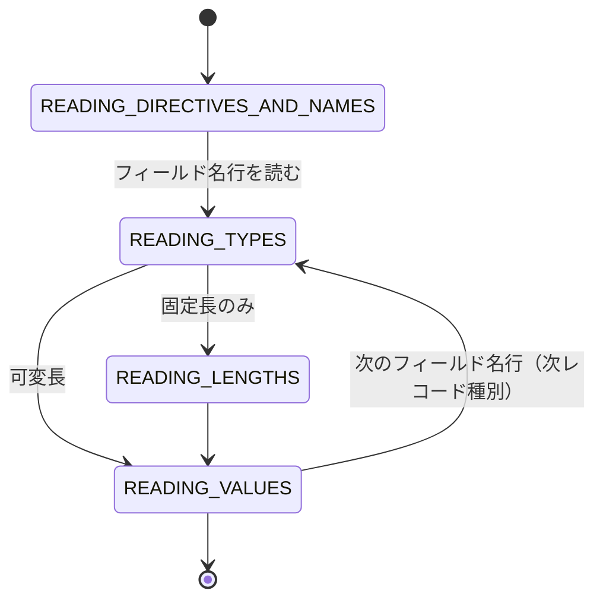

# NTF テストデータ YAML スキーマ設計メモ

NTF（Nablarch Testing Framework）が読み込むテストデータを YAML で書くためのスキーマと記法のリファレンス。「この場面でどう書くか」「YAML がどう解釈されるか」「変換ツール（Excel→YAML）がどう振る舞うべきか」を引くための文書。通読ではなく必要箇所を参照する前提で構成する。

> **スコープ**: NTF が読み込むテストデータ構造のみを対象とする。セルの色・コメント・シート保護・マーカーカラムの値などの「NTF が参照しない付加情報」は変換対象外。

---

## 1. 全体像

### Excel 概念 → YAML 構造 対応表

| Excel概念 | YAML構造 | 備考 |
|---|---|---|
| `.xls` / `.xlsx` ファイル | 1つの `.yaml` ファイル | Excelファイル1つが YAMLファイル1つに対応 |
| シート | ファイル内のトップレベルセクション（`setup_tables:` 等）にデータを記述 | シート名の概念は消滅。1ファイルに全種別データを共存可能 |
| データタイプ行（`SETUP_TABLE=...`） | セクションキー（`setup_tables`）+ 各要素の `table:` フィールド | 種別とテーブル名を分離して表現 |
| グループID（`[groupId]`） | `group_id:` フィールド（省略可） | 省略時はグループIDなし扱い |
| ヘッダ行（カラム名） | `rows` 内の各オブジェクトのキー | 各行ごとにキーを書くため冗長だが可読性高 |
| マーカーカラム（`[COLNAME]`） | `"[COLNAME]"` 形式のキー（ダブルクォートが必須） | YAMLで角括弧がフロー配列と誤解釈されないようクォートが必要 |
| ディレクティブ行（`key\|value`） | `directives:` オブジェクト | 構造化されて型安全 |
| フィールド名行・データ型行・フィールド長行（3行1組） | `fields:` 配列の1要素（`name`/`type`/`length`） | 行分割をなくし1フィールド1定義に統合 |
| データ行（先頭空の行） | `rows:` 配列内の値配列 | `fields` と同順 |
| レコード種別（先頭セルが種別名） | `record_type:` フィールド | `records:` 配列の1要素 |
| コメント行（`//`始まり） | YAMLコメント（`#`） | YAML標準のコメント構文を使用 |

### rows の形式は種別で 2 系統に分かれる

最も間違えやすい点。テーブル系とファイル系で `rows` の形が違う。

| 種別 | `rows` の形式 | 例 |
|---|---|---|
| `setup_tables` / `expected_tables` / `expected_complete_tables` / `list_maps` | **オブジェクト配列** | `[{COL: "val"}, ...]` |
| `setup_files` / `expected_files` / `messages` 等の `record_fragment` | **配列の配列** | `[["val1", "val2"], ...]` |

- テーブル系（オブジェクト配列）：採用理由は下表のとおり。15列以上を大量行扱うとトークン消費が増えるが、可読性と AI 利用を優先して採用。

  | | オブジェクト形式（採用） | 配列形式 |
  |---|---|---|
  | 可読性 | 高い（カラム名が値に隣接） | 低い（カラム名と値が離れる） |
  | AI書きやすさ | 高い（カラム名を都度確認不要） | 低い（列順を常に意識） |
  | 冗長性 | 高い（カラム名が全行に繰り返される） | 低い |
  | 一部カラム省略 | 自然（キーを書かなければ省略） | 不自然 |

- ファイル系（配列の配列）：フィールド名は `fields` に定義済みのため、各データ行でキーを繰り返さず同順の配列で圧縮。ファイルデータは行数が多い傾向があるための選択。
- ファイル系の `rows` 配列は `fields` と**完全に同じ順序・件数**で並べる。列順ミスはパーサのランタイムエラーでしか検出されず、JSON Schema では検出できない（→ [4.1 検証モード](#41-検証モードリンタ)）。

---

## 2. 変換ビフォーアフター（Excel → YAML）

> Excel の `|` はセル境界を模した擬似表記。実際のExcelでは各セルが独立している。

### テーブルデータ（グループIDなし）

**Excel:**
```
行1: SETUP_TABLE=USER_TABLE
行2: USER_ID | USER_NAME
行3: 001     | 山田太郎
```

**YAML:**
```yaml
setup_tables:
  - table: USER_TABLE       # group_id フィールドは省略
    rows:
      - USER_ID: "001"
        USER_NAME: "山田太郎"
```

### テーブルデータ（グループID付き・マーカーカラムあり）

**Excel:**
```
行1: SETUP_TABLE[case1]=USER_TABLE
行2: USER_ID | USER_NAME | AGE | [MARKER]
行3: 001     | 山田太郎   | 30  | X
行4: 002     | 鈴木花子   | 25  | Y
```

**YAML:**
```yaml
setup_tables:
  - group_id: case1
    table: USER_TABLE
    rows:
      - USER_ID: "001"
        USER_NAME: "山田太郎"
        AGE: "30"
        "[MARKER]": "X"
      - USER_ID: "002"
        USER_NAME: "鈴木花子"
        AGE: "25"
        "[MARKER]": "Y"
```

> マーカーカラムは NTF が DB 操作から除外する付加情報のため、本来 YAML には出力しない（→ [3.6 マーカーカラム](#36-マーカーカラム)）。上例はキー表現の説明用。

### 固定長ファイル（Excel 6行 → YAML records 1ブロック）

**Excel:**
```
行1: SETUP_FIXED[grp1]=input/data.dat
行2: text-encoding | MS932          ← ディレクティブ行
行3: DATA    | USER_ID | USER_NAME | AMOUNT    ← フィールド名行（先頭がレコード種別名）
行4:         | X       | N         | Z         ← データ型行（先頭空）
行5:         | 10      | 20        | 10        ← フィールド長行（先頭空）
行6:         | 001     | 山田太郎   | 0000005000 ← データ行（先頭空）
```

**YAML:**
```yaml
setup_files:
  - group_id: grp1
    path: input/data.dat
    type: fixed
    directives:
      text-encoding: MS932
    records:
      - record_type: DATA
        fields:
          - {name: USER_ID,   type: 半角, length: 10}
          - {name: USER_NAME, type: 全角, length: 20}
          - {name: AMOUNT,    type: 数値, length: 10}
        rows:
          - ["001", "山田太郎", "5000"]  # パディングは自動付与されるため不要
```

- Excel の3行（フィールド名・型・長さ）が `fields:` の1要素に横方向統合される。
- 固定長ファイルの `rows` 値はパディング不要。`FixedLengthDataRecordFormatter` がフィールド長に合わせて自動パディングする（Excel セルに `001` と書くのと同様、YAML でも `"001"` でよい）。

---

## 3. 各要素の記述ルール

### 3.1 セクション統合（SETUP_FIXED / SETUP_VARIABLE）

Excelでは別データ種別だが、`BasicTestDataParser#getSetupFile()` が両者をまとめて返す実装に揃え、`type: fixed/variable` で区別する1セクションに統合した。`expected_files` も同様。

### 3.2 expected_tables と expected_complete_tables（分離維持）

両者は `getExpectedTableData()` でマージされて返されるが、`EXPECTED_COMPLETE_TABLE` が `fillDefaultValues()` を呼ぶかどうかの違いがある。YAMLでは `expected_tables` と `expected_complete_tables` を分けて保持し、変換時に呼び分けられるようにした。

- `expected_tables`: 記述したカラムのみを比較。
- `expected_complete_tables`: 記述していないカラムにも `fillDefaultValues()` でデフォルト値が補完され全カラムを比較。省略カラムが多い場合に使う。

**データタイプの混在順序は自由（旧 Doc-4 はYAMLでは不適用）**: YAML パーサは `expected_tables` と `expected_complete_tables` をそれぞれ独立にセクションキーで取得（`getList`）して連結する。記述順序や交互記述に依存せず両方が正しく読み込まれる（実ロードで確認済み）。旧 Doc-4 の「混在させると後半が読み込まれない」制約は Excel の行ステートマシン（別 DataType が現れたら読み込み終了）由来で、セクションキーで構造化された YAML には当てはまらない。Excel 移行時にデータタイプごとにまとめ直す必要はない。

#### BasicDefaultValues のデフォルト値一覧

`expected_complete_tables` で省略カラムに補完される値（`BasicDefaultValues` の実装）:

| カラム型 | デフォルト値 |
|---|---|
| 数値型（`java.lang.Number` のサブクラス） | `"0"` |
| 固定長文字列型（`CHAR`, `NCHAR` 等） | 半角スペース × カラム長 |
| 可変長文字列型（`VARCHAR` 等） | `" "`（半角スペース1文字） |
| 日付型（`java.sql.Date` 等） | `"1970-01-01 09:00:00.0"`（UTC epoch を JVM タイムゾーンで文字列化。JST 環境では `"1970-01-01 09:00:00.0"`、UTC 環境では `"1970-01-01 00:00:00.0"`） |
| バイナリ型 | 10バイトのゼロバイト列の HexString |
| Boolean型 | `"false"` |

補完値は `BasicDefaultValues` の `charValue` / `numberValue` / `dateValue` プロパティをコンポーネント設定ファイルで変更可能（Doc-1）。変更する場合は DI 設定を確認する。

**型記号の注意**: `BasicDataTypeMapping` では `半角数字` は文字型（型記号 `X`）にマッピングされる（数値型 `Z`＝ゾーン10進数ではない）。YAML には日本語名称をそのまま書く（`type: 半角数字`）。

#### テーブル系の補完・省略ルール

- `SETUP_TABLE` / `EXPECTED_TABLE` でも、`rows` オブジェクトに含まれない（キーを省略した）カラムには INSERT 時に `DefaultValues` でデフォルト値が補完される（`TableData#convert()`）。省略カラムの補完は `EXPECTED_COMPLETE_TABLE` 専用ではない。
- **`SETUP_TABLE` では主キーカラムは省略不可**（Doc-2）: 省略するとデフォルト値（`0`・スペース等）が補完され意図しないレコードが INSERT される。`EXPECTED_TABLE` では省略カラムは比較対象外（省略可）。
- **`java.sql.Timestamp` 型カラムの期待値は末尾 `.0` が必要**（Doc-3）: `expected_tables` / `expected_complete_tables` では `"2010-01-01 12:34:56.0"` のようにナノ秒部分の `.0` を付加する。`Timestamp#toString()` の出力形式に合わせないとアサートが失敗する。

### 3.3 型名称（field_def.type と BasicDataTypeMapping）

**YAML には日本語型名称（`半角英字`, `全角`, `数値` 等）を記述する。** Excel・公式解説書と同一表記で、追加設定なしで動作する。

**根拠**:
- 公式解説書（`05_UnitTestGuide/02_RequestUnitTest/send_sync.rst`, `batch.rst`）が「データ型は日本語名称で記述する」と明記。型と日本語名称のマッピングは `BasicDataTypeMapping` の `DEFAULT_TABLE` が担う。
- 既存 Excel テストデータも型行は日本語（`半角`, `全角漢字`, `半角カナ` 等）。
- `DataFileFragment#setTypes()` は内部で `DataTypeMapping#convertToFrameworkExpression()` を呼ぶ。`BasicDataTypeMapping` は日本語名称キー（`"半角英字"` → `X` 等）で構成されるため、日本語名称をそのまま渡せば追加設定なしで変換される。

**旧設計（記号採用）からの変更**: 旧設計は「YAML には記号（`X`, `N`, `Z`）を記述し、識別 mapping を `SystemRepository["dataTypeMapping"]` に登録」としていた。撤回理由:
1. 公式仕様・既存 Excel・変換ツール出力のすべてが日本語。記号採用は YAML だけが非対称になり、型書き換えの負担と移行時混乱を生む。
2. 記号採用は移行先プロジェクトに identity mapping 登録を強制する。忘れるとファイル系・メッセージ系読み込み時に `IllegalArgumentException: can't convert value [X]` が出る初見殺し。日本語採用なら不要。
3. 変換ツールは型セルを無加工で写すため Excel の日本語型がそのまま `type: 半角` として出る。記号採用だと変換ツールに記号変換ロジックが要り保守点が増える。

**スキーマへの反映**: `field_def.type` は旧 `pattern: "^[A-Z][A-Z0-9_]*$"`（記号のみ許容）を撤回し日本語名称を許容する定義に変更する。`TEST_` プレフィクスのテスト専用型など日本語名称以外のカスタム型も許容できるよう、過度に厳しいパターン制約は設けない（→ [3.10 拡張ポイント](#310-拡張ポイント) §15・§16）。

**identity mapping の扱い**: `unit-test-yaml.xml` に登録されていた `dataTypeMapping`（記号10種の identity mapping）は不要のため削除する。

### 3.4 null・空文字・特殊値

**すべての値は文字列（クォート付き）で記述すること。** YAMLパーサが数値・真偽値として解釈するとスキーマバリデーション違反になる。

```yaml
# NG
rows:
  - AGE: 30
    ACTIVE: true
# OK
rows:
  - AGE: "30"
    ACTIVE: "true"
```

**null の仕様（確定）**: YAMLネイティブ `null`（アンクォート）を正式採用。

| 意図 | YAML記述 | 動作 |
|---|---|---|
| DBにNULL | `null` | YAMLパーサがJava nullとして渡す |
| DBにNULL（**NG例**） | `"null"` | QuotationTrimmerが外側クォートを除去し文字列 `null` を格納 ← 意図と逆 |
| DBに空文字 | `""` | 空文字列として渡す |
| 文字列 "null" をDBに格納（意図的） | `'"null"'` | QuotationTrimmerが外側クォートを除去して "null" を格納 |
| システム日時 | `"${systemTime}"` | DateTimeInterpreter が変換 |

`NullInterpreter` は大文字小文字を区別しない（`equalsIgnoreCase`）。`"NULL"` / `"Null"` / `"null"` のいずれも Java null に変換される。

**QuotationTrimmer によるスペース値・引用符の明示記法（Doc-8）**:

| YAML記述 | 変換後 | 用途 |
|---|---|---|
| `'"⊔"'` (`"⊔"` = 半角スペース1文字) | 半角スペース1文字 | 空白に見えて空白であることを明示 |
| `'"△△"'` (`"△△"` = 全角スペース2文字) | 全角スペース2文字 | 全角空白の明示 |
| `'"""'` | ダブルクォート1文字 `"` | ダブルクォート文字そのものをDBに格納 |

文字列全体をシングルクォートで囲み `'"⊔"'` と書くと、パーサが `"⊔"` という文字列を渡し、QuotationTrimmer が外側クォートを除去して半角スペースを格納する。

`QuotationTrimmer` は全角ダブルクォートにも対応。除去条件:
- 半角: 先頭と末尾が**同じ** `"`（U+0022）の場合に適用。
- 全角: 先頭が開き引用符 `"`（U+201C）かつ末尾が閉じ引用符 `"`（U+201D）の**異なる文字のペア**で判定（`QuotationTrimmer.java: str.startsWith("“") && str.endsWith("”")`）。
- いずれも片側のみはスルー。`""abc""` → `"abc"`（最外側の1層のみ除去）。

その他の特殊値記法:
- CR文字: `"\r"`（ファイル系レコード値のみ有効。`LineSeparatorInterpreter`）
- LF文字: `"\n"`（ファイル系レコード値のみ有効。Doc-7）
- バイナリ直接記述: `"0x4AD"`（`0x` プレフィクス付き16進数。`BinaryInterpreter` が解釈。`0x` がなければ文字列扱い）
- 文字種生成: `"${全角英字, 10}"`（`BasicJapaneseCharacterInterpreter`。→ [3.9 インタプリタ](#39-インタプリタ特殊記法の解決)）

### 3.5 日付型カラムの記述形式

テーブルデータの日付型カラムが受け付ける形式（`TableData#asYyyyMMddHHmmssSSS()`）:

| 形式 | 例 | 備考 |
|---|---|---|
| `yyyyMMddHHmmssSSS`（17文字） | `"20240101120000000"` | 標準形式 |
| 17文字未満（後置0埋め） | `"20240101"` | 後ろに `"00000000000000000"` を付加して前17文字を使用 |
| `yyyyMMddHHmmss`（12文字、ミリ秒省略）（Doc-6） | `"20240101120000"` | 公式解説書に明示。後置0埋めで `"20240101120000000"` と等価 |
| `yyyyMMdd HHmmss`（スペース区切り14文字） | `"20240101 120000"` | スペースを含む14文字形式 |
| `yyyyMMddHHmmssS`（ミリ秒1桁15文字） | `"200001011234560"` | ミリ秒が1桁の15文字形式 |
| JDBCタイムスタンプエスケープ（5文字目が `-`） | `"2024-01-01"`, `"2024-01-01 12:00:00.000"` | `isJdbcTimestampFormat()` で判定 |

### 3.6 マーカーカラム

Excel では `[COLNAME]` 形式のカラム名がマーカーとして扱われる（`HeaderLine` の規則）。マーカーカラムの値は NTF が DB 操作から除外するため**YAML には出力しない**。変換ツールは `HeaderLine#getEffectiveColumnNames()` と同様にマーカーカラムを除外してから `rows` を生成する。

### 3.7 group_id（グループID）

Excel では `SETUP_TABLE=TABLE_NAME`（角括弧なし）がグループIDなしを意味する。YAMLでは `group_id:` フィールドを省略して表現する。

- グループIDがない場合は `group_id` フィールド自体を省略する。`null` や `""` は不可（空文字列のグループIDとして扱われ誤マッチが起きる）。
- 存在しない `group_id` を `getTableData()` 等に指定しても例外はスローされず空リストが返る。タイプミスはランタイムエラーにならないため注意。
- **`default` グループIDの特殊扱い（Doc-5、バッチ固有）**: バッチリクエスト単体テストでは `group_id: "default"` がグループIDなし扱いと同等になる。グループIDなしのデータと `group_id: "default"` のデータを同時使用すると、どちらも同じグループとして扱われる（`batch.rst` 記載）。

### 3.8 SingleData 系（LIST_MAP / MESSAGE）の id 制約

SingleData 系は同一ファイル内で id が一致した最初の1ブロックのみ取得する（`SingleDataParsingTemplate` の規則）。

- `id:` はファイル内でユニークにする。同一 `id` の重複エントリはエラーにならず後続が黙って無視される。
- **`testShots` 予約ID（Doc-16、バッチ固有）**: バッチリクエスト単体テストでは `list_maps` の `id: testShots` が特殊な予約IDとして扱われ、フレームワークがこの ID で `LIST_MAP` データをテストケース一覧として自動読み込みする（ショット数・グループIDの定義に使用）。

### 3.9 インタプリタ（特殊記法の解決）

`${...}` 等の特殊記法は実行時にインタプリタが解決する。インタプリタは DI で組み立てる。

- **CompositeInterpreter（DI 必須）**: `interpreters` プロパティに `TestDataInterpreter` のリストを DI しないと機能しない（デフォルト空リスト）。`DateTimeInterpreter`, `BasicJapaneseCharacterInterpreter`, `BinaryFileInterpreter` 等を登録すると各 `${...}` セグメントの解釈が有効になる。
- **DateTimeInterpreter（完全一致制約）**: 値が `${systemTime}`, `${setUpTime}`, `${updateTime}` と**完全一致**する場合のみ変換（Map lookup）。`"${systemTime}_suffix"` のような複合式は `CompositeInterpreter` の `${...}` セグメントとして分解してから渡す。`${setUpTime}` の変換後値は JDBC タイムスタンプ書式（`yyyy-MM-dd HH:mm:ss.SSS`）で設定する（`setSetUpDateTime()` のバリデーション）。
- **BinaryFileInterpreter（パス基準）**: `${binaryFile:相対パス}` は Excel ファイルのディレクトリ基準で解決される（コンストラクタの `path` 引数）。YAML 移行後は YAML ファイルのディレクトリ基準か絶対パスかをアダプタ実装時に統一する。
- **BasicJapaneseCharacterInterpreter（有効トークン14種）**:

  半角英字 / 半角数字 / 半角記号 / 半角カナ / 全角英字 / 全角数字 / 全角ひらがな / 全角カタカナ / 全角漢字 / 全角記号その他 / 中国語 / サロゲートペア / 改行 / 外字

  書式 `${文字種,文字数}` にマッチしない入力はスルー（例外なし）。書式はマッチするが文字種が未知なら `IllegalArgumentException`（スキーマでは検出不可、実行時エラー）。`${半角記号}` の生成には `"`, `#`, `,`, `\` は含まれない（`JapaneseCharacterSet.ASCII_SYMBOL` の除外リスト）。公式解説書（`01_Abstract.rst`）は11種と記載するが、中国語・サロゲートペア・改行・外字の4種が欠如しており実装の14種が正確（Doc-17）。
- 複合式: `"${半角数字,4}-${半角数字,4}"` は `CompositeInterpreter` が各 `${}` を個別解釈して結合。

### 3.10 拡張ポイント

`SystemRepository` への DI でデフォルトディレクティブ・型マッピング・コンバータをカスタマイズできる。

**デフォルトディレクティブ（§14）** — 値は `Map<String, String>`。個別ファイルの `directives:` 指定があればそちらが優先:

| SystemRepository キー | 適用範囲 | 根拠 |
|---|---|---|
| `"defaultDirectives"` | 全ファイル（固定長・可変長共通） | `DataFile` コンストラクタ |
| `"fixedLengthDirectives"` | 固定長ファイル専用 | `FixedLengthFile` コンストラクタ |
| `"variableLengthDirectives"` | 可変長ファイル専用 | `VariableLengthFile` コンストラクタ |

**DataTypeMapping の優先検索順（§15）** — `DataFileFragment#setTypes()` の取得順:
1. `SystemRepository["dataTypeMapping_{エンコーディング名}"]`（例 `"dataTypeMapping_MS932"`）
2. `SystemRepository["dataTypeMapping"]`
3. `BasicDataTypeMapping`（デフォルト・日本語名称キー）

YAML には日本語型名称を書くためデフォルトの `BasicDataTypeMapping` がそのまま使える。プロジェクトがエンコーディング別・独自マッピングを登録していればそちらが優先。日本語名称にない独自型を使う場合はその名称を含むマッピングを登録する。

**TEST_ プレフィクス型の自動昇格（§16）**: `TEST_` プレフィクスのデータ型が `ConvertorFactory` に登録されていると、対応する型（例 `符号無数値` → 型記号 `X9`）に対してパーサが `getTypeForTest()` で `TEST_` 付きの型を自動優先選択する（`DataFileFragment`）。YAML の type 記述（日本語名称）を変えずにテスト専用の型変換へ切り替えできる。

**TestDataConverter 拡張点（§17）**: `SystemRepository["TestDataConverter_" + file-type]`（例 `"TestDataConverter_Fixed"`）に `TestDataConverter` 実装を登録すると、レイアウト定義生成（`createDefinition()`）とデータレコード変換（`convertData()`）をカスタマイズできる（`FixedLengthFile` / `VariableLengthFile`）。

### 3.11 ファイルレコードの長さ・パディング

- **固定長ファイルの空行**: スペースパディングされた定長レコードとして書き出される（0バイト行にはならない）。
- **可変長ファイルの空行**: スキップされず、全フィールドが `""` のレコードとして保持される（`ignore-blank-lines` ディレクティブを true にするとスキップ可）。
- **空ファイル（0バイト）の表現（Doc-10）**: `directives` のみ記述し `records` を空配列にする。

  ```yaml
  setup_files:
    - path: output/empty.dat
      type: fixed
      directives:
        text-encoding: MS932
      records: []  # 0バイトの空ファイル
  ```

  `records: []` が有効なのはスキーマ上 `minItems: 0`（Doc-10対応済み）。`records:` キー自体を省くと `required: ["records"]` によりバリデーションエラー。
- **`X9` / `SX9` 型（Doc-12）**: 符号無数値型 `X9` / 符号付数値型 `SX9` には、固定長ファイルから入出力される実際のバイト列表現（パディング文字・符号を含む）をそのまま記述する。EBCDIC 系の数値表現に対応する型で、`Z`（ゾーン10進数）や `P`（パック10進数）とは異なる。バイト列を16進数や文字で直接記述する場合は `TEST_X9` / `TEST_SX9` コンバータ設定（§16）が必要になる場合がある。
- **`"-"` 長フィールドの最終サイズ（`ONDEMAND_CALC_FIELD_SIZE`）**: フィールド長に `"-"` を指定すると、そのフィールドの最終バイト長は**全レコード中の最大バイト長**になる。`addValue()` が呼ばれるたびに最大値を比較更新し、全レコード追加完了時点の最大値を使用。格納値は `removeLineSeparatorWithTrim()` により改行コードと前後空白が除去されてから長さ計算される。

---

## 4. ファイルデータの構造（DataFileParser の状態機械）

### 4.1 1ファイルセクション内の複数レコードレイアウト（§24）

1つの `record_fragment`（`records:` の1要素）がレコード種別1つに対応する。1ファイルセクション内に複数の `record_fragment` を並べると複数レコードレイアウトを表現できる。

```yaml
setup_files:
  - path: input/multi_layout.dat
    type: fixed
    directives:
      text-encoding: MS932
    records:
      - record_type: HEADER        # レコード種別1
        fields:
          - {name: TYPE, type: 半角, length: 4}
          - {name: DATE, type: 半角, length: 8}
        rows:
          - ["HDR", "20240101"]
      - record_type: DATA          # レコード種別2（連続して記述）
        fields:
          - {name: ID,    type: 半角, length: 10}
          - {name: VALUE, type: 数値, length: 10}
        rows:
          - ["0000000001", "5000"]
          - ["0000000002", "9800"]
      - record_type: TRAILER       # レコード種別3
        fields:
          - {name: TYPE,  type: 半角, length: 4}
          - {name: COUNT, type: 数値, length: 6}
        rows:
          - ["TRL", "2"]
```

`DataFileParser` の状態機械はフィールド名行（先頭セルが非空・非ディレクティブ）を読むと型・長さ・データを順に読み、次のフィールド名行が来ると次ブロックとして扱う。



### 4.2 Excel → YAML の行処理ルール（§13、TestDataParsingTemplate）

| Excel での扱い | 規則 | YAML での同等表現 |
|---|---|---|
| コメント行 | 先頭セルが `//` で始まる行を行ごとスキップ | `#` コメント |
| 行内コメント | 先頭以外のセルが `//` で始まると以降を切り捨て（`cutComment()`） | 列途中の `#` コメント |
| 空行スキップ | 全セルが空（null または空文字）の行を読み飛ばし（`isBlankLine()`） | （YAML では構造で表現） |

---

## 5. MESSAGE 系（電文）の構造

messaging 系は FW 制御ヘッダの表現が用途で 2 通りに分かれる。最も誤りやすい領域。

### 5.1 電文の構造（公式仕様準拠）

公式解説書（`send_sync.rst` の電文表書式）に従い、電文は次の順序で構成される。

1. **ディレクティブ群**（`text-encoding` 等。`名前｜値`）
2. **FW 制御ヘッダ群**（`requestId`, `userId` 等。`名前｜値`。どのフィールド名がFW制御ヘッダかは `reader.fwHeaderfields` で決まりプロジェクトごとに可変）
3. **`no` 行＝フィールド名称行**（先頭セルが `no`。フィールド名称行の起点）
4. **データ型行** → **フィールド長行** → **データ行**

### 5.2 DataType と FW 制御ヘッダ表現の使い分け

歴史的経緯ではなく**用途の違いによる本質的な差**（公式 `02_RequestUnitTest` / `03_DealUnitTest`、実データ・実コードで確認）。

| DataType | 経路 | テスト手法 | FW制御ヘッダの表現 |
|---|---|---|---|
| `MESSAGE`（`messages`） | MockMessaging（取引単体テスト） | ヘッダ・本文の値を**指定** | **`fw_header:` マップ** |
| `EXPECTED_REQUEST_HEADER_MESSAGES` | SendSync（リクエスト単体テスト） | フィールド単位で**アサート** | `records` の `fields:`/`rows:` |
| `EXPECTED_REQUEST_BODY_MESSAGES` | 同上 | フィールド単位でアサート | `fields:`/`rows:` |
| `RESPONSE_HEADER_MESSAGES` | 同上 | フィールド単位で**生成** | `fields:`/`rows:` |
| `RESPONSE_BODY_MESSAGES` | 同上 | フィールド単位で生成 | `fields:`/`rows:` |

**根拠**: `MessageParser`（MESSAGE 経路）は `processDirectives` で「名前｜値」を読み `isFrameworkHeader` で `fwHeader` Map に分離する。一方 `SendSyncMessageParser`（expected/response 経路）は `getFwHeader()` が `UnsupportedOperationException` を投げ、FW制御ヘッダ分離を行わない。`requestId` 等も `no` 行のフィールドとして型・長さ・複数データ行つきで定義され、フィールド単位の検証/生成に使われる。`fw_header:` マップにすると型・長さ・複数行が表現できずテスト目的が成立しない。

### 5.3 MESSAGE（messages）の YAML 表現（fw_header マップ）

| 構成要素 | YAML 表現 |
|---|---|
| ディレクティブ（`text-encoding` 等） | `directives:` マップ |
| FW 制御ヘッダ（`requestId` 等） | `fw_header:` マップ（**任意キー許容**） |
| 電文本文（`no` 行以降の名称・型・長さ・データ） | `records:` の `fields:`/`rows:` |

```yaml
messages:
  - id: requestMessages
    directives:
      text-encoding: Windows-31J
    fw_header:
      requestId: hoge
      userId: moge
    records:
      - record_type: default
        fields:
          - {name: ユーザ名, type: 全角, length: 50}
        rows:
          - ["電文太郎"]
```

### 5.4 EXPECTED_REQUEST_* / RESPONSE_* の YAML 表現（fields/rows）

ヘッダ部・本文部とも `records` の `fields:`/`rows:` でフィールド単位に定義する。`requestId` 等のヘッダフィールドも `fields` の1要素（日本語型・長さつき）として書く。`fw_header:` は使わない。`text-encoding` 等のディレクティブは `directives:` に分離する（混入させない）。

### 5.5 fw_header 採用の根拠（旧設計 §12 旧版からの変更）

旧設計は FW 制御ヘッダを `record_type: FW_HEADER` のレコードの `fields`/`rows` で表していた。撤回し `fw_header:` マップを採用する。

1. **公式仕様に忠実**: FW 制御ヘッダは公式上「名前｜値」のディレクティブ行群でありディレクティブと同じ構造。値は1電文につき1組で、複数データ行を持つ電文ボディとは性質が異なる。`fields`/`rows` 表現では rows が常に1行のいびつな形になる。
2. **データモデルに一致**: ランタイムは FW 制御ヘッダを `Map<String,String>`（`fwHeader`）で保持する。`fw_header:` マップはこの内部モデルに素直に対応する。
3. **位置ずれが原理的に起きない**: `fields`/`rows` 表現は名前と値が位置対応のため列ずれ事故の温床（変換ツールの実バグ C-2 と同根）。マップはキー対応のため起きない。
4. **任意キーを安全に扱える**: FW 制御ヘッダ名はプロジェクトごとに可変（`reader.fwHeaderfields`）。`fw_header:` に書いたキーはすべて FW 制御ヘッダとして扱い、ランタイムは設定値でフィルタして取り捨てない（記述したものが黙って消えない）。スキーマは `additionalProperties` で任意キーを許容する。

### 5.6 record_type の扱い

`MessageParser` は内部で `FixedLengthFileParser#onReadingNames()` をオーバーライドし、先頭セル（レコード種別名）を常に `"default"` に置き換える。このため `record_type` 値は識別・可読性のためだけで実行時挙動に影響しない。`record_type: FW_HEADER` のような予約値は存在しない（FW 制御ヘッダは `fw_header:` で表す）。

### 5.7 errorMode との共存

`response_*_messages`（`MockMessagingContext` / `MockMessagingClient` 経路）の `errorMode:timeout` / `errorMode:msgException` 行マーカーは `fw_header:` の分離とは独立した別の仕組み。`fw_header:` 分離後も errorMode 行はそのまま機能する。`RequestTestingSendSyncSupport` 経路では errorMode は使用されない。`SendSyncMessageParser` は `rows` 先頭値が `"errorMode:timeout"` / `"errorMode:msgException"` の場合そのレコードをエラーモードマーカーとして扱い送受信エラーをシミュレートする。

### 5.8 ランタイムへの影響（getMessageWithoutCache 経路）

ランタイムの `YamlMessageBuilder` は `messages`（`getMessage`）経路でのみ `fw_header:` を読んで FW ヘッダ Map を構築する。`expected_request_*` / `response_*`（`getMessageWithoutCache` 経路）では FW ヘッダ分離を行わず空 Map を渡す（Excel 版 `SendSyncMessageParser#getFwHeader()` が `UnsupportedOperationException` を投げる挙動と整合）。現状実装は `getMessageWithoutCache` も `extractFwHeader` を呼んでいるため、経路で呼び分けるよう是正する。

### 5.9 RESPONSE_HEADER/BODY_MESSAGES の 2 アクセスパス（§10）

`RESPONSE_HEADER_MESSAGES` / `RESPONSE_BODY_MESSAGES` には2つの異なるアクセス経路がある。

| 経路 | 呼び出し元 | パーサ | group_id |
|---|---|---|---|
| A | `RequestTestingSendSyncSupport` | `GroupMessageParser`（GroupData系） | **必須** |
| B | `MockMessagingContext` / `MockMessagingClient` | `SendSyncMessageParser`（SingleData系） | 不要 |

経路Aは `GroupDataParsingTemplate#isTargetType()` が `group_id` でフィルタリング。経路Bは `SingleDataParsingTemplate#isTargetType()` が `id`（`=`以降の値）で照合。Excel形式でいうと経路Aは `RESPONSE_HEADER_MESSAGES[grp1]=id`、経路Bは `RESPONSE_HEADER_MESSAGES=id`。YAMLでは `group_id` フィールドを省略した場合が経路B相当。

### 5.10 messaging テストデータの制約（RequestTestingMessagingClient）

- ステータスコード列（`_nbctlhdr.statusCode` 等）がない場合、デフォルト `"200"` が自動使用される（明示不要）。
- `EXPECTED_REQUEST_HEADER_MESSAGES` と `EXPECTED_REQUEST_BODY_MESSAGES` の行数（records 配下の rows 合計数）は一致が必須。不一致は `IllegalStateException: "number of lines of header and body does not match."`。
- **マルチレコード送信時のヘッダ繰り返し（Doc-13）**: 同一リクエストIDで N 回送信する場合はヘッダの `rows` を N 行、ボディの `rows` も N 行記述する（ヘッダを送信回数分繰り返す）。
- **`no` 列と複数回送信（Doc-14）**: 同一リクエストIDで複数回送信する場合は `no` の値を変えて連続記述し、送信順序と `no` 値の順番を一致させる。`no` 列は `fields` の1要素として定義し `rows` に各送信回の値を並べる（先頭が1回目、次が2回目…）。
- **異なるレコード種別間のフィールド名重複は許容（Doc-9）**: `records` 配列内の異なる `record_fragment` 間では同一フィールド名が存在してもよい。重複禁止チェックは同一 `record_fragment` 内でのみ適用。
- **HTTP同期応答メッセージのボディ行長制約（Doc-15）**: `http_send_sync` では `response_body_messages` の各データ行の文字列長が同一であることが必要（JSON/XML データ形式使用時）。行長が異なるとパース時にエラー。

### 5.11 変換ツール（Excel → YAML）への影響

変換ツールの `parseMessageBlock` は電文構造（ディレクティブ群 → FW制御ヘッダ群 → `no` 行＝フィールド名称行 → 型 → 長さ → データ）を正しく状態遷移して解釈し、ディレクティブを `directives:`、FW制御ヘッダを `fw_header:`、電文ボディを `records:` に振り分けて出力する必要がある（現状の実装は3者を区別できず破綻している。修正タスク参照）。

### 5.12 SendSyncSupport のテストデータ配置規則（§18）

`MockMessagingContext` / `MockMessagingClient` 経由の同期送信テスト（`SendSyncSupport`）の配置:
- ベースパス: `FilePathSetting["sendSyncTestData"]` で設定されるディレクトリ。
- ファイル配置: `{ベースパス}/{requestId}/message.xlsx`（Excel時）→ YAML 移行後は `{ベースパス}/{requestId}/message.yaml` 等。
- シート名（Excel）: `"message"` 固定（`SendSyncSupport.RESPONSE_MESSAGES_SHEET_NAME = "message"`）。

呼び出し毎にレコードを順番に消費するキャッシュ機構がある（ファイルのタイムスタンプが変わらない限りキャッシュを使いまわし、内部カウンタで次レコードを返す）。

### 5.13 メッセージ関連の DI 設定（§19・§20）

- **アサート方式切り替え（§19）**: `RequestTestingMessagingClient` は `SystemRepository["messaging.assertAsMapFileType"]`（デフォルト `"Fixed"`）の値と一致するファイルタイプのメッセージを DataRecord 単位で検証する。一致しないファイルタイプは電文バイト列を文字列全体で比較する。
- **フォーマット定義ファイルの命名規則（§20、HTTP系リクエスト単体テスト）**: 送信電文 `{requestId}_SEND`（`requestMessageFormatFileNamePattern`）、応答電文 `{requestId}_RECEIVE`（`responseMessageFormatFileNamePattern`）。これらは `FilePathSetting["format"]` ベースパス配下に配置する。

---

## 6. ディレクティブの記述ルール

| ディレクティブ | 記述 | 備考 |
|---|---|---|
| `field-separator`（タブ区切り） | `"\\t"`（バックスラッシュ+t の2文字文字列） | `VariableLengthFile` がタブ文字 U+0009 に変換。1文字のみ有効（変換後1文字のため `"\\t"` も有効） |
| `quoting-delimiter`（ダブルクォート1文字） | `'"'`（シングルクォートで囲む） | `"\""`（バックスラッシュエスケープ）でも同結果だが `'"'` の方が可読性が高い |
| `record-separator`（CRLF） | `"\r\n"` | `"\\r\\n"` はバックスラッシュ+r+バックスラッシュ+n の4文字になるため誤り。シンボル形式（`"CRLF"`/`"LF"`/`"CR"`/`"NONE"`）も有効 |
| `record-separator`（LF） | `"\n"` | 同上 |
| boolean 型ディレクティブ | `true` / `false`（クォート不要） | `required-decimal-point` / `fixed-sign-position` / `required-plus-sign` / `ignore-blank-lines` / `requires-title` はスキーマで boolean 型。`"true"` / `"false"` ではなく `true` / `false` |

---

## 7. 検証モード（リンタ機能）

### 目的と必要性

変換ツールに検証モードを追加する。主用途は **AI（または人間）がテストデータ YAML を新規作成・修正する際の事前チェック（リンタ）**。

YAML の構造誤り（列数不一致・FW制御ヘッダの取り違え・スキーマ違反）をテスト実行で検知しようとすると、ビルド → DB 起動 → テスト走行が必要で、エラーも `IllegalArgumentException: can't convert value [...]` のような間接的なスタックトレースとしてしか現れず、原因特定に時間とトークンを要する。検証モードは「入力 = YAML、出力 = 構造エラー一覧」で完結し、実行環境に依存せず原因が一意に示される。

### 検証内容（最低限）

1. **列数の一致**: 各 `record_fragment` 内で `fields` の件数と各 `rows` 配列の要素数が一致すること（`{name: 半角, type: 50}` のような列ずれを検出）。
2. **構造境界の妥当性**: `directives:` / `fw_header:` / `records:` が正しく分離されていること（`text-encoding` が `fw_header:` に混入していない等）。
3. **スキーマ適合**: 変換後 YAML が JSON Schema（`ntf-testdata-yaml-schema.json`）に適合すること。既存の `YamlSchemaValidationTest` 相当の検証を変換ツールから呼べるようにする。

### 動作

- 検証失敗時はどのファイル・どの位置で何が崩れているかを構造エラー一覧として出力する。
- 「検証のみ実行するモード」と「変換実行時に検証も行い失敗したら変換を中断するモード」を提供する。

### 列順ミスとの関係（K）

ファイル系の `rows` は `fields` と同順の位置対応配列で、列順の取り違えは JSON Schema では検出できない（スキーマの原理的限界）。検証モードの「列数の一致」チェックで件数ずれは確実に捕捉できるが、列順そのものの正しさは検証できない。設計書・解説書で「`fields` の順序と `rows` の値順を必ず一致させること」を引き続き明記する。

---

## 8. 段階的移行戦略

### Excel と YAML の並存

現状の NTF パーサ（`PoiXlsReader` + `BasicTestDataParser`）は Excel のみを読み込む。YAML 対応では `TestDataReader` インタフェースを実装した YAML パーサを作成し、`BasicTestDataParser`（あるいはそのファクトリ）でファイル拡張子（`.yaml`/`.yml`）により `PoiXlsReader` と切り替える。NTF が Reader を DI で差し込む構造なら、コンポーネント設定ファイルの変更も必要。


### 移行優先度の基準

- **優先度高**: 更新頻度が高い Excel（手書きコストが高い）／テーブルデータのみのシンプルな Excel（変換が容易）
- **優先度低**: 固定長ファイル定義が複雑な Excel（変換スクリプトの作り込みが必要）
- **後回し可**: 更新頻度が低く安定している Excel（移行コストに見合わない）

### 変換ツール方針

- テーブル名・カラム名は `toUpperCase()` されているため YAML 側では大文字で出力する。
- マーカーカラム（`[COLNAME]`）は YAML キーとして `"[COLNAME]"` にクォートする。
- Excel のセル値が空（`""`）でも意図的に空文字として出力する（省略しない）。`null` セルは `null` として出力する。
- **数値型セルの文字列化**: Excel のセルが数値型で保存されている場合（例 `001` が整数 `1`）は POI の `DataFormatter#formatCellValue(cell)` で文字列化してから取得する（`cell.setCellType(STRING)` は POI 4.x 以降で削除済のため使用不可。`DataFormatter` は依存している POI 3.8 にも存在する）。
  - **現状の不具合**: `XlsFormatReader` は数値型セルを `cell.toString()` で文字列化しており、`2` が `"2.0"` のように小数表記になってフィールド型・値に混入する（`MessageParserTest.xls` で確認）。`DataFormatter#formatCellValue(cell)` を使うよう修正する（修正タスク参照）。
- **複数シートの分割（選択肢A）**: `FooTest.xlsx` の各シート（`setUpDb`, `testMethod1` 等）をそれぞれ `FooTest.setUpDb.yaml`, `FooTest.testMethod1.yaml` として独立ファイルに出力する。1ファイル複数シート相当の構造をスキーマに追加する選択肢B は既存スキーマの破壊的変更が必要なため採用しない。先行実装例（nablarch-example-*-ntf-yaml）もフラット変換（1シート→1ファイル）方式で整合が取れる。
- **`dataName`（リソース名）は `"ブック名/シート名"` 形式を維持（テストコード変更不要）**: 既存テストでは `TestSupport#getResourceName(sheetName)` が `getBookName() + "/" + sheetName`（例 `"FooTest/setUpDb"`）を返し、これがリソース名兼キャッシュキーになる。YAML 移行では**ブック名をディレクトリ名、シート名をファイル名**に対応させる（例 `FooTest/setUpDb.yaml`）。YAML パーサは `basePath + "FooTest/setUpDb" + ".yaml"` で目的ファイルを解決でき、リソース名の形式は不変。テストクラスが渡すリソース名もそのまま使えるためテストコード変更は不要。

  > 旧版では「シートの概念がなくなるためキャッシュキー形式をプロジェクトで統一せよ／参照名の変更が必要」と記載していたが、上記のディレクトリ/ファイル対応により不要となるため撤回する。

---

## 9. AI 向けプロンプト補助情報

このスキーマを AI にテストデータ生成させる際、プロンプトに一緒に渡すためのルール集。本文 §1〜§6 の要点を AI 向けに凝縮した別形式であり、AI へ渡す目的で意図的に重複させている（編集時は本文と内容を同期させること）。

```
# NTF テストデータ YAML 生成ルール

## rows の形式の区別
- テーブル系（setup_tables / expected_tables / expected_complete_tables / list_maps）の rows は
  オブジェクト配列: [{COL: "val"}, ...]
- ファイル系（setup_files / expected_files / messages /
  expected_request_header_messages / expected_request_body_messages /
  response_header_messages / response_body_messages）の record_fragment の rows は
  配列の配列: [["val1", "val2"], ...]

## expected_tables と expected_complete_tables の使い分け
- expected_tables: 記述したカラムのみを比較する
- expected_complete_tables: 記述していないカラムにも BasicTestDataParser#fillDefaultValues() で
  デフォルト値が補完され、全カラムを比較する。省略カラムが多い場合に使う

## 値の型ルール
- すべての値は文字列型（ダブルクォート）で記述すること
- 数値・真偽値もクォートする: "30", "true"
- DBにNULLを入れる場合: null （YAMLキーワード、クォートなし）
- DBに空文字を入れる場合: "" （ダブルクォート2つ）

## record_fragment の列順保証
- records[].rows の各配列は、同ブロックの fields 配列と完全に同じ順序・同じ件数で値を並べること

## group_id の省略ルール
- グループIDがない場合は group_id フィールド自体を省略すること（null や "" は不可）
- group_id に null や "" を指定すると空文字列のグループIDとして扱われ誤マッチが起きる

## SingleData 系の id 一意制約
- list_maps / messages / expected_request_header_messages / expected_request_body_messages は
  ファイル内で id がユニークでなければならない（重複時は最初の1件のみ取得）
- 同一テストシナリオで複数バリエーションが必要な場合は別の id を使うこと

## ディレクティブの field-separator
- タブ区切りを指定する場合: field-separator: "\\t"  （バックスラッシュ+t の2文字文字列。VariableLengthFile がタブ文字 U+0009 に変換する）
- field-separator は1文字のみ有効（"\\t" 変換後は1文字となるため "\\t" も有効）

## ディレクティブの quoting-delimiter
- ダブルクォート1文字を指定する場合: quoting-delimiter: '"'  （シングルクォートで囲む）
- "\""（バックスラッシュエスケープ）でも同じ結果だが '"' の方が可読性が高い

## ディレクティブの boolean 値はクォート不要
- required-decimal-point / fixed-sign-position / required-plus-sign /
  ignore-blank-lines / requires-title はスキーマで boolean 型として定義
- rows フィールドの値と異なり、true / false とクォートなしで記述すること
  （"true" や "false" ではなく true / false）

## ディレクティブの record-separator
- record-separator の値は YAML ダブルクォート文字列内でエスケープシーケンスを使う
- CRLF: "\r\n" （正しい）
- LF:   "\n"   （正しい）
- "\\r\\n" はバックスラッシュ+r+バックスラッシュ+n の4文字になるため誤り
- シンボル形式（"CRLF" / "LF" / "CR" / "NONE"）も有効

## 列順ミスはスキーマでは検出されない
- record_fragment の rows は fields の順序に対応するが、列ズレは JSON Schema で検出できない
- fields に定義した順序と rows の値の順序を必ず目視で確認すること
- 列順ミスはパーサのランタイムエラーまで発覚しない

## マーカーカラム
- NTF が DB 操作から除外する付加情報であるため、YAML には出力しない
- Excel → YAML 変換時に HeaderLine#getEffectiveColumnNames() と同様に除外すること

## 特殊値
- null（DB NULL）: null  ← クォートなしの YAML キーワード。"null" と書くと文字列 null が格納される（意図と逆）
  ※ NullInterpreter は大文字小文字を区別しない。"NULL" / "Null" / "null" はすべて null に変換される
- 空文字: ""
- システム日時: "${systemTime}"
- セットアップ時刻: "${setUpTime}"
- 文字種生成（例）: "${全角英字, 10}"  ← BasicJapaneseCharacterInterpreter（14種のトークンが有効）
- バイナリファイル: "${binaryFile:path/to/file.bin}"
- CR文字: "\r"  ← ファイル系レコード値のみ有効
- 複合式: "${半角数字,4}-${半角数字,4}" は CompositeInterpreter が各 ${} を個別解釈して結合

## BasicJapaneseCharacterInterpreter の有効トークン（14種）
半角英字 / 半角数字 / 半角記号 / 半角カナ /
全角英字 / 全角数字 / 全角ひらがな / 全角カタカナ / 全角漢字 / 全角記号その他 /
中国語 / サロゲートペア / 改行 / 外字
- 書式 ${文字種,文字数} にマッチしない入力はスルーされる（例外なし）
- 書式はマッチするが文字種が未知の場合は IllegalArgumentException がスローされる（スキーマでは検出できないが実行時にエラー）
- ${半角記号} の生成には ", #, ,, \ は含まれない（JapaneseCharacterSet.ASCII_SYMBOL の除外リスト）
- ※ 公式解説書（01_Abstract.rst）では11種として記載（中国語・サロゲートペア・改行・外字の4種が欠如）。実装は14種が正確（Doc-17）

## 特殊値の追加記法（Doc-7/8）
- LF文字: "\n"  ← ファイル系レコード値のみ有効（LineSeparatorInterpreter が変換。"\r" → CR と同様）
- スペース値の明示: '"⊔"'（半角スペース）、'"△"'（全角スペース）← QuotationTrimmer が外側クォートを除去
  - NG: " " と記述した場合、前後の空白は QuotationTrimmer で除去されないが見た目が不明瞭
  - OK: '"⊔"' または '"△"' と明示することで意図が伝わる
- ダブルクォート1文字: '"""' ← QuotationTrimmer が外側クォートを除去してダブルクォート1文字を格納
- バイナリ直接記述: "0x4AD"（0xプレフィクス付き16進数）← BinaryInterpreter が解釈。"0x" がない場合は文字列として扱われる

## messaging の追加注意事項（Doc-13/14）
- マルチレコード送信テスト: ヘッダの rows と ボディの rows を同じ行数にすること（N回送信 → N行ずつ）
- no列の順序: 同一リクエストIDで複数回送信する場合は no の値を変えて連続記述し、送信順序と一致させること

## ファイル系の空行動作
- 可変長ファイルの空行はスキップされない。全フィールドが "" のレコードとして保持される
  （ignore-blank-lines ディレクティブを true にすると空行をスキップできる）
- 固定長ファイルの空行はスペースパディングされた定長レコードとして書き出される（0バイト行にはならない）

## "-" 長フィールドの注意点
- フィールド長に "-" を指定したフィールドの最終バイト長は、全レコード中の最大バイト長で決定される
- 複数レコードを records.rows に追加し終えたタイミングで最大値が確定する（逐次比較更新）
- 格納値は改行コードと前後空白が除去される（DataFileFragment#removeLineSeparatorWithTrim()）

## LIST_MAP 重複セクションの先着一致
- 同一 YAML ファイル内に同じ id を持つ list_maps エントリが複数存在する場合、最初の1件のみ読まれる
- 後続の同 id エントリは黙って無視される（エラーにはならない）

## group_id が存在しない場合の挙動
- 存在しない group_id を指定した場合、例外はスローされず空リストが返る
- テストが意図せず group_id をタイプミスした場合も例外で検出されないため注意

## messaging（RequestTestingMessagingClient）の注意事項
- テストデータにステータスコード列（_nbctlhdr.statusCode 等）がない場合、デフォルト "200" が自動使用される
- EXPECTED_REQUEST_HEADER_MESSAGES と EXPECTED_REQUEST_BODY_MESSAGES の行数（records 内の rows 数）は一致が必須
  行数不一致は IllegalStateException: "number of lines of header and body does not match." が発生する

## messages / expected_request_*_messages の record_type に注意
- MessageParser は record_type の値を無視し、内部的に "default" という固定名に置き換える
- record_type は識別用途のみ（FW_HEADER, BODY 等の名前を書いても動作に影響しない）
- フィールド定義（fields）の内容のみが実際の解析に使われる

## response_*_messages の errorMode（MockMessagingContext/Client 経路のみ）
- SendSyncMessageParser は rows 先頭値が "errorMode:timeout" または "errorMode:msgException"
  の場合、そのレコードをエラーモードマーカーとして扱い送受信エラーをシミュレートする
- RequestTestingSendSyncSupport 経路（GroupMessageParser）では errorMode は未使用
```

---

## 10. 成果物ファイル一覧

| ファイル | 内容 |
|---|---|
| `ntf-testdata-structure.md` | Phase 1: コード調査報告（データ構造の完全な記述） |
| `ntf-testdata-yaml-schema.json` | Phase 2: JSON Schema定義 |
| `ntf-testdata-yaml-examples.yaml` | Phase 2: 各データ種別のYAML記述例 |
| `ntf-testdata-yaml-design.md` | Phase 2: 設計判断・トレードオフ（本ファイル） |
| `tasks.md` | 作業タスクリスト（中断・再開用） |
