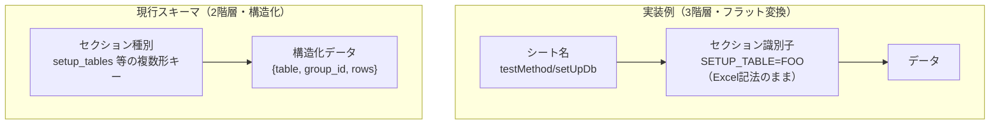
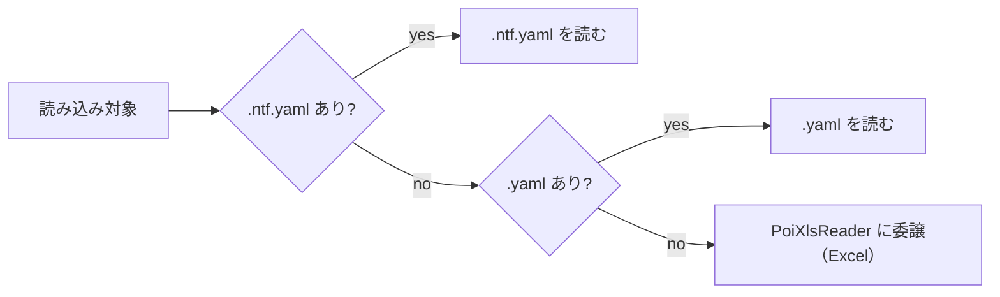

# 実装例リポジトリ vs 現行スキーマ設計 評価レポート

- **調査日**: 2026-05-15
- **評価対象リポジトリ**（javajavawhale）:
  - https://github.com/javajavawhale/nablarch-example-batch-ntf-yaml
  - https://github.com/javajavawhale/nablarch-example-web-ntf-yaml
  - https://github.com/javajavawhale/nablarch-example-rest-ntf-yaml
- **比較対象スキーマ**: `docs/pr75/ntf-testdata-yaml-schema.json` / `docs/pr75/ntf-testdata-yaml-design.md`

---

## 1. 結論と推奨

現行スキーマ設計（構造化）は、型安全性・可読性・設計文書の整備度で実装例（フラット変換）より優れる。維持してよい。劣るのは 2 点に絞られる。

- **1 ファイル複数シートの格納規則が未定義** — 実装例は 1 テストクラス = 1 ファイルを自然に扱える。現行スキーマは未対応。
- **Excel→YAML の機械変換が難しい** — 実装例は Excel 行をほぼ 1:1 で写すため変換が容易。現行スキーマは構造化パーサを要する。

**推奨**：前者はスキーマ設計の方針決定として、後者は変換ツールの実装課題として、それぞれ `design.md` に追記する。あわせて未確認 2 件（`"?"` プレフィックス、シート分割方針）の追跡を要する（→ §5）。

---

## 2. 評価基準

NTF テストデータを YAML で表す 2 つの設計を、次の軸で測る。実装例は 3 リポジトリとも同一の `YamlReader.java` 設計を共有するため、1 設計として扱う。

| 評価軸 | なぜ測るか |
|---|---|
| 互換性（NTF との動作互換） | どちらも最終的に NTF が読める形に落ちるか |
| 可読性・型安全性 | AI 生成・IDE 補完・バリデーションの可否 |
| 移行容易性（Excel→YAML） | 既存 Excel 資産を機械変換できるか |
| 設計の整備度 | スキーマ・設計文書・サンプルの有無 |
| 複数シート対応 | 1 テストクラス = 1 ファイルの管理規則に乗るか |
| パーサ実装コスト | 読み込み実装の規模 |

---

## 3. 比較

### 3.1 軸ごとの評価（測定）

| 評価軸 | 評価 | 事実 |
|---|---|---|
| 互換性 | ◎ 差なし | 実装例も現行スキーマも最終的に NTF の行変換形式に変換する |
| 可読性・型安全性 | ◎ 現行スキーマ優位 | 現行スキーマは JSON Schema 定義あり。実装例にスキーマ定義なし |
| 移行容易性 | △ 実装例優位 | 実装例はフラット変換で機械変換が容易 |
| 設計の整備度 | ◎ 現行スキーマ優位 | 現行スキーマは `design.md`・`examples.yaml`・カバレッジ文書を完備。実装例はコード内暗黙規約のみ |
| 複数シート対応 | ✕ 現行スキーマに未定義 | 実装例は 1 ファイル複数シートを扱える |
| パーサ実装コスト | △ 実装例が低コスト | 実装例は約 150 行。現行スキーマは構造化パーサが必要 |

### 3.2 設計思想の差（最大の差異）

両者を分けるのは階層構造である。実装例は Excel のシート概念を保ったフラット変換、現行スキーマはシートを消したセクション種別ごとの構造化。



| 観点 | 実装例（javajavawhale） | 現行スキーマ |
|---|---|---|
| トップレベル構造 | `シート名 → セクション識別子 → データ` の 3 階層 | `セクション種別（複数形キー）→ データ` の 2 階層 |
| シートの概念 | 保持（シート名がトップレベルキー） | 消滅（1 ファイル = 1 シート相当を前提） |
| セクション識別子 | Excel の `SETUP_TABLE=FOO` をそのままキーに使う | `setup_tables: [{table: FOO, ...}]` のように構造化 |
| スキーマ定義 | なし（コード内の暗黙規約のみ） | `ntf-testdata-yaml-schema.json` で明示的に定義 |

実装例（フラット変換）:
```yaml
setUpDb:
  SETUP_TABLE=USER: #ListMap
    - USER_ID: "001"

testMethod1:
  SETUP_TABLE[1]=USER: #ListMap
    - USER_ID: "002"
  EXPECTED_TABLE[1]=USER: #ListMap
    - USER_ID: "002"
```

現行スキーマ（構造化）:
```yaml
setup_tables:
  - table: USER
    rows:
      - USER_ID: "001"

  - group_id: "1"
    table: USER
    rows:
      - USER_ID: "002"

expected_tables:
  - group_id: "1"
    table: USER
    rows:
      - USER_ID: "002"
```

### 3.3 実装例のファイル構造と読み込み規約

```
<テストクラスと同ディレクトリ>/ClassName.ntf.yaml
```



- 1 ファイルが Excel の 1 ファイルに対応する。
- YAML トップレベルのキー = シート名（テストメソッド名 / `setUpDb` 等）。
- YAML が無い場合は Excel フォールバックで段階的移行ができる。

データ形式は値の型で 2 種類に分岐する。コメント（`#ListMap` / `#RawRows`）はパーサが参照せずドキュメント用で、`instanceof List<Map>` / `instanceof List<List>` で動的分岐する。

| コメント | 値の型 | 変換方式 |
|---|---|---|
| `#ListMap` | `List<Map>` | keys をヘッダ行に、各 Map の値をデータ行に変換 |
| `#RawRows` | `List<List>` | 行をそのまま Excel 相当の行として渡す |

### 3.4 表現方法の差（要素別）

#### ファイル系セクション（固定長・可変長）

実装例（RawRows）は Excel の行構造を直接再現する。
```yaml
SETUP_VARIABLE[1]=path/to/file.csv: #RawRows
  - ["text-encoding", "UTF-8"]
  - ["record-separator", "CRLF"]
  - ["データレコード", "field1", "field2", "field3"]
  - ["",              "半角",   "半角",   "半角"]
  - ["",              "10",     "20",     "10"]
  - ["",              "val1",   "val2",   "val3"]
```

現行スキーマは `fields` を 1 要素に統合する。
```yaml
setup_files:
  - path: path/to/file.csv
    type: variable
    directives:
      text-encoding: UTF-8
      record-separator: "\r\n"
    records:
      - record_type: データレコード
        fields:
          - {name: field1, type: X, length: 10}
          - {name: field2, type: X, length: 20}
          - {name: field3, type: X, length: 10}
        rows:
          - ["val1", "val2", "val3"]
```

実装例はパーサが大幅に単純（Excel 行変換のみ）。現行スキーマは構造が明確で型チェック・補完が可能。

#### フィールド型・null・空テーブル

| 観点 | 実装例 | 現行スキーマ |
|---|---|---|
| フィールド型 | 日本語設計書記法（`"半角"`, `"全角漢字"` 等）を RawRows の型行にそのまま使用。`BasicDataTypeMapping` のデフォルトマッピングが変換 | フレームワーク型記号（`X`, `N`, `Z` 等）を `fields[].type` に使用。`setTypes()` に渡す前に identity mapping に変換（design.md §5） |
| DB NULL | `"null"`（文字列）を多用。`NullInterpreter` が DB NULL に変換。`~` は空テーブルセンチネル専用 | `null`（YAML ネイティブ）を正式採用。`"null"` は `NullInterpreter` 経由の後方互換 |
| 空文字 | `""` | `""` |
| 空テーブル（全件 DELETE） | 全カラムを `~`（YAML null → Java `null`）にした 1 行のセンチネル行を記述。パーサは「全値 null の先頭行はセンチネル」として除外 | `rows: []`（空配列）。design.md §schema.json description に「空配列は全件削除」と記載 |
| 設計の根拠 | Excel 慣習の踏襲 | YAML ネイティブ null を使うことで意味が明確 |

**測定に対する判断**：
- 型記法は、実装例は日本語表記で設計書との照合が容易、現行スキーマはマッピングを意識せず書けるが設計書との対照が必要。
- DB NULL は、実装例の `"null"` 文字列は NTF の内部変換知識を要し、現行スキーマの YAML ネイティブ `null` の方が意味が明確。
- 空テーブルは、実装例のセンチネル方式はデータに見えてデータでなく直感的でない。現行スキーマの `rows: []` の方が意図が明確。

### 3.5 実装例にあり現行スキーマに無い概念

| 概念 | 実装例の記法 | 現行スキーマでの扱い |
|---|---|---|
| シート（テストメソッド）スコープ | 1 ファイルに `setUpDb`・`testNormalEnd` 等が共存し、メソッド単位でデータをスコープ | 概念なし。ファイル全体が 1 シート相当 |
| グループ ID | `SETUP_TABLE[1]=TABLE_NAME` の `[数字]`。数字以外の任意文字列も可（例 `EXPECTED_TABLE[case1]=...`） | `group_id: "1"` に対応。文字列型なので互換あり |
| `"?"` プレフィックス | batch リポジトリの `SETUP_VARIABLE` で `"?filler"` を確認 | 記載なし。用途は未確認（DataFormat の filler フィールドのワイルドカード指定か。[要確認]） |
| `"${attach:...}"` 記法 | web リポジトリで `"${attach:./path/to/file}"` を確認。ファイルアップロードの添付パス参照 | 記載なし。`BinaryFileInterpreter` の `${binaryFile:パス}` とは別物（HTTP リクエスト系の添付指定） |

シートスコープの影響：実装例と同じ「1 テストクラス 1 ファイル」配置を採る場合、現行スキーマには複数シートを 1 ファイルに格納する方法が無い。`design.md §変換ツール方針` に「複数シートはプロジェクトルールで決定すること」とあるが、スキーマレベルでは未対応。

---

## 4. 根拠（軸ごとの優劣の出どころ）

### 4.1 現行スキーマが優れる点

| 観点 | 根拠 |
|---|---|
| 型安全性・バリデーション | JSON Schema による型チェック・enum 制約・required 検証が可能。実装例にはスキーマ定義がない |
| AI 可読性 | 構造化キー名（`setup_tables`, `records`, `fields`）で意図が明確。実装例の `SETUP_TABLE=FOO` は NTF 知識が前提 |
| 空テーブルの表現 | `rows: []` は意図が明確。実装例の全 `~` センチネル行は直感的でない |
| null の表現 | YAML ネイティブ `null` で意味が明確。実装例の `"null"` 文字列は NTF の内部変換知識が必要 |
| フィールド定義の可読性 | `{name: FOO, type: X, length: 10}` で 1 行 1 フィールド。実装例は RawRows 形式で可読性が低い |
| 設計文書の整備 | `design.md`・`examples.yaml`・P4-2 カバレッジ文書が揃う。実装例はコード内暗黙規約のみ |

### 4.2 実装例が優れる点

| 観点 | 根拠 |
|---|---|
| パーサ実装の単純さ | Excel 行変換ロジックを流用でき `YamlReader.java` が約 150 行で完結。現行スキーマは構造化パーサが必要 |
| 既存テストデータとの互換性 | Excel の行構造をそのまま YAML に落とすためほぼ 1:1 で機械変換できる |
| フィールド型の可読性 | `"半角"`・`"全角漢字"` 等の日本語表記が使え、設計書との照合が容易 |
| 1 ファイル複数シート | テストクラスと 1:1 対応でき、Excel ファイル単位の管理規則と親和性が高い |
| 後方互換（Excel フォールバック） | YAML が無い場合に自動で Excel へ委譲し、段階的移行が容易 |

---

## 5. 次の一歩（design.md へのフィードバック）

### 5.1 要検討：複数シート格納の対応

1 テストクラス = 1 ファイルは現実的なユースケースだが、現行スキーマには複数シートを 1 ファイルに格納する方針が無い。`design.md §段階的移行戦略` の「複数シートの Excel ファイルはシートごとに YAML を分割するか 1 ファイルにまとめるかをプロジェクトルールで決定すること」は言及にとどまる。選択肢：

- **A**：現行スキーマを維持し、1 テストクラスを複数 YAML に分割（`FooTest.setUpDb.yaml`・`FooTest.testMethod1.yaml` 等）
- **B**：現行スキーマにシート名トップレベルを追加し、1 ファイル複数シートを許容
- **C**：実装例方式（フラット変換）と現行スキーマ（構造化）を別実装とし、パーサで切り替え

→ `design.md` の移行戦略節に「ファイル分割方針の決定を要する」旨を追記する。

### 5.2 要検討：`"?"` プレフィックス（ワイルドカード）

batch リポジトリの `"?fieldName"` 記法が NTF のどの機能に対応するかは未確認。DataFormat の `?filler` は期待値検証をスキップするフィールド指定の可能性がある。[要確認] P4-3（テストコード調査）で確認する。

### 5.3 確認済み：null の設計方針は現行スキーマが優位

実装例の `"null"` 文字列の多用は技術的負債。現行スキーマの YAML ネイティブ `null` 推奨は正しい。追加対応不要。

### 5.4 確認済み：`"${attach:...}"` 記法は対象外

`"${attach:./path/to/file}"` は HTTP 系リクエストテストのファイルアップロード専用記法で、NTF のテストデータ構造（テーブル・ファイル・メッセージ）の範囲外（テストフレームワーク側の機能）。現行スキーマの対象外で問題ない。
