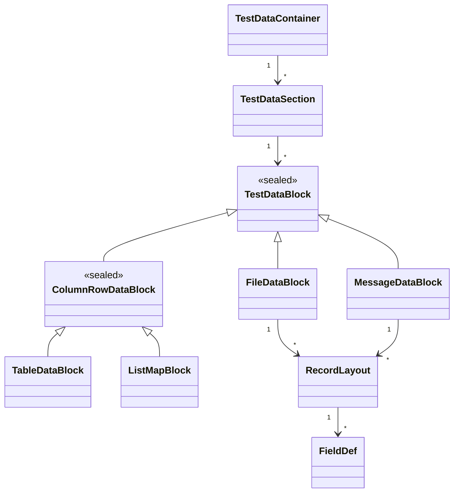
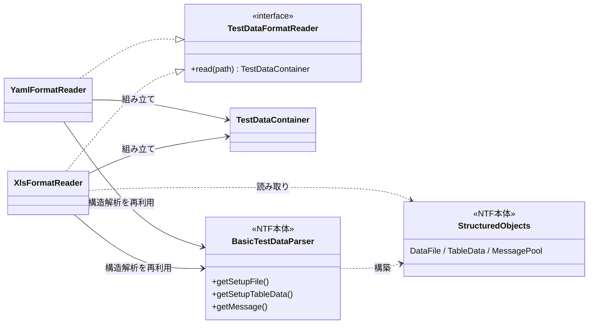
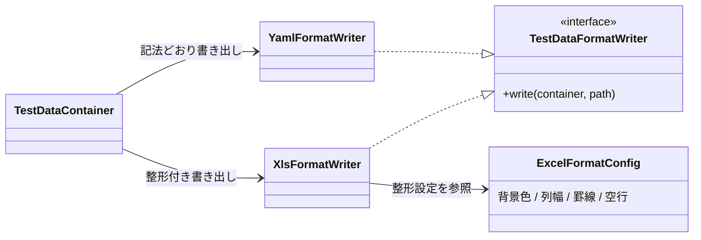
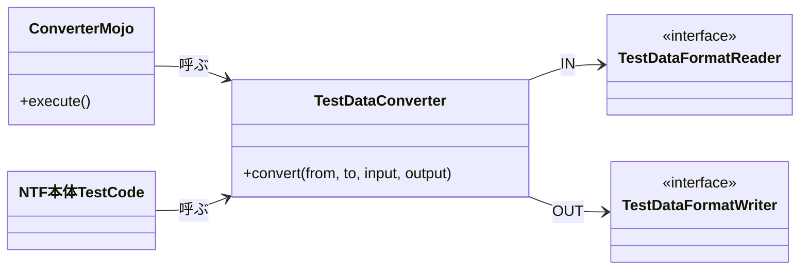

# NTF テストデータ変換ツール 設計書

---

## 1. 背景

NTF のテストデータは Excel で記述されてきたが、新たに YAML 形式に対応する。
Excel と YAML を相互変換する変換ツールを提供するにあたり、変換ツールと NTF 本体で**読み込みロジックを共有**し、両者で解釈がズレないことを保証する。
解釈がズレると、変換ツールが妥当とみなしたデータを本体が別物として読む、といった不整合が生じるため、共有を設計の前提とする。

本体の読み込み機構は `ntf-testdata-loading.md` を参照。

---

## 2. 要件

### 2.1 NTF 仕様

中間モデルは、特定の形式ではなく **NTF 仕様上の意味**を基準に表現する。
Excel と YAML は同じ意味を各形式の記法で表したものであり、いずれも基準としない。

**可逆性**：ある形式から中間モデルへ変換し、再び同じ形式へ書き出したとき、NTF 仕様上の意味が変わらないこと。
形式に固有で NTF 仕様上の意味を持たない情報（Excel の色・書式・結合セル、YAML のコメント等）は中間モデルに乗らず、可逆性の対象外とする。

**保持の判断基準**：その情報がテスト作成者の意図を持つなら中間モデルに保持する。持たない（本体が機械的に補う/捨てる）なら本体に従う。

本体の読み込み①読む→②掃除→③特殊記法変換→④組み立てに対し、変換ツールが各処理を実行するかを示す。

| 段 | 処理 | 変換ツールでの実行 | 理由 |
|---|---|---|---|
| ① | 読む（形式→行・セル）| 実行する | 変換ツールも各形式を読み取る |
| ② | コメント行除去 | 実行する | 注釈用途。中間モデルに位置づける先がない |
| ② | 行内コメント除去（`//` 以降）| 実行する | 同上 |
| ② | 空行除去（完全な空行）| 実行する | 全セル空は無意味。仕様上もスキップ対象 |
| ③ | 特殊記法変換（`null`・`${...}`・`""`・`\r` 等）| 実行しない | 不可逆。記法のまま保持しないと本体の挙動が壊れる |
| ④ | 構造解析（名前/型/長さ/データの読み解き）| 実行する | 中間モデルの組み立てに必須 |
| ④ | マーカーカラム除外 | 実行しない | `[...]` を外せば意味のあるカラム名であり、作成者の意図を持つ |
| ④ | 行末空セル除去 | 実行する | 末尾の無意味な余白。意図を持たない |
| ④ | レコード種別の default 補完 | 実行しない | 元データにない値。補完は本体の責務 |
| ④ | デフォルト値補完（DB 登録時）| 実行しない | DB 登録時の処理であり読み込み構造化の対象外。元にない値 |

補足：

- **空行の区別**：完全な空行（全セル空）は無意味として除去する。「先頭フィールドのみ空」の空エントリは完全な空行ではなく、ファイルデータではデータ行として意味を持つため保持する。
- **補完を行わない整合**：default 補完・DB デフォルト値補完は中間モデルでは行わず空欄のまま保持し、復元時も補完しない。最終的に本体が読み込む際に補うため結果は変わらない。補完は本体の責務に一貫させる。

中間モデルが満たす状態：

- **構造は解析済み**：レコードレイアウトの区切り、各行の役割（ディレクティブ／レコード種別／フィールド名称／データ型／フィールド長／データ）、フィールド名と値の対応を保持する。
- **値は未変換**：特殊記法を解決せず元データのまま保持する（例：`${systemTime}` は文字列のまま）。
- **意図ある情報は無損失**：マーカーカラム、空エントリ、空欄のレコード種別を保持する。
- **無意味な情報は持たない**：コメント、完全な空行、行末の空セルは保持しない。

### 2.2 後方互換性

- **既存 NTF 本体（Excel 読み込み）**：観測可能な挙動の維持が必達。振る舞いを変えないリファクタリングは可。
- **YAML 対応・変換ツール**：新規開発につき変更可。
- **既存 NTF 本体のテストコード**：変更可。

### 2.3 モジュール

- YAML 対応と変換ツールは、実装完了後に**別リポジトリへ分割**する。他バージョンの実装をフォークして作りやすくするため。
- Nablarch の機能追加対象は**最新バージョン（v6）のみ**。

---

## 3. アプローチ

要件（2 章）を満たすための具体的な実現方法。
変換ツール側で作るものと、それが依存する NTF 本体の再利用化に分けて示す。

### 3.1 変換ツール

#### 中間モデル

NTF 仕様の構造（2.1）をそのまま持ち、形式に依存しない。
Excel 固有・YAML 固有の表現（色・書式・結合セル・コメント等）は持たず、形式間で共通の表現とする。

#### IN（形式 → 中間モデル）

各形式を読み、構造を読み解いて中間モデルへ写す。各処理を実行するかは 2.1 の表に従う。本体ロジックのうち、

- **実行する**：①読む、④構造解析（3.2 で再利用化したもの）。
- **実行しない**：③特殊記法変換、④破壊的整形。

を経路に組み込み、特殊記法・マーカーカラム・空欄は未解決のまま中間モデルへ渡す。

#### OUT（中間モデル → 形式）

中間モデルの内容を、各形式の記法で書き出す。未解決の特殊記法・マーカーカラム・空欄は、その形式の書式でそのまま表現する。
本体仕様に書き出し処理はないため、OUT は各形式の記法規則と、後述の整形設定で定まる。

形式によって読み手が異なるため、整形の方針を分ける。

- **YAML OUT**：AI エージェントが読む前提。機械可読であれば足り、記法どおりに書く。整形の作り込みは行わない（インデント・クォートスタイル程度）。
- **Excel OUT**：人が見て編集する前提。行の種類ごとの装飾やレイアウトで読みやすく整える。

**Excel OUT の整形は設定で指定可能とする。** 整形は NTF 仕様上の意味を持たないため中間モデルには乗らず、OUT 時に設定に従って新規付与する。
設定しなくても見やすい既定値（デフォルト）を用意する。
整形は可逆性の対象外であり、Excel → 中間モデル → Excel の往復で元の色・書式は再現されず、設定（またはデフォルト）に従った整形が付く。

整形項目とデフォルト（いずれも上書き可能）：

| 設定項目 | デフォルト |
|---|---|
| データタイプ識別行（`SETUP_TABLE=...` 等）の背景色 | 一般的な見やすい配色を調査して決める |
| フィールド名称行／ヘッダ行（カラム名行）の背景色 | 一般的な見やすい配色を調査して決める |
| ディレクティブ行・データ型行・フィールド長行の背景色 | 一般的な見やすい配色を調査して決める |
| マーカーカラムの背景色 | 一般的な見やすい配色を調査して決める |
| 列幅 | 各列の値の最大文字数に合わせて自動調整 |
| 罫線 | データブロックの外枠に細線 |
| データブロック間の空行 | 1 行挿入 |

### 3.2 NTF 本体の再利用化

#### 方針

要件で再利用すると定めた①読む・④構造解析を、変換ツールから本体と共有して呼び出せるようにする。
後方互換性（2.2）により、既存の観測可能な挙動は変えない。対応はいずれも、構成での差し替え、または API を広げる方向（後方互換を保つ変更）に限る。

#### 再利用したい処理と課題

本体には Excel 読み込みと YAML 読み込みの **2 系統**があり、両系統は別実装である。再利用する①読む・④構造解析の各系統での実装は次のとおり。③特殊記法変換は再利用対象ではないが、構造解析と同じ経路を通るため併記する。

| 段 | Excel 経路 | YAML 経路 | 課題 |
|---|---|---|---|
| ① 読む | `PoiXlsReader` | `YamlLoader.load` | なし。そのまま再利用できる |
| ③ 特殊記法変換 | `interpreters` を読み込み段で全行適用 | `YamlSection.interpret` | 変換ツールでは不要（外したい） |
| ④ 構造解析 | `DataFileParser`／`TableDataParser` の状態機械 | `YamlFileBuilder`／`YamlTableDataBuilder` の独自実装 | 結果を取り出せない。2 系統が別実装 |

④構造解析の課題は 2 つ。

- **結果を取り出せない**：結果（`DataFile`／`TableData`／`MessagePool`）は本体が読み解いた内容をすべて保持する（無損失）が、取り出し口 `getResult` がパッケージプライベートで外部から呼べない。器の中身を読む getter も揃っていない。
- **2 系統が別実装**：同じ `DataFileFragment`／`TableData` の構築が Excel・YAML で二重にあり、構造解釈ズレの温床となる。これが最大の課題。

#### 対応

各段への対応を、依存の浅い順に示す。いずれもコアの観測可能な挙動を変えない。

##### ① 読む — そのまま再利用

両経路ともリファクタリング不要。変換ツールは経路に応じて `PoiXlsReader`（Excel）／`YamlLoader.load`（YAML）を供給する。

##### ③ 特殊記法変換 — 外す

`interpret` は `interpreters`（`List<TestDataInterpreter>`）を順に適用する処理で、Excel・YAML いずれも構成で差し替えられる。変換ツールは**空の `interpreters`** を渡す。これにより特殊記法（`null`・`${...}`・`""` 等）が記法のまま保持される。

> ④破壊的整形（`trimTailCopy`、行末空セル除去）は要件 2.1 で「実行する」と定めた整形に当たる。通してよく、外すのは③のみ。

##### ④ 構造解析 — 結果を取り出す

`getResult` を `protected` へ広げ、構造解析の結果を取り出せるようにする。取り出した結果を変換ツールが中間モデルへ写す（マッピングは変換ツールの責務）。`parse → getResult` の順序保証は、外部入口を公開 API（`getSetupFile` 等）に保つことで維持する。
全データタイプ（FIXED／VARIABLE／TABLE／LIST_MAP／MESSAGE）で取り出しと無損失を実証済み。

結果を取り出せても、その中身を読む手段が要る。器ごとに getter の整備状況が異なる。

| 器 | 中身を読む公開 getter | 対応 |
|---|---|---|
| `TableData` | 整備済み（`getTableName`／`getColumnNames`／`getValue`。`getValue` は無損失） | そのまま使う |
| `DataFile`／`DataFileFragment` | 未整備（フラグメント列・names／types／lengths／values の getter なし。`DataFileFragment` は `@Published` も無し） | getter を追加。`DataFileFragment` に `@Published` を付与 |
| `MessagePool` | 未整備（fwHeader・records の getter なし） | getter を追加 |
| LIST_MAP | 不要（戻り値が `List<Map<String,String>>` で素の型） | 対応なし |

getter 追加は `TableData` で確立済みの方針へファイル系・メッセージ系を揃えるもの。内部表現の露出を避けるため読み取り専用ビュー等で返す。

なおテーブル系は、構造解析（`TableData.addRow`）の途中で `dbInfo.getColumnType` を要求する。値の保持は文字列のままで型に依存しないが、`dbInfo` が null だと読み取れない。変換ツールは型を要さないため、カラム型を返すだけの**スタブ `DbInfo`**（`@Published` インタフェース）を構成で差し込む。

##### ④ 構造解析 — 2 系統を統合する

ここまでで Excel・YAML とも既存の④実装から結果を取り出せる。ただし④が 2 系統に分かれたままでは、解釈ズレの温床（最大の課題）が残る。
両経路とも行（`List<String>` 相当）を構造解析へ供給する点は共通である。供給元を `TestDataReader`（`@Published` の公開インタフェース）実装として揃えれば、その先の④を 1 本へ統合できる。

- Excel：`PoiXlsReader`（既存）。
- YAML：YAML を行表現へ写す `TestDataReader` 実装を新設し、`YamlFileBuilder`／`YamlTableDataBuilder` の独自構築を廃して同一の④へ合流させる。

これにより `DataFileFragment`／`TableData` の構築が 1 箇所となり、二重実装と解釈ズレが解消する。統合の具体的な接合点は 4 章「構造」で確定する。

---

## 4. 構造

変換ツールは中間モデルを介する Reader／Writer 構成をとる。中間モデル・IN・OUT の順に示す。
要件との照合により、IN は本体の構造解析を再利用する形とし、OUT の Excel は整形設定を加える。

### 中間モデル

読み込み単位までの対応：

| クラス | 役割 | Excel | YAML |
|---|---|---|---|
| `TestDataContainer` | テストクラス1つ分のテストデータ | 1 ブック | 1 ディレクトリ |
| `TestDataSection` | 読み込み単位 | 1 シート | 1 ファイル |

読み込み単位の中身（データブロックとその構成要素）：

| クラス | 役割 |
|---|---|
| `TestDataBlock` | データブロック。データブロック種別＋識別子の値で識別する |
| `FileDataBlock` | ファイルデータブロック |
| `ColumnRowDataBlock` | カラム名行＋データで表すデータブロック（テーブル／LIST_MAP） |
| `MessageDataBlock` | メッセージングのデータブロック（FW 制御ヘッダ＋本文） |
| `RecordLayout` | レコードレイアウト（レコード種別＋フィールド定義＋データ） |
| `FieldDef` | 1 フィールド分（フィールド名称・データ型・フィールド長） |

### IN（形式 → 中間モデル）

各形式を本体の構造解析（3.2）で読み解き、中間モデルへ組む。

| クラス | 役割 |
|---|---|
| `TestDataFormatReader` | IN の共通インタフェース |
| `XlsFormatReader` | Excel を読む |
| `YamlFormatReader` | YAML を読む |
| `BasicTestDataParser` | 本体の構造解析の入口（公開 API） |
| `StructuredObjects` | 構造解析の結果（`DataFile`／`TableData`／`MessagePool`） |

### OUT（中間モデル → 形式）

中間モデルを各形式へ書き出す（3.1）。

| クラス | 役割 |
|---|---|
| `TestDataFormatWriter` | OUT の共通インタフェース |
| `YamlFormatWriter` | YAML を書き出す |
| `XlsFormatWriter` | Excel を書き出す |
| `ExcelFormatConfig` | Excel の整形設定（3.1 の表）。デフォルトを備え上書き可能 |

---

## 5. UX

### 利用者

| 利用者 | やりたいこと | 利用シーン |
|---|---|---|
| NTF の利用 PJ（AI 対応を使いたい PJ） | 既存の Excel テストデータを、AI エージェントが扱える YAML へ移す（または逆） | 手元でコマンドを実行し、ディレクトリ配下を一括変換する |
| Nablarch 開発チーム | YAML 対応の品質担保として、本体テストを変えずに YAML 経路でも通るか確認する | テスト実行時に Excel を YAML へ動的変換し、その YAML でテストを回す |

### 提供形態

両利用者は同じ変換の入口クラス（`TestDataConverter`）を使う。利用 PJ は Maven プラグインから、開発チームはテストコードから、同じ入口クラスを呼ぶ。

| クラス | 役割 |
|---|---|
| `TestDataConverter` | 変換の入口。形式（from／to）と入出力先を受け、IN→OUT を実行する |
| `ConverterMojo` | Maven プラグインの実行単位。引数を組み立てて `TestDataConverter` を呼ぶ |

### 利用 PJ：Maven プラグイン

`ConverterMojo` が変換形式・対象範囲（include／exclude）・上書き可否などを受け取り、`TestDataConverter` をディレクトリ単位で起動する。

### 開発チーム：テストコードからの利用

テストコードが `TestDataConverter` を直接呼び、既存の Excel テストデータを実行時に YAML へ変換する。

- 出力先に一時ディレクトリを渡す。変換結果の YAML は git 管理せず、テスト実行のたびに生成・破棄する。
- 入口クラスは出力先を引数で受けるだけで、一時領域か永続領域かを区別しない。一時ディレクトリの確保と後始末はテストコード側が担う。

---

## 6. 品質担保

変換ツールの品質は「変換しても NTF 仕様上の意味が変わらない」ことに尽きる。粒度の小さい順に 4 段階で担保する。

### 6.1 各クラスのユニットテスト

IN（Reader）・OUT（Writer）・中間モデルの各クラスを単体で検証する。カバレッジ C0／C1 100% を基準とし、分岐はモックで網羅する。

- IN：各形式・各データブロック種別を読み、中間モデルが期待どおり組まれるか。特に値が未変換（特殊記法が記法のまま）であること。
- OUT：中間モデルから各形式へ書き、記法・整形が期待どおりか。
- 全データブロック種別（FIXED／VARIABLE／TABLE／LIST_MAP／MESSAGE 系）を網羅する。

### 6.2 往復変換の確認

可逆性（2.1）を検証する。同一形式での往復（Excel → 中間モデル → Excel、YAML → 中間モデル → YAML）で、NTF 仕様上の意味が変わらないことを確認する。

- 形式固有で意味を持たない情報（色・書式・コメント等）は対象外。整形は設定に従って付与されるため、元の装飾の再現は問わない。

### 6.3 本体テストの YAML 変換（振る舞い不変の担保）

`nablarch-testing` の既存 Excel テストを YAML へ変換し、**全件 PASS する**ことを確認する。

- 5 章のテストコード用途（`TestDataConverter` を実行時に呼び、Excel を一時 YAML へ変換）を用いる。
- 既存テストのアサーションを変えず、読み込む形式だけを YAML に差し替えて回す。Excel で全件 PASS している既存テストが、YAML 経路でも全件 PASS すれば、変換が NTF 仕様上の意味を保っていることの担保になる。
- 変換結果の YAML は git 管理せず、テスト実行のたびに生成・破棄する。

### 6.4 サンプルアプリでの動作確認

公式サンプルアプリのテストデータをすべて YAML へ変換し、テストが全件 PASS することを確認する。対象は次のとおり。

Example アプリ：

- [nablarch-example-web](https://github.com/nablarch/nablarch-example-web)（ウェブ）
- [nablarch-example-rest](https://github.com/nablarch/nablarch-example-rest)（RESTful Web サービス）
- [nablarch-example-batch](https://github.com/nablarch/nablarch-example-batch)（Nablarch バッチ）
- [nablarch-example-http-messaging](https://github.com/nablarch/nablarch-example-http-messaging)（HTTP メッセージング受信）
- [nablarch-example-http-messaging-send](https://github.com/nablarch/nablarch-example-http-messaging-send)（HTTP メッセージング送信）
- [nablarch-example-mom-delayed-send](https://github.com/nablarch/nablarch-example-mom-delayed-send)（MOM 応答不要送信）
- [nablarch-example-mom-sync-send-batch](https://github.com/nablarch/nablarch-example-mom-sync-send-batch)（MOM 同期応答送信）
- [nablarch-example-mom-delayed-receive](https://github.com/nablarch/nablarch-example-mom-delayed-receive)（MOM 応答不要受信）
- [nablarch-example-db-queue](https://github.com/nablarch/nablarch-example-db-queue)（DB キュー）
- [nablarch-biz-sample-all](https://github.com/nablarch/nablarch-biz-sample-all)（ユースケース別実装例）

[システム開発ガイドのサンプルプロジェクト](https://github.com/Fintan-contents/nablarch-system-development-guide)（`Sample_Project/Source_Code` 配下）：

- climan-project（顧客管理システム）の RESTful Web サービス
- proman-project（プロジェクト管理システム）のバッチ（proman-batch）

---

## 7. 開発

### 開発とリポジトリ分割の手順

リポジトリ分割（2.3）を見据え、`nablarch-testing` 内で YAML 対応・変換ツールを独立したパッケージとして分離して開発する。分割は次の手順で行う。

1. `nablarch-testing` 内で、分割先と同じ境界でパッケージを分けて開発する。
2. 6.3（本体テストの YAML 変換が全件 PASS）まで完了させる。
3. 有識者レビューを受ける。
4. 承認後、既存の分割先リポジトリ（[nablarch-testing-yaml](https://github.com/nablarch/nablarch-testing-yaml)／[nablarch-testing-converter](https://github.com/nablarch/nablarch-testing-converter)）へ分割する。
5. 分割後、6.4（サンプルアプリでの動作確認）を実施する。

### 過去バージョンへの対応

機能追加対象は最新バージョン（v6）だが、過去バージョンへの展開も見込む。

#### v6（機能追加対象）

機能追加で対応する（Nablarch のバージョンポリシーに従う）。
全バージョンのリリースノートを確認した結果、変換ツールが依存する本体 API・読み込み構造解析に対し、v6 では後方互換を壊す変更は確認されなかった。`nablarch-testing` は v6 で `2.x` 系であり、v6 での主な変更は Jetty 12 化・Java 21 対応・公開 API 追加にとどまり、いずれも読み込み構造解析に影響しない。よって v6 への機能追加は阻害要因なく成立する。

#### v5・v1.4〜v1.2（過去展開）

- **YAML 対応**：フォークして過去バージョン向けに作成する。対象バージョンに合わせて JDK と NTF のバージョンを変える必要がある。
- **変換ツール**：依存する本体 API（4 章 IN）に、過去バージョンのリリースノート上で後方互換を壊す変更は確認されなかった。よって過去バージョンでもそのまま再利用できる。

なお、過去バージョンでは本体の読み込み挙動そのものが次の境界で切り替わる。いずれも本体側の挙動差であり、変換ツールは本体の構造解析を再利用する（3.2）ため自動的に追従する。変換ツール側に固有の対応は要さないが、対象バージョンの本体挙動として認識しておく。

| 挙動差 | 境界 | 内容 |
|---|---|---|
| 空行の扱い | NTF 1.1 系で修正 | 全カラム空文字レコードを読み飛ばす不具合を、空行を明示記述できるよう修正。境界より前は空エントリの保持挙動が異なる |
| xlsx 形式対応 | NTF 1.2.0 で追加 | テストデータの形式として xls に加え xlsx に対応（Apache POI 入替）。境界より前は本体が xlsx を読めない |
| 空文字→null 変換 | dataformat（v5 で挙動明確化） | 可変長／固定長ファイル読込時、未入力値（空文字列）を既定で null に変換（`convertEmptyToNull`）。設定で無効化できる |

#### 判定の根拠

Nablarch は後方互換を維持する方針であり、後方互換に影響する変更（API・動的挙動とも）はリリースノートに記録される。上記はその全バージョンのリリースノートを確認した範囲での判断である。
