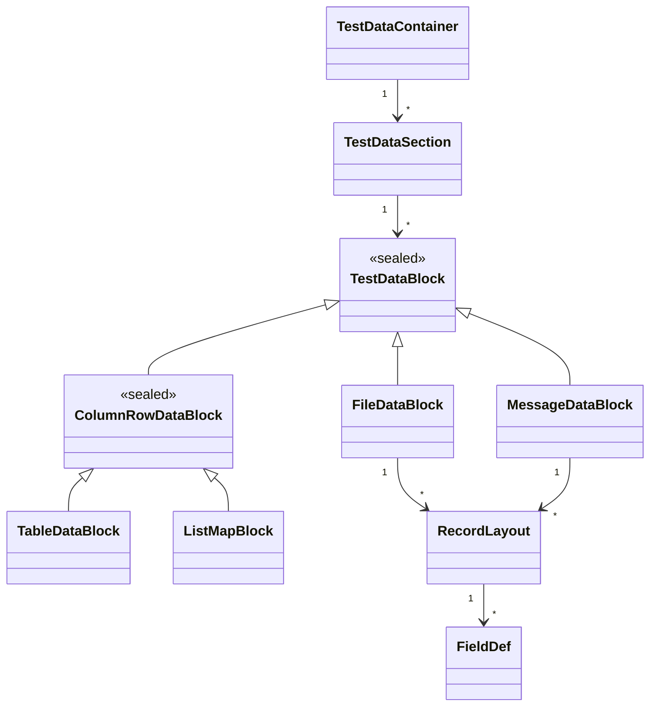
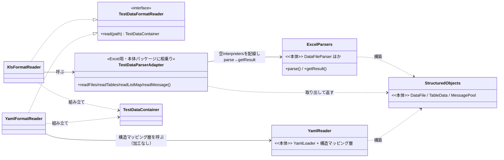
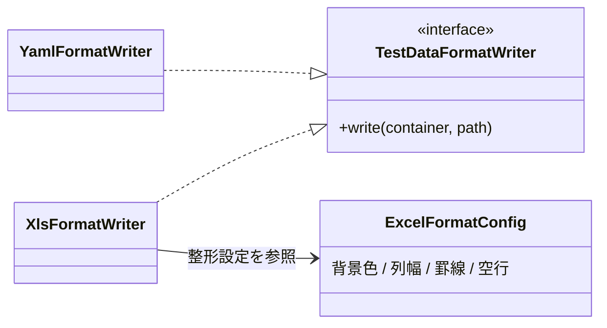
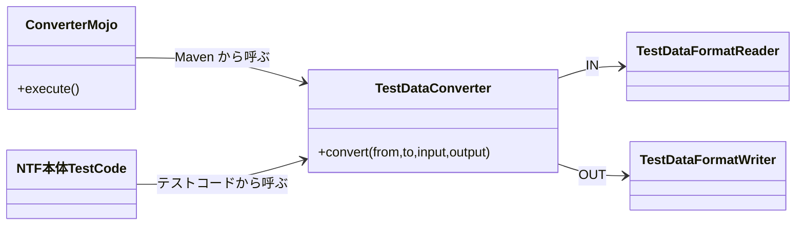

# NTF テストデータ変換ツール 設計書

NTF のテストデータを Excel と YAML で相互変換するツールの設計です。
中核の設計判断は一つ──**読み込みロジックを NTF 本体と共有し、変換ツールと本体で解釈がズレないことを保証する**こと。ズレれば、変換ツールが妥当とみなしたデータを本体が別物として読む不整合が起きます。この一点から、以下の構造・再利用方針・品質担保がすべて導かれます。

本体の読み込み機構は [ntf-testdata-loading.md](ntf-testdata-loading.md) を参照。

---

## 1. 何を作るか（背景と決定）

### 解くべき課題

Excel で書かれてきた NTF テストデータを、AI エージェントが扱える YAML にも対応させる。そのため両形式を相互変換するツールを作る。難所は前述のとおり、変換ツールと本体で構造解釈をズラさないことにある。

### 基準は「形式」ではなく「NTF 仕様上の意味」

中間モデルを置き、Excel と YAML はその意味を各形式の記法で表したものとして扱う。どちらの形式も基準としない。

**可逆性**：ある形式 → 中間モデル → 同じ形式 と往復したとき、NTF 仕様上の意味が変わらないこと。形式に固有で意味を持たない情報（Excel の色・書式・結合セル、YAML のコメント等）は中間モデルに乗らず、可逆性の対象外とする。

**中間モデルが満たす状態**：

- 構造は解析済み（レコードレイアウトの区切り、各行の役割、フィールド名と値の対応を保持）
- 値は未変換（`${systemTime}` 等の特殊記法を解決せず文字列のまま保持）
- 意図ある情報は無損失（マーカーカラム、空エントリ、空欄のレコード種別を保持）
- 無意味な情報は持たない（コメント、完全な空行、行末の空セルを除去）

### 保持するか捨てるかの判断基準

迷う情報は一つの基準で割り切る。**その情報がテスト作成者の意図を持つなら保持し、持たない（本体が機械的に補う／捨てる）なら本体に従う。**

本体の読み込み（①読む→②掃除→③特殊記法変換→④組み立て）の各処理を、変換ツールが実行するかどうかは、この基準で決まる。

| 段 | 処理 | 変換ツール | 理由 |
|---|---|---|---|
| ① | 読む（形式→行・セル）| 実行 | 変換ツールも各形式を読む |
| ② | コメント行・行内コメント除去 | 実行 | 注釈用途。中間モデルに位置づける先がない |
| ② | 空行除去（完全な空行）| 実行 | 全セル空は無意味。仕様上もスキップ対象 |
| ③ | 特殊記法変換（`null`・`${...}`・`""`・`\r` 等）| **実行しない** | 不可逆。記法のまま保持しないと本体の挙動が壊れる |
| ④ | 構造解析（名前/型/長さ/データの読み解き）| 実行 | 中間モデルの組み立てに必須 |
| ④ | マーカーカラム除外 | **実行しない** | `[...]` を外せば意味あるカラム名。作成者の意図を持つ |
| ④ | 行末空セル除去 | 実行 | 末尾の無意味な余白。意図を持たない |
| ④ | レコード種別の default 補完 | **実行しない** | 元データにない値。補完は本体の責務 |
| ④ | デフォルト値補完（DB 登録時）| **実行しない** | DB 登録時の処理。読み込み構造化の対象外 |

補足が要るのは 2 点。**空行の区別**──「先頭フィールドのみ空」の空エントリは完全な空行ではなく、ファイルデータではデータ行として意味を持つため保持する。**補完の一貫性**──default 補完・DB デフォルト値補完は中間モデルでは行わず空欄のまま保持し、復元時も補完しない。最終的に本体が読む際に補うので結果は変わらず、補完の責務を本体に一貫させられる。

### 制約

- **既存 NTF 本体（Excel 読み込み）**：観測可能な挙動の維持が必達。挙動を変えないリファクタリングは可。
- **YAML 対応・変換ツール**：新規開発につき変更可。
- 機能追加対象は最新バージョン **v6 のみ**。実装完了後、YAML 対応と変換ツールは別リポジトリへ分割する（他バージョンをフォークで作りやすくするため）。

---

## 2. どう作るか（設計判断）

冒頭の「本体と解釈をズラさない」を、**本体の構造解析を変換ツールが再利用する**ことで満たす。本体と同じ器（`DataFile`／`TableData`／`MessagePool`）に行き着けば、構造解釈は 1 箇所に集約されズレない。

再利用する処理としない処理の線引きは、1 章の表のとおり。①読む・④構造解析は再利用し、③特殊記法変換・④破壊的整形（本体 getter が被せる加工）は持ち込まない。

ここで設計判断が分かれるのは、**本体に Excel と YAML の 2 系統があり、再利用の取り回しが違う**点。経路ごとに判断を示す。

### 判断 A：Excel 経路 — アダプタで再利用

**検討した選択肢と却下理由**

本体の `BasicTestDataParser` の公開 API（`getSetupFile`／`getExpectedTableData` 等）をそのまま呼ぶ案は却下した。これらは結果を返す前に不要な加工を被せるため──`getSetupFile` は `BinaryFileInterpreter` を必ず先頭に積み `${binaryFile:...}` を解決し、`getExpectedTableData` は `fillDefaultValues`（DB 全カラム補完）と種別マージを行う。1 章の「記法のまま・無損失」に反する。

**決定**

公開 API を経由せず、配線役の責務だけを薄いアダプタが肩代わりする。`BasicTestDataParser` は各 Parser へ `reader`・`interpreters`（・テーブル系は `dbInfo`）を渡して生成しデータタイプで振り分ける配線役にすぎない。アダプタが同じ配線を、**空の `interpreters`** で行い、`parse → getResult` で生の器を取り出す。

これで `null`・`${...}`・`""` 等は解釈されず、補完・マージも起きない。特殊記法は記法のまま中間モデルへ運ばれ、本体がテストとして読む際に解釈される。

> 1 章で「実行する」と定めた整形（行末空セル除去など）は外さない。外すのは③特殊記法変換のみ。

**残る課題と対応**：取り出し口 `getResult` と一部 Parser のコンストラクタがパッケージプライベートで、変換ツールの正しいパッケージから直接呼べない。同一パッケージに置いたアダプタがこの壁を越える（相乗りはこのアダプタ 1 枚に閉じる)。

### 判断 B：YAML 経路 — 構造マッピング層を再利用

**検討した選択肢と却下理由**

YAML も本体の読み込み（`YamlLoader` ＋ Builder 群）が同じ加工（特殊記法解釈・補完・マージ）を含むため、Excel と同じくアダプタで回避する案がまず考えられる。だが YAML は変更可（新規開発）であり、「空の `interpreters` を渡すと加工が外れる」という暗黙の切り替えに頼る回避策をあえて選ぶ理由がない。

**決定**

本体の YAML 読み込みを 2 層に分ける。

- **構造マッピング層**：YAML の構造（テーブル名・カラム・行・型）を本体の器へ写す。値の加工はしない。本体テスト読み込みと変換ツールが共有する。
- **値加工層**：特殊記法の解釈・補完・マージ。本体がテストとして読むときだけ上に乗せる。

本体テスト読み込みは両層、変換ツールは構造マッピング層だけを呼ぶ。呼び分けが暗黙でなく明示になり、構造解釈は 1 箇所に集約される。YAML は新規開発なので、この分離を最初から織り込める。

> **依存の向き**：主軸は NTF 本体。本体の YAML 読み込みは本体基準で設計し本体の器を返す。変換ツールはそれを再利用する側で、依存は変換ツール → 本体の一方向。本体が変換ツールの中間モデルに合わせて設計されることはない。NTF 仕様の特殊記法（`${systemTime}` 等）は YAML でも当然サポートし、解釈は値加工層が担う。

### 共通：器の中身を読む手段

取り出した器の中身は、本体に整備済みの public getter で読める。いずれも**本体無変更**。

| 器 | 中身を読む手段 |
|---|---|
| `TableData` | `getTableName`／`getColumnNames`／`getValue` |
| `DataFile`／`DataFileFragment` | `getAllFragments`／`getNames`／`getTypes`／`getLengths`／`getValues`／`getDirectives` |
| `MessagePool` | FW 制御ヘッダは `getFwHeader`。本文は `FixedLengthFile` として取る |
| LIST_MAP | 戻り値が `List<Map<String,String>>` の素の型 |

テーブル系は構造解析（`TableData.addRow`）の途中で `dbInfo.getColumnType` を要求する。値は文字列のままで型に依存しないが `dbInfo` が null だと読めないため、カラム型を返すだけの**スタブ `DbInfo`** を構成で差し込む。

### 書き出し（OUT）の整形方針

書き出しは形式の記法規則で定まるが、Excel だけ整形の判断が要る。読み手が違うため方針を分ける。

- **YAML OUT**：AI エージェントが読む前提。機械可読なら足り、記法どおりに書く（インデント・クォートスタイル程度）。
- **Excel OUT**：人が見て編集する前提。行種別ごとの装飾やレイアウトで読みやすく整える。整形は**設定で指定可能**とし、未設定でも見やすい既定値を用意する。

整形は NTF 仕様上の意味を持たないため中間モデルに乗らず、OUT 時に設定に従って新規付与する。よって Excel → 中間モデル → Excel の往復で元の色・書式は再現されず、設定（またはデフォルト）に従った整形が付く（可逆性の対象外）。

| 設定項目 | デフォルト |
|---|---|
| データタイプ識別行・各種ヘッダ行・マーカーカラムの背景色 | [要確認] 見やすい配色を調査して決定 |
| 列幅 | 各列の値の最大文字数に合わせ自動調整 |
| 罫線 | データブロックの外枠に細線 |
| データブロック間の空行 | 1 行挿入 |

---

## 3. 構造

中間モデルを介する Reader／Writer 構成。図に役割を持たせ、文は補足に絞る。

### 中間モデル

`TestDataContainer` がテストクラス 1 つ分（Excel は 1 ブック／YAML は 1 ディレクトリ）、`TestDataSection` が読み込み単位（Excel は 1 シート／YAML は 1 ファイル）。その下に、データブロック（`FileDataBlock`／テーブル・LIST_MAP をまとめる `ColumnRowDataBlock`／`MessageDataBlock`）と、レコードレイアウト・フィールド定義がぶら下がる。

### IN（形式 → 中間モデル）

各形式を本体の読み込み（2 章）で読み解き、本体の器を受け取って中間モデルへ組む。Excel はアダプタ経由、YAML は直接呼びで経路が分かれる。

受け取るのはいずれも**本体の器**で、それを変換ツールが中間モデルへ写す。中間モデルは変換ツール内部の表現で、本体には現れない（依存は変換ツール → 本体の一方向）。

経路ごとの要点は 2 章の判断 A・B のとおり。Excel は可視性の壁を越えるため `nablarch.test.core.reader` に薄いアダプタ `TestDataParserAdapter` を 1 枚だけ相乗りさせ、相乗りの影響をそこに局所化する。MESSAGE 本文はアダプタが本体 `MessageParser.getDelegate()` から `FixedLengthFile` を再利用して取る。YAML は本体の YAML 読み込みが public で器を返すためアダプタ不要で、`YamlFormatReader` が構造マッピング層を直接呼ぶ。

### OUT（中間モデル → 形式）

`YamlFormatWriter` は記法どおり、`XlsFormatWriter` は `ExcelFormatConfig`（2 章の整形表。デフォルトを備え上書き可能）を参照して整形付きで書き出す。

### 利用の入口

利用 PJ も開発チームも、同じ入口 `TestDataConverter`（form／to と入出力先を受け、IN→OUT を実行）を使う。

| 利用者 | やりたいこと | 呼び方 |
|---|---|---|
| NTF 利用 PJ | 既存 Excel を AI が扱える YAML へ移す（または逆） | `ConverterMojo`（Maven プラグイン）が include／exclude・上書き可否を受けディレクトリ単位で起動 |
| Nablarch 開発チーム | 本体テストを変えず YAML 経路でも通るか確認 | テストコードが `TestDataConverter` を直接呼び、実行時に Excel を一時 YAML へ変換 |

開発チーム用途では出力先に一時ディレクトリを渡し、変換結果の YAML は git 管理せず実行のたびに生成・破棄する。入口は出力先を引数で受けるだけで、一時／永続を区別しない（後始末はテストコード側の責務）。

---

## 4. 品質担保

品質は「変換しても NTF 仕様上の意味が変わらない」ことに尽きる。粒度の小さい順に 4 段で担保する。

1. **各クラスのユニットテスト**：IN／OUT／中間モデルを単体検証。カバレッジ C0／C1 100% を基準とし分岐はモックで網羅。全データブロック種別（FIXED／VARIABLE／TABLE／LIST_MAP／MESSAGE 系）を網羅し、特に IN で値が未変換（特殊記法が記法のまま）であることを確認する。
2. **往復変換の確認**：可逆性の検証。同一形式の往復（Excel→中間→Excel、YAML→中間→YAML）で NTF 仕様上の意味が変わらないこと。意味を持たない情報（色・書式・コメント）は対象外。
3. **本体テストの YAML 変換**：振る舞い不変の担保。`nablarch-testing` の既存 Excel テストを YAML へ変換し**全件 PASS** すること。アサーションは変えず読み込む形式だけを YAML に差し替える。Excel で全件 PASS の既存テストが YAML 経路でも全件 PASS すれば、変換が意味を保っている担保になる。
4. **サンプルアプリでの動作確認**：公式サンプルアプリ（Example 各種＋システム開発ガイドのサンプルプロジェクト）のテストデータをすべて YAML へ変換し、全件 PASS すること。

---

## 5. 開発とバージョン展開

### 開発とリポジトリ分割の手順

リポジトリ分割を見据え、`nablarch-testing` 内で分割先と同じ境界のパッケージとして分離開発する。

1. `nablarch-testing` 内で分割先と同じ境界でパッケージを分けて開発
2. 品質担保 3（本体テストの YAML 変換が全件 PASS）まで完了
3. 有識者レビュー
4. 承認後、分割先リポジトリ（nablarch-testing-yaml／nablarch-testing-converter）へ分割
5. 分割後、品質担保 4（サンプルアプリ確認）を実施

### 過去バージョンへの展開

機能追加対象は v6 だが、過去展開も見込む。**全バージョンのリリースノートを確認した範囲**での判断を以下に示す（Nablarch は後方互換に影響する変更を API・動的挙動ともリリースノートに記録する方針のため、この確認で判定できる）。

- **v6（機能追加対象）**：変換ツールが依存する本体 API・読み込み構造解析に、後方互換を壊す変更は確認されなかった。v6 の `nablarch-testing` は `2.x` 系で、主な変更は Jetty 12 化・Java 21 対応・公開 API 追加にとどまり読み込み構造解析に影響しない。機能追加は阻害なく成立する。
- **v5・v1.4〜v1.2（過去展開）**：YAML 対応はフォークで作成（対象バージョンに合わせ JDK と NTF バージョンを変える）。変換ツールは、依存する本体 API に後方互換を壊す変更が確認されなかったため、そのまま再利用できる。

過去バージョンでは本体の読み込み挙動そのものが次の境界で切り替わる。いずれも本体側の差で、変換ツールは本体の構造解析を再利用するため自動追従する（変換ツール固有の対応は不要）。

| 挙動差 | 境界 | 内容 |
|---|---|---|
| 空行の扱い | NTF 1.1 系で修正 | 全カラム空文字レコードを読み飛ばす不具合を、空行を明示記述できるよう修正。境界より前は空エントリの保持挙動が異なる |
| xlsx 形式対応 | NTF 1.2.0 で追加 | xls に加え xlsx 対応（Apache POI 入替）。境界より前は xlsx を読めない |
| 空文字→null 変換 | dataformat（v5 で明確化）| 可変長／固定長読込時、空文字を既定で null に変換（`convertEmptyToNull`）。設定で無効化可 |