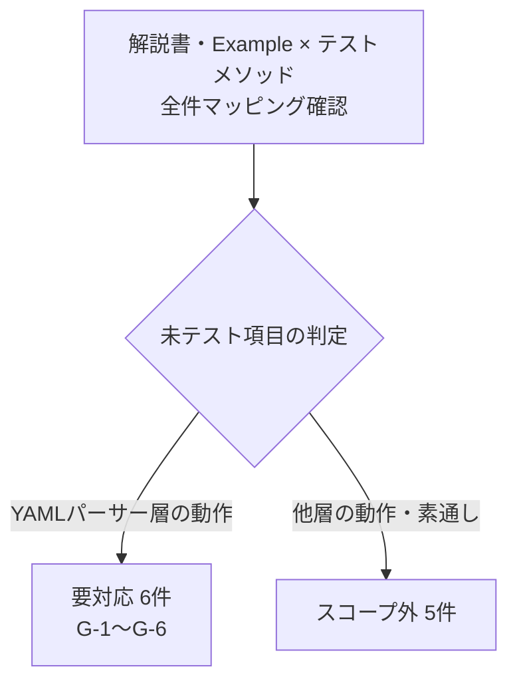

# R-1 カバレッジギャップ一覧

解説書・Example ファイルとテストメソッドのマッピングを全件確認した結果に基づく、YAML パーサー層の未テスト項目とスコープ外判定の一覧。

作成日: 2026-05-26

## 全体像

確認範囲と判定の内訳は次のとおり。要対応は YAML パーサー層に閉じ、スコープ外は他層の動作（パーサーは値を素通しするのみ）。

## 要対応（YAML パーサー層・6件）

| # | 対象節 | 内容 | 追加先テストクラス | 対応テストメソッド |
|---|---|---|---|---|
| G-1 | 8.1 / examples-special.md 8.2 | ダブルクォート1文字 `"\""` → `QuotationTrimmer` で `"` 1文字になること | `YamlTableDataBuilderTest` | `testBuildListMapRows_escapedDoubleQuoteIsDoubleQuoteChar` |
| G-2 | 8.1 / examples-special.md 8.1 | `"${updateTime}"` / `"${setUpTime}"` → `DateTimeInterpreter` でシステム時刻に変換されること | `YamlTableDataBuilderTest` | `testBuildListMapRows_updateTimeAndSetUpTimeConverted` |
| G-3 | 9.3 / examples-special.md 9.2 | 可変長ファイルの `field-separator: "\\t"` がタブ文字として設定されること | `YamlFileBuilderTest` | `testBuildFileList_tabFieldSeparatorBecomesTabChar` |
| G-4 | 7.3 / examples-messaging.md 7.3 | `messages` の `id` にパスセグメントを含む形式（`sendSyncTestData/REQ001/message`）が正しく取得できること | `YamlMessageBuilderTest` | `testBuildMessagePool_idWithPathSegments` |
| G-5 | 7.2 / examples-messaging.md 7.2 | `expected_request_header_messages` から `buildMessagePool` で正しく取得できること | `YamlMessageBuilderTest` | `testBuildMessagePool_expectedRequestHeaderMessages` |
| G-6 | 4章 / examples-testshots.md | `testShots` という予約 ID で `list_maps` が正しく取得でき、Web/Batch/Messaging 各カラムが保持されること | `YamlTableDataBuilderTest` | `testBuildListMapRows_testShotsReservedId` |

## スコープ外（テスト不要と判定・5件）

いずれも YAML パーサー層の外（DB アサート層・DB 格納層・固定長フォーマッタ層・メッセージング層・SnakeYAML）の動作。パーサーは値を文字列として素通しするため、パーサーのテスト対象にならない。

| 対象節 | 内容 | 判定の根拠（動作する層） |
|---|---|---|
| 8.7 | `java.sql.Timestamp` 末尾 `.0` 必須 | DB アサート層（`TableData.getValue()` 比較）。YAML パーサーは値を文字列として素通し |
| 8.8 | `0xCAFEBABE` バイナリ記述 | DB 格納層。YAML パーサーは値を文字列として素通し |
| 8.9 | X9/SX9 型フィールド | 固定長フォーマッタ層。YAML パーサーはフィールド型文字列を素通し |
| 7.4 | ステータスコードデフォルト `"200"` | `SendSyncMessageParser` / `MockMessagingClient` 層。YAML ビルダーは値を保持するのみ |
| 10.3 | `#` コメント構文 | SnakeYAML のネイティブ動作。パーサーが介在せず YAML リーダーのテスト対象外 |

## 対応完了後のアクション

- 全 G-1〜G-6 のテストがグリーンになったら `R-1-coverage-gaps.md` を更新（各行に対応テストメソッド名を追記）
- `docs/pr75/steering.md` の R-1 作業内容チェックリストを更新
