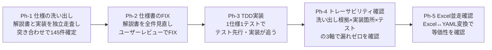
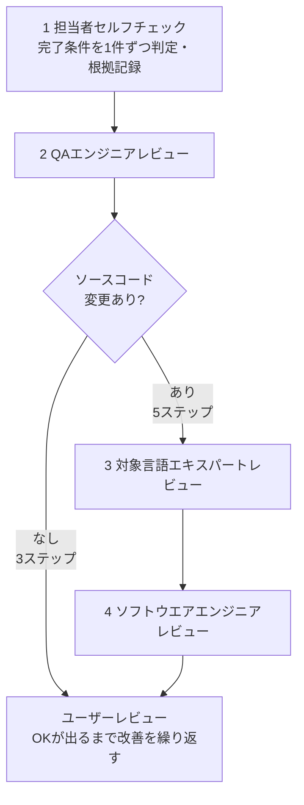
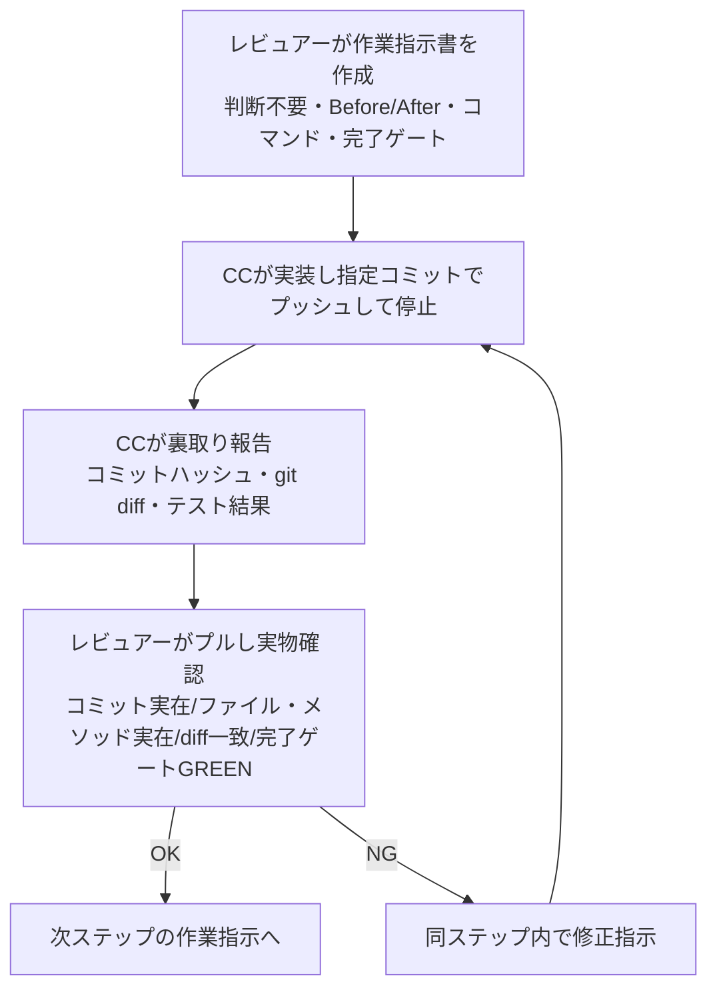

# NTF テストデータ YAML 実装フェーズ

ブランチ: `convert-testdata-excel-to-text`

このファイルはプロジェクトの進行管理・経緯記録です。PR レビュアーは「成果物」までを参照してください。「作業ガイド」以降は作業を再開・引き継ぐエージェント向けの参照情報です。

---

## 背景・目的

Nablarch は銀行・保険・官公庁等のミッションクリティカルな大規模基幹系システムで使われるフレームワークである。NTF（Nablarch Testing Framework）はそのテスト基盤であり、NTF 自体のバグが顧客システムの品質を直接損なう。

**設計・実装・テスト・レビューのすべてに、ミッションクリティカルな基幹系システムと同等の高品質を要求する。**

- テストは「通った」だけでは不十分。境界値・異常系・仕様の端点を網羅し、意図が明確であること
- レビューは「問題なさそう」ではなく、仕様の全 ID に対して根拠を持って充足を確認すること
- 「動く」と「正しい」は別物。正しさを根拠で説明できない実装・テストは完了とみなさない

**このPRで行ったこと**: YAML スキーマ設計フェーズ（完了済み）で固めたスキーマを実際に動かす。YAML リーダーを TDD で実装し、NTF 仕様の全 ID に対してテストが 1 対 1 で対応しカバー漏れゼロであることを根拠で説明できる状態を目指す。あわせて Excel↔YAML 変換ツールを実装する。

---

## アプローチ

**根拠立ての原則**: 仕様を先に固め、実装はその後。「動く」ではなく「全仕様 ID に対して根拠で説明できる」状態を目指す。フェーズは依存順に進める。



各タスクはレビュー工程（後述「タスク完了プロセス」）を経て完了とした。指摘は全件対応。

---

## 成果物

| 種別 | ファイル | 内容 |
|---|---|---|
| **仕様リスト** | [ntf-impl-spec-list.md](ntf-impl-spec-list.md) | 全145件（解説書マッピング × 実装マッピング × テストメソッド） |
| **NTFテストデータ解説書** | [docs/ntf-testdata-doc.md](docs/ntf-testdata-doc.md) | YAML テストデータ記述仕様書 |
| **スキーマ** | [src/main/resources/nablarch/test/ntf-testdata-yaml-schema.json](../../src/main/resources/nablarch/test/ntf-testdata-yaml-schema.json) | JSON Schema 定義 |
| **ADR** | [adrs/ADR-001-yaml-library.md](adrs/ADR-001-yaml-library.md) | SnakeYAML Engine 採用根拠 |
| **NTF変換ツール設計書** | [docs/testdata-converter-design.md](docs/testdata-converter-design.md) | Excel↔YAML変換ツール設計書 |

---

## フェーズ進捗

- [x] **Ph-1** 仕様リスト確定 — 解説書188件・実装226件から突き合わせ、145件確定。ユーザーレビュー OK
- [x] **Ph-2** 解説書 FIX — 全145件と1対1対応を確認。ユーザーレビュー OK
- [x] **Ph-3** YamlTestDataParser TDD 実装 — 138件グリーン。ユーザーレビュー OK（2026-05-27）
- [x] **Ph-4** トレーサビリティマトリクス完成 — 145件全件3軸記録・未対応ゼロ確認。ユーザーレビュー OK（2026-05-27）
- [x] **Ph-5** Excel 並走確認
    - [x] **C-1** 変換ツール設計・実装 — 156テスト全グリーン。ユーザーレビュー OK（2026-06-05）
    - [x] **S-6** JSON Schema 整合性確認 — 完了。ユーザーレビュー OK（2026-05-29）
    - [x] **V-1** 全Excelテストの YAML 版並走実行 — T7 に統合・完了
- [x] **Ph-6** ユーザーレビュー指摘の是正（2026-06-02 ユーザーレビューで確定）
  - 前提: 文書 `docs/pr75/docs/ntf-testdata-doc.md` / `docs/pr75/design/ntf-testdata-yaml-design.md` / `docs/pr75/ntf-impl-spec-list.md` / `src/main/resources/nablarch/test/ntf-testdata-yaml-schema.json` / `docs/pr75/docs/ntf-testdata-doc-examples-messaging.md` は是正済み（あるべき姿）。本フェーズはこれら文書を正とし実装を一致させる
  - 各タスクは「ソースコード変更を含むタスク（5ステップ）」プロセスに従う。完了条件は各チェックファイルに記載
  - [x] **T1** フィールド型記法を日本語名称に統一 — `docs/pr75/checks/T1.md`（ユーザーレビュー OK 2026-06-05）
  - [x] **T2** `fw_header` マップ対応（ランタイム、messages 限定） — `docs/pr75/checks/T2.md`
  - [x] **T3** 変換ツール `parseMessageBlock` の構造分離修正 — `docs/pr75/checks/T3.md`（ユーザーレビュー OK 2026-06-03）
  - [x] **T4** 変換ツールの数値書式セル文字列化を `DataFormatter` に修正 — `docs/pr75/checks/T4.md`
  - [x] **T5** 変換ツールに検証モード（リンタ）を追加 — `docs/pr75/checks/T5.md`
  - [x] **T5-ext** バリデータに V-FNAME / V-DKEY を追加（シフトレフト拡張） — `docs/pr75/checks/T5.md`（ユーザーレビュー OK 2026-06-03）
  - [x] **T6** `expected_tables`/`expected_complete_tables` 混在順序非依存の確認テスト — `docs/pr75/checks/T6.md`
  - [x] **T7** 等価性テストの拡充（型行を持つ実Excel・messaging 系の並走。旧 V-1 を統合） — `docs/pr75/checks/T7.md`（ユーザーレビュー OK 2026-06-05）

---

---

# 作業ガイド

*以降はエージェントが作業継続に必要な情報。PRレビュアーは上記までを参照。*

---

## 作業ルール（全作業共通）

- **全体整合確認**: ファイルを変更する際はパッチあてに留まらず、ファイル全体を見て不要・矛盾・重複がないか確認してから変更する
- **コミット単位**: ファイルを変更したら目的単位でコミットする
- **プッシュ必須**: ファイルを変更したらコミット後に必ずプッシュする
- **環境変更は事前確認必須**: ライブラリ追加・ツールインストール等、環境への変更が必要になったらユーザーに確認を取ってから実施する。勝手にインストール・追加しない
- **作業内容に従う**: タスクのチェックリストを上から順に実施する。完了したステップは即座に `[x]` に更新してコミット・プッシュし、作業の実態とチェックリストを常に同期させる

---

## タスク完了プロセス（全タスク共通）

各タスクの最後に必ずレビュー工程を実施する。ソースコード変更を含むタスクは5ステップ、それ以外は3ステップ。



チェック結果は `docs/pr75/checks/{タスクID}.md` に出力する。

### レビューはサブエージェントで実施する（バイアス排除）

**QA エンジニア・対象言語エキスパート・ソフトウエアエンジニアのレビューは、いずれもサブエージェント（Agent ツール）で実施する。** メインエージェントは実装の詳細を把握しておりバイアスがかかりやすい。サブエージェントは会話コンテキストを引き継がず独立した立場でレビューでき、見落としや甘い判定を防げる。

サブエージェントへの指示には次を含める。

- レビュー対象ファイルのパス一覧
- レビューの役割（QAエンジニア / 対象言語エキスパート / ソフトウエアエンジニア）
- 評価観点（下記の各観点を全文コピーして渡す）
- 「本質的な指摘がなくなるまで改善→再レビューを繰り返す」旨

### 各ステップの評価観点

| ステップ | 観点 |
|---|---|
| 1 担当者セルフチェック | 完了条件を1件ずつ確認し、判定（OK/NG）と根拠を記録する |
| 2 QAエンジニア | 目的に対して意味のあるテスト・動作確認が実施されているか（「通った」だけでなく仕様の意図を検証しているか）／エッジケース（境界値・異常系・空入力・最大値・型変換の端点等）が漏れなく検証されているか |
| 3 対象言語エキスパート | ベストプラクティス準拠（命名・例外処理・null の扱い・スレッドセーフ性等）／同リポジトリの他コードと書き方を合わせているか（Javadoc・`@Override`・型引数・アクセス修飾子等）／テストコードが GWT（Given/When/Then）形式で内容が分かるか |
| 4 ソフトウエアエンジニア | 責務分離が適切か（1クラス・1メソッドの責務が明確か）／変更がシステム全体の整合性を壊していないか（インタフェース契約・既存 API との互換性）／保守性・拡張性に問題のある実装パターン（重複・深いネスト・マジックナンバー等）がないか |
| 5 ユーザーレビュー | 担当者・QA（5ステップ時はエキスパート2種も）がパスした後にユーザーへ確認依頼。OK が出るまで改善を繰り返す |

### レビュー指摘への対応方針

- **指摘は原則として全件対応する。** 「軽微」「優先度低」を理由にスキップしない
- 対応しない指摘がある場合は、**ユーザーに確認を取ってから判断する**。勝手に対応不要と判断しない
- 明らかに誤った指摘（事実誤認・前提が異なる等）の場合のみ、その根拠を明記して対応不要と判断できる

### カバレッジ確認（ソースコード変更タスク）

意味のあるテストの網羅性を担当者が確認できるよう、JaCoCo でカバレッジレポートを生成する。

- `pom.xml` に JaCoCo 設定がない場合は、ユーザーに追加可否を確認してから設定する
- `mvn test` 実行後に `target/site/jacoco/index.html` で行・分岐カバレッジの未達箇所をチェックする
- 未達箇所はテスト追加の検討対象として担当者セルフチェックに記録する

### チェックファイルフォーマット

```markdown
# {タスクID} 完了条件チェック

## 完了条件チェックリスト

| 完了条件 | 担当者判定 | 担当者根拠 | QA判定 | QA根拠 |
|---|---|---|---|---|
| （完了条件の文章） | OK / NG | （確認した内容・証跡） | OK / NG | （QAが確認した内容・懸念点） |

## QAエンジニアレビュー

| 観点 | 判定 | 根拠・改善案 |
|---|---|---|
| 目的に対して意味のあるテスト・動作確認が実施されているか | OK / NG | |
| エッジケースが漏れなくテスト・動作確認されているか | OK / NG | |

## エキスパートレビュー（ソースコード変更タスクのみ）

### 対象言語エキスパートレビュー

| 観点 | 判定 | 根拠・改善案 |
|---|---|---|
| ベストプラクティス準拠 | OK / NG | |
| 既存コードスタイル統一 | OK / NG | |
| テストコードのGWT形式 | OK / NG | |

### ソフトウエアエンジニアレビュー

| 観点 | 判定 | 根拠・改善案 |
|---|---|---|
| 責務分離の適切さ | OK / NG | |
| システム全体の整合性 | OK / NG | |
| 保守性・拡張性 | OK / NG | |

## 総合判定

- 担当者: OK / NG
- QA: OK / NG
- 対象言語エキスパート: OK / NG / 該当なし（ソースコード変更なし）
- ソフトウエアエンジニア: OK / NG / 該当なし（ソースコード変更なし）
- ユーザーレビュー可否: 可 / 不可（理由）
```

---

## 再開手順

1. `git status` でクリーン確認（ブランチ: `convert-testdata-excel-to-text`）
2. **次アクション: 実装ステップ計画（設計書 6.3 到達）の Step 3 から着手**
   - 設計書: `docs/pr75/docs/testdata-converter-design.md`
   - 作業手順: 下記「実装ステップ計画」を参照
   - Step 1 完了コミット: `61c79e5` / Step 2 完了コミット: `095bf64`

---

## 実装ステップ計画（設計書 6.3 までの到達経路）

設計書 `docs/pr75/docs/testdata-converter-design.md`（正）どおり実装し、6.3（既存 Excel テストを YAML へ動的変換して全件 PASS＝振る舞い不変の担保）まで到達する。

### 進め方（全ステップ共通）

レビュアー（claude.ai）と CC（Claude Code）が 1 ステップずつ往復する。依存の浅い順（＝TDD の依存先順）に進め、前ステップの完了ゲート GREEN が次ステップの前提。



### ステップ一覧

| # | 内容 | 設計書参照 | 完了ゲート | 状態 |
|---|---|---|---|---|
| 1 | `getResult` を protected 化（`TestDataParsingTemplate` の abstract 宣言＋各サブクラスのオーバーライド） | 3.2「④構造解析―結果を取り出す」 | reader パッケージの既存テスト全 GREEN（振る舞い不変） | **完了** `61c79e5` |
| 2 | 結果オブジェクトの getter 整備（`DataFile`／`DataFileFragment`／`MessagePool` に読み取り getter 追加、`TableData` に揃える。`DataFileFragment` に `@Published` 付与） | 3.2「④構造解析―結果を取り出す」器ごとの表 | getter の単体テスト GREEN ＋ 既存テスト不変 | **完了** `095bf64` |
| 3 | `XlsFormatReader` を本体再利用へ改修（独自実装 `parseBlocks`／`parseRecordLayouts`／`isDataRow`／`trimQuotation` を撤去し、本体構造解析＋空 `interpreters`＋スタブ `DbInfo` で中間モデルを組む） | 3.2「③外す」「④結果を取り出す」、4 章 IN | 既存 `XlsFormatReaderTest` 不変 ＋ 全データ種別の無損失 | 未着手 |
| 4 | `YamlFormatReader` を本体再利用へ改修＋④の 2 系統統合（YAML→行表現の `TestDataReader` 実装を新設し、`YamlFileBuilder`／`YamlTableDataBuilder` の独自構築を廃して同一の④へ合流） | 3.2「④―2 系統を統合する」、4 章 IN | 既存 Yaml 系テスト不変 ＋ Excel/YAML が同一④経由 | 未着手 |
| 5 | 6.3 達成（既存 Excel テストを `TestDataConverter` で一時 YAML へ動的変換し、アサーションを変えずに全件 PASS） | 6.3 | `nablarch-testing` 既存テスト全件 GREEN | 未着手 |

**各ステップの詳細は作業指示書を参照。** ステップごとにユーザーレビューを受けてから次へ進む。

### スコープ外（本経路では実施しない）

- 6.4（サンプルアプリでの動作確認）: リポジトリ分割後に実施（設計書 7 章）
- リポジトリ分割そのもの（設計書 7 章手順 4）: 6.3 完了＋有識者レビュー後
- Excel OUT の整形設定（`ExcelFormatConfig`）の作り込み: 6.3 は読み込み経路の担保が目的のため本経路の必須ではない（往復確認 6.2 で別途）

---

## タスク詳細・経緯

### C-1: NTF テストデータ変換ツール 設計・実装（TDD）

**目的**: NTF テストデータを Excel ↔ YAML 間で変換するツールを TDD で設計・実装する。
**前提**: Ph-3 完了（`YamlTestDataParser` の YAML 仕様が FIX していること）

**設計方針（ユーザーレビューで確定済み）**:

- Excel IN/OUT、YAML IN/OUT の 4 方向を全て対応する（Reader/Writer の組み合わせ）
- 中間データの設計は調査タスク（C-1-0）で決定（結論: 独自モデル採用）
- 設計書は特定リポジトリの運用情報（59件・具体パス等）を含めない汎用ツールとして書く

**設計書**: `docs/pr75/docs/testdata-converter-design.md`

**作業内容**:

- [x] **C-1-0〜C-1-2**: 設計（中間データ方式調査・仕様リスト見直し・設計書全面作成）
- [x] **C-1-3〜C-1-7**: 設計書レビュー（セルフ・QA・Java・SWE）・ユーザーレビュー OK（2026-05-28）
- [x] **C-1-8〜C-1-12**: TDD 実装・実装レビュー（セルフ・QA・Java・SWE 全完了）
- [x] **C-1-13〜C-1-14**: パッケージ分割・カバレッジ網羅（147テスト全グリーン）
- [ ] **C-1-15**: ユーザーレビュー依頼・OK取得（進行中）
  - ユーザーレビュー中に発覚した問題を順次修正済み（2026-05-29）:
    - `TestDataBlock` を sealed class 化（`ColumnRowDataBlock`・`FileDataBlock`・`MessageDataBlock` が `permits`）し、`TableDataBlock`/`ListMapBlock`/`FileDataBlock`/`MessageDataBlock` を `final` に変更
    - `XlsFormatWriter.writeBlock()` の到達不可 `return rowNum` を削除（sealed class で不要になったため）
    - 到達不可ガードを `IllegalArgumentException` → `AssertionError("UNREACHABLE:")` に統一
    - `readCells()` の重複末尾空セル除去ロジックを削除し `trimTrailingEmpty()` に一本化
    - `TestDataConverter.System.exit()` を削除（`mvn exec:java` 前提では不要・有害）
    - `YamlFormatWriter` の `IOException` catch テストを `mockStatic` → `setWritable(false)` に置き換え
    - `YamlFormatReader` に `isDirectory()==false`・`listFiles()==null` テストを追加
    - `writeRecordLayout()` の `type==null` 分岐テストを追加（`fileBlockFieldWithNullTypeWritesNameOnly`）
    - 147テスト全グリーン。残カバレッジ未達2件（番人コード。`docs/pr75/checks/C-1.md` に理由記録済み）

**完了条件**:

- 設計書がユーザーレビュー OK 済みであること
- 全テストが全グリーンであること
- 変換ツールが設計書で定義した実行方法で動作すること

### V-1: 全 Excel テストの YAML 版並走実行

**目的**: C-1 で実装した変換ツールで全 Excel テストデータを YAML に変換し、Excel リーダーと YAML リーダーの等価性を確認する。
**前提**: C-1 完了

**作業内容**:

- [x] 変換ツールで全59件の `.xls`/`.xlsx` を `.yaml` に変換する
- [x] 変換結果を目視確認し、問題のあるファイルを一覧化する
- [x] 各テストクラスに YAML 版テストを作成し、同一アサーションで実行する
- [x] 差分が生じた場合の対処方針を明記する（修正して差分解消 or 除外して理由記録）
- [x] セルフチェック（チェック結果: `docs/pr75/checks/V-1.md`）
- [x] QAエンジニアレビュー（QA8件指摘→全件対応済み）
- [ ] ユーザーレビュー依頼・OK取得

**完了条件**:

- 全テストが Excel/YAML どちらでも同一結果でグリーンであること
- 差分が生じたファイルがある場合、ファイル名・差分内容・原因・対処を一覧で記録すること

### T7 動的アプローチ（進行中）

**方針**: 静的アプローチ（等価照合テスト）を廃棄し、動的アプローチ（既存テストを Excel/YAML 両入力で 2 回実行する Runner）で再実装する。
**作業指示書**: `docs/pr75/inspection/CC作業指示-T7再実装.md`（STEP 1〜7）、STEP5 詳細: `docs/pr75/inspection/CC作業指示-T7-STEP5.md`

**進捗**:

- [x] **STEP 1** T7 等価照合実装を全リバート — 完了（2026-06-04）。ユーザーレビュー OK
- [x] **STEP 2** NPE 修正を TDD で再投入（独立コミット） — 完了（2026-06-04）。ユーザーレビュー OK
- [x] **STEP 3** 変換ツールの共通入口を構造化インタフェースで切り出す — 完了（2026-06-04）。ユーザーレビュー OK
- [x] **STEP 4** パッケージ整理（YAML 対応の集約） — 完了（2026-06-04）。ユーザーレビュー OK
- [x] **STEP 5** テストデータ駆動テスト用 Runner の新規作成 — 完了（2026-06-05）。ユーザーレビュー OK
  - `NtfTestdataTestRunner`（`DatabaseTestRunner` 継承）を新規作成
  - `runChild` を2回実行（1回目: Excel、2回目: YAML）
  - `getTestRules` をオーバーライドし YAML モード時に `YamlSetupRule` をリスト先頭（最内側）に追加
  - `YamlSetupRule` が `SystemRepositoryResource.before()` 後に変換・差し替え・復元を実行
  - `IgnoreDetectingNotifier` で `@TargetDb` Ignored メソッドの二重集計を防止
  - ThreadLocal (`YAML_MODE`) は使用後に必ず `remove()`
  - `NtfTestdataTestRunnerTest`: 5テスト全グリーン（2回実行・YAML差し替え・復元・Ignored スキップ・例外時復元）
  - QA/Java/SWE 全レビュー OK
  - ベースライン `Tests run: 1243 → 1248`（+5新規テスト）、`Failures: 1, Errors: 26`（変化なし）
- [x] **STEP 6** 対象テストクラスへ Runner を適用（18クラス）— 完了（2026-06-05）
  - 18クラスへ `@RunWith(NtfTestdataTestRunner.class)` 付与済み（HttpRequestTestSupportTest は TestDataParser 非使用のため対象外・`@RunWith` を元に戻した）
  - YAML モード (Run 2) で発生していた全不具合を修正済み。主な修正:
    - `NtfTestdataTestRunner.clearAllStaticCaches()`: Run1→Run2 の static キャッシュ汚染を全除去
    - `YamlMessageBuilder.buildSendSyncMessageList`: `group_id` にブラケットを付与して `"[case1]"` 形式に統一
    - `YamlTableDataBuilder.buildTableDataList`: `rows: []` 空テーブルを DELETE 対象として扱う（Excel と同等）
    - `YamlTestDataParser.getSendSyncMessage`: groupId をブラケット付き形式に正規化
    - キャッシュクリアメソッドをパーサー系各クラスに追加（`clearCacheForTest()`）、`BasicTestDataParser` にファサード追加
    - `XlsFormatReader` / `YamlFormatWriter`: isDataRow・parseMessageBlock・writeMessageBlock の修正
    - `BinaryFileInterpreter`: バイナリファイルを YAML 出力ルートにコピーする処理を追加
    - `QuotationTrimmer`: length < 2 のガード追加
    - entity テスト群: `ThreadContext.setLanguage()` でロケール設定
    - `TestSupportTest`: パステスト修正
  - 全テスト green: `Tests run: 1472, Failures: 0, Errors: 0, Skipped: 7`
  - ユーザーレビュー OK（2026-06-05）
- [x] **STEP 7** 仕上げ（T7.md・steering 更新）— 完了（2026-06-05）
- [x] **STEP D** 残存 YAML テスト失敗の修正 — 完了（2026-06-09）
  - リフレクション（`switchDefaultRepositoryToYaml`）を廃棄し、`wrapForYaml()` デコレータパターンに差し替え — コミット `595fda1`
  - `YamlModeTestBase.wrapForYaml()`: `TestShotAround.createMain()` を差し替え、`super.handle()` 完了後（`revertDefaultRepository()` 発火後）に `reInitializeRepository(yaml)` を再 load する非リフレクション実装
  - 対象クラス: `DBtoDBBatchSampleYamlTest`・`FileToFileBatchSampleYamlTest`・`SimpleBatchSampleYamlTest`・`MessagingRequestTestSupportYamlTest`・`MessagingReceiveTestSupportYamlTest`・`AbstractHttpRequestTestTemplateYamlTest`
  - 旧コード（リフレクション版）と新コード（非リフレクション版）の結果を比較: 228 tests、旧 43F/37E → 新 42F/37E（1件改善）
  - 残存 42F/37E は旧コードでも同数発生していた STEP D 以前からのバグ（YAML データ変換未対応）。本是正の対象外
- [x] **STEP D-1** 空文字列変換バグ修正 — 完了（2026-06-09）— コミット `b269487`
  - `XlsFormatReader.readCells()` に `trimQuotation()` を追加（`QuotationTrimmer` と同一ルール）
  - `trimTrailingEmpty()` を生値に適用してから `trimQuotation()` を適用する順序を厳守（逆順だと `""` → 空文字列後に末尾空セル除去されてデータ行が消える）
  - `FileSupportYamlTest` 空文字列関連5件グリーン。`TestDataConverterTest` 49件グリーン。新規失敗ゼロ
- [x] **STEP D-1 追加是正** `XlsFormatReader.trimQuotation` を `QuotationTrimmer` と完全一致させ・`YamlTestDataParser` パッケージ移動取り消し — 完了（2026-06-09）— コミット `cffee2f`
  - `trimQuotation`: 全角クォート判定を U+201C/U+201D ペアから U+201D 両端（本家と同一）に修正。`length >= 2` チェック削除
  - `YamlTestDataParser` を `reader/yaml` → `reader` に戻し、`BasicTestDataParser.formatGroupId` を package-private（変更前）に戻す
  - `git diff main..HEAD -- BasicTestDataParser.java` で差分ゼロ確認済み（既存本体コード無変更）
  - テスト: 109件グリーン（退行ゼロ）

### T5-ext: バリデータに V-FNAME / V-DKEY / V-MSGROW を追加（シフトレフト拡張）

**チェックファイル**: `docs/pr75/checks/T5.md`（完了条件チェックリスト・レビュー欄を追記する）
**変更対象**: `YamlTestDataValidator`・`YamlTestDataValidatorTest`・設計書 §10.3 は更新済み
**実施手順**: ソースコード変更を含むタスクの5ステップに従い TDD（RED→GREEN）で進める。

| ID | 内容 | 実装メモ |
|---|---|---|
| V-FNAME | 同一 `record_fragment` 内のフィールド名重複を検出 | `fields` リストの `name` を Set で重複判定 |
| V-DKEY | `directives:` キーが既知ディレクティブ名（`MessageDataBlock.KNOWN_DIRECTIVE_NAMES` + 固定長専用キー）以外を検出 | 既知キー Set は `MessageDataBlock.KNOWN_DIRECTIVE_NAMES` をそのまま使う（固定長・可変長の区別は type フィールドで判断できないため全既知キーで許容し、未知キーをエラーとする） |
| V-MSGROW | `expected_request_header_messages[i]` と `expected_request_body_messages[i]` の `rows` 合計行数の一致を検出 | ファイル内の2セクションをペアリングしインデックス単位で比較 |

**追加対応（2026-06-03）— KNOWN_DIRECTIVE_NAMES と NTF 本体ディレクティブの整合テスト**: ユーザーレビューで、`YamlTestDataValidator`（V-DKEY）が手書き定数 `MessageDataBlock.KNOWN_DIRECTIVE_NAMES` に依存し本体とのずれを検知できない点を指摘。`YamlTestDataValidatorTest#knownDirectiveNames_matchesNtfDirectives` を追加し、`Directive`/`FixedLengthDirective`/`VariableLengthDirective` の全キーをリフレクションで動的収集して `KNOWN_DIRECTIVE_NAMES` と完全一致を検証。本体でディレクティブが追加・変更・削除されれば即座に検知される。

### T5: 変換ツールに検証モード（リンタ）を追加

**チェックファイル**: `docs/pr75/checks/T5.md` ／ **変更対象**: 設計書 §28 参照

### T3: 変換ツール parseMessageBlock の構造分離修正（差し戻し対応完了・ユーザーレビュー待ち、2026-06-03）

- ユーザーレビューで差し戻し: no行を先頭に持つフィールド名称行（実 Excel 形式）が FW ヘッダに誤投入され、フィールド名1列ずれ・データ消失が発生
- `XlsFormatReader.parseMessageBlock`: no行（先頭セルが "no"）をフィールド名称行起点として認識しディレクティブ/FW ヘッダ収集を打ち切る
- `parseRecordLayouts`: `withNoColumn` フラグ追加。メッセージング（fixedRecordType != null）で型行後の先頭空行（長さ行等）をスキップし先頭非空（シーケンス番号）行をデータ行として読む
- `XlsFormatWriter.writeMessageBlock`: データ行先頭をシーケンス番号に変更（ラウンドトリップバグ修正）
- テスト: 166件全グリーン。実Excel確認テスト（MessageParserTest.xls, MessagingRequestTestSupportTest.xls）・ラウンドトリップテスト追加
- QA・Java・SWE 各レビュー指摘を全件対応済み。T3.md チェックファイル更新済み

### T1: フィールド型記法を日本語名称に統一（完了、2026-06-02）

- `unit-test-yaml.xml` から identity mapping 削除（コミット `c5af79f`）
- テスト YAML を日本語型に更新（`fileData.yaml` 等7ファイル）
- QA 指摘2件対応・エキスパートレビュー指摘2件対応（コミット `e3eef83`・`f18499f`）
- T1.md レビュー結果記録済み（コミット `67ac3af`）

### T2: fw_header マップ対応（完了・ユーザーレビュー OK、2026-06-02）

- 実装: `YamlMessageBuilder.extractFwHeader` を `fw_header:` マップ方式に変更
- テスト: 27テスト全グリーン（QA・Java・SWE 各レビュー指摘を全件対応済み）
- T2.md チェックファイル記入済み（コミット `b9eef74`）

---

## 決定事項

### Ph-6 是正方針（ユーザーレビューで確定 2026-06-02）

判断に迷った場合は、対応する文書の該当章を正とする。

| 決定 | 内容 | 正となる文書 |
|---|---|---|
| 型記法 | フィールド型は日本語名称（`半角英字`/`全角`/`数値` 等）で記述する。記号（`X`/`N`/`Z`）は採用しない。identity mapping（`unit-test-yaml.xml` の `dataTypeMapping`）は削除する | 設計書 §5、スキーマ `$defs/field_def/type` |
| FW制御ヘッダ | `messages`（MESSAGE）のみ `fw_header:` マップ（任意キー許容、設定値でフィルタしない）で表す。`expected_request_*`/`response_*` の4種は `fw_header` を使わず `records` の `fields/rows` でフィールド単位に定義する。`record_type: FW_HEADER` 方式は廃止 | 設計書 §12、スキーマ `$defs/message_data/fw_header`・`$defs/fw_header` |
| ランタイムFW分離 | `getMessage`（messages）経路のみ `fw_header` を読む。`getMessageWithoutCache`（expected/response）経路は `extractFwHeader` を呼ばず空 Map を渡す | 設計書 §12、仕様リスト MS-04 |
| ディレクティブ分離 | `text-encoding` 等のディレクティブは `directives:` に入れる。FW制御ヘッダ・電文ボディに混入させない | 設計書 §12 |
| 電文構造 | 電文は ディレクティブ群 → FW制御ヘッダ群 → `no` 行（フィールド名称行）→ 型 → 長さ → データ の順。変換ツール `parseMessageBlock` はこの構造で解釈する | 設計書 §12、解説書 §7 |
| Doc-4 撤回 | `expected_tables` と `expected_complete_tables` の混在順序は自由（YAML はセクションキーで独立取得）。旧 Doc-4「混在で後半が読まれない」制約は撤回 | 設計書 §4、解説書 §3.3 |
| 数値書式セル | 変換ツールは数値/日付書式セルを `DataFormatter#formatCellValue(cell)` で文字列化する。`cell.toString()` は使わない | 設計書 §（数値セル注記） |
| 検証モード | 変換ツールに検証モード（列数一致・構造境界・スキーマ適合を検査するリンタ）を追加する | 設計書 §28 |
| リソース名 | リソース名は `"ブック名/シート名"` を維持（ブック名→ディレクトリ、シート名→ファイル名）。テストコードの変更は不要 | 設計書 移行戦略 |
| 等価性テスト | 等価性テストに型行を持つ実Excel・messaging 系（FW制御ヘッダ・日本語型・複数データ行）を追加する | 仕様リスト SS-05/MS-04、T7 |

### C-1 中間データモデルの命名（ユーザーレビューで確定済み 2026-05-27）

| クラス名 | 実態 |
|---|---|
| `TestDataContainer` | 上位。テストクラスと1対1のコンテナ（Excel ブック / YAML ディレクトリに相当） |
| `TestDataSection` | 中位。読み込み単位（Excel の1シート / YAML の1ファイルに相当） |
| `TestDataBlock` | 下位。DataType + 識別子 + データ行の塊 |

### ADR（設計判断記録）

- `docs/pr75/adrs/ADR-001-yaml-library.md`: SnakeYAML Engine 3.0.1 採用の根拠
- `docs/pr75/adrs/ADR-002-yaml-dependency-scope.md`: compile スコープ採用の根拠

---

## 環境情報

- **Java**: Eclipse Temurin 17（`update-alternatives` で切り替え済み）
- **Maven settings**: `~/.m2/settings.xml` に社内 Nexus リポジトリ設定済み（`nablarch-parent:6-NEXT-SNAPSHOT` 解決済み）
- **注意**: `mvn clean package` は Javadoc プラグインが `JAVA_HOME` 未設定で `BUILD FAILURE` になるが、テスト自体は全グリーン。`Tests run:` 行と `Failures: 0, Errors: 0` で確認すること
- **注意**: `/tmp/nablarch-document` は再起動で消える。必要時は `git clone https://github.com/nablarch/nablarch-document.git /tmp/nablarch-document` で再取得

### カバレッジ取得方法

```bash
# 1. テスト実行（jacoco.exec がプロジェクトルートに生成される）
mvn clean package -Dtest="対象テストクラス..."

# 2. レポート生成
mvn jacoco:report -Djacoco.dataFile=/path/to/nablarch-testing/jacoco.exec
# → target/site/jacoco/index.html で確認
```

`mvn test` だけでは `restore-instrumented-classes` が走らず（`prepare-package` フェーズにバインド）、`jacoco:report` 時に「instrumented class」エラーになる。`package` まで実行すること。
